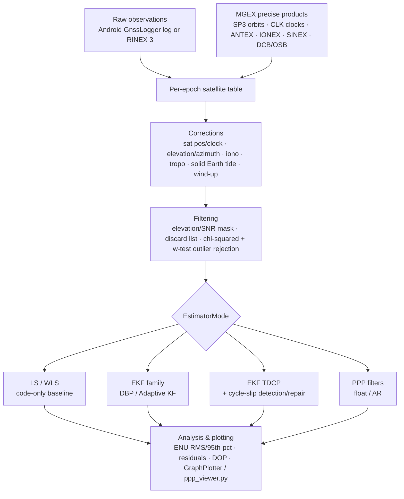

# gnssAug

A Java engine for high-precision GNSS positioning. It processes both consumer smartphone GNSS (raw Android `GnssLogger` logs) and geodetic-grade receiver data (RINEX 3 + IGS/MGEX precise products) through a shared stack of physical correction models, Kalman filter estimators, and a full Java port of the TU Delft **LAMBDA 4.0** integer ambiguity resolution toolbox — covering everything from single-epoch least squares to a full undifferenced-uncombined Precise Point Positioning (PPP) filter with cycle-slip detection and repair.

The codebase originated as the implementation and validation vehicle for a PhD thesis on smartphone GNSS positioning; that research record — motivation, theory, and validated experiment results — lives in [`docs/thesis/`](docs/thesis/README.md) and is worth reading for the *why*. This README and the rest of `docs/` describe the codebase as it stands today.

## What's in here

- **Two positioning stacks**: `Android.*` for consumer raw-log data (Google Decimeter Challenge and general `GnssLogger` captures), `Rinex.*`/`IGS.*` for RINEX 3 observations and geodetic reference stations — sharing the same correction models and estimator families.
- **A family of Kalman filters**: from conventional position/velocity random-walk EKFs, through a Doppler-driven filter that automates process-noise tuning, an adaptive filter that learns measurement noise in real time, a hierarchical cycle-slip detection-and-repair engine, up to a full PPP filter.
- **A full LAMBDA 4.0 port**: ILS, IA-FFRT, BIE, PAR, PAR-FFRT, IR, IB, plus a Monte Carlo variance-estimation engine — used for both cycle-slip repair and ambiguity resolution.
- **Standard GNSS file-format support**: RINEX 3, SP3, CLK, ANTEX, IONEX, SINEX, DCB/OSB bias files, plus Android raw logs and Google Decimeter Challenge CSVs.

## Documentation

📖 **[docs/](docs/README.md)** is split into two tracks:

- **Living reference** (`docs/*.md`) — package-by-package documentation of the codebase as it exists today: [architecture](docs/architecture.md), the Android pipeline, the RINEX/IGS pipeline, the Kalman filter family, the PPP engine, the LAMBDA estimators, physical correction models, file parsers, and utilities. This is the entry point for extending or understanding the current code.
- **Thesis record** (`docs/thesis/`) — the original PhD thesis this codebase implements: full theoretical derivations, and validated experiment results with real numbers, datasets, and figures. Frozen as of the thesis defense; a great read for the research story, not necessarily in sync with the current code.
- **Generated API docs** — method-level Javadoc, published at [naman4u13.github.io/gnssAug](https://naman4u13.github.io/gnssAug/), regenerated on every push.

## Architecture



Four top-level pipelines: `Android.Android` (raw logs, kinematic), `Android.Android_Static` (raw logs, static benchmark at a surveyed point), `Android.Android_Static_Rinex` (Android data via the RINEX/PPP pipeline), and `IGS.IGS` (RINEX + MGEX products, geodetic reference stations). Full package layout and the `EstimatorMode` dispatch table are in **[docs/architecture.md](docs/architecture.md)**.

## Requirements

- Java 18, Maven
- [Orekit](https://www.orekit.org/) auxiliary data (`orekit-data`) — required for solid Earth tides, tropospheric mapping functions, and frame/time transformations. Download and point `IGS.java` / `Android*.java` at your local copy (see the `DirectoryCrawler` setup near the top of `IGS.posEstimate`).
- MGEX precise products (SP3 orbits, CLK clocks, OSB/DCB biases, IONEX GIM, SINEX) for PPP-grade runs — fetch them with `tools/download_igs_products.py`.

```bash
mvn compile
mvn exec:java -Dexec.mainClass=com.gnssAug.MainApp
```

`MainApp.RUN` selects one of six pre-wired scenarios (`GDC_DYNAMIC`, `IGS_RINEX`, `ANDROID_STATIC`, `ANDROID_PEDESTRIAN`, `PERSONAL_STATIC`, `RINEX_ANDROID_STATIC`); each `case` block owns its own file paths, observable set, and estimator flags. **Note:** dataset paths are currently hard-coded to the author's local machine — point them at your own data before running.

## Python tooling (`tools/`)

- **`download_igs_products.py`** — derives year/DOY from a RINEX filename and fetches all MGEX products a run needs (orbits, clocks, biases, IONEX, SINEX, broadcast nav) from IGN/BKG/CDDIS mirrors, with `--dry-run` support and a choice of analysis center (WUM, COD, GFZ, JAX).
- **`extend_obs.py`** — stitches consecutive 15-minute IGS high-rate RINEX blocks into a single extended observation file for longer test windows.
- **`ppp_viewer.py`** — renders a 7-page diagnostic PDF (position/geometry, pseudorange & phase residuals, Doppler, atmosphere/clocks, signal quality, convergence) from a PPP run's `*_epochs.jsonl` output.

## Data formats supported

RINEX 3 (observation & navigation), SP3 (precise orbits), CLK (precise clocks), ANTEX-derived antenna PCO/PCV, IONEX (Global Ionosphere Maps), SINEX (station solutions), DCB and OSB bias files (MGEX SINEX BIAS format), raw Android `GnssLogger` logs, and Google Smartphone Decimeter Challenge `derived.csv` / ground-truth CSVs. Full detail in [docs/file-formats-and-parsers.md](docs/file-formats-and-parsers.md).

## Status

Active research codebase — see `git log` for the chronological build-out. Not packaged for external reuse: paths and station configuration are embedded in `MainApp` and adjacent pipeline classes rather than externalized to config files. Device compatibility for the smartphone cycle-slip-repair/PPP path is limited — see the device suitability checklist in [docs/thesis/10-results-and-recommendations.md](docs/thesis/10-results-and-recommendations.md) before pointing it at a new phone.

## License

Licensed under the [PolyForm Noncommercial License 1.0.0](LICENSE) — free for research, academic, and personal use; commercial use requires a separate agreement with the author.

## Citation

This codebase underpins the PhD thesis *"Improving Precise Smartphone GNSS with Robust Dynamics, Adaptive Stochastics, and Cycle Slip Repair"* (N. Agarwal, Department of Geomatics Engineering, University of Calgary, 2026; DOI: [10.11575/PRISM/51108](https://doi.org/10.11575/PRISM/51108)). If you use this code or its methods in academic work, please cite it — see [CITATION.md](CITATION.md) for the full reference, BibTeX entry, and the list of peer-reviewed papers each module is drawn from.

## Author

Naman Agarwal — PhD, Department of Geomatics Engineering, University of Calgary.
[Thesis](https://ucalgary.scholaris.ca/items/e9b24a29-0d68-4f5d-ab0f-6a401eef1c9d) · [DOI](https://doi.org/10.11575/PRISM/51108) · naman4u13@gmail.com
