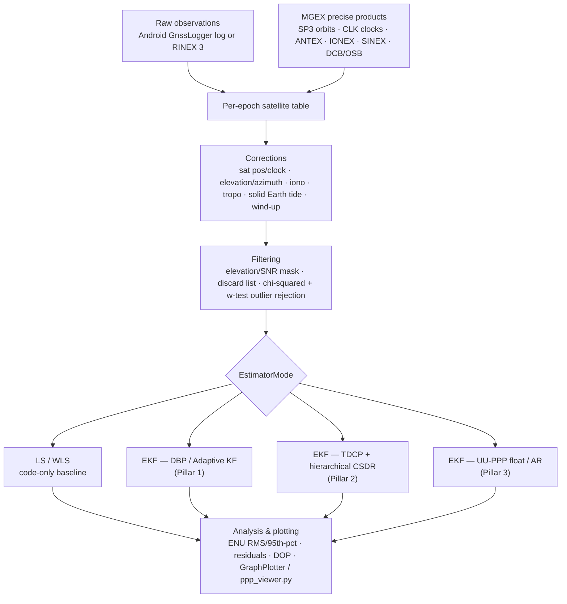

# gnssAug

**A Java engine for decimeter-level smartphone GNSS positioning**, built to implement and validate the PhD thesis *"Improving Precise Smartphone GNSS with Robust Dynamics, Adaptive Stochastics, and Cycle Slip Repair"* (N. Agarwal, Department of Geomatics Engineering, University of Calgary, 2026). It processes both consumer smartphone GNSS (raw Android `GnssLogger` logs) and geodetic-grade receiver data (RINEX 3 + IGS/MGEX precise products) through a shared stack of physical correction models, Kalman filter estimators, and a full Java port of the TU Delft **LAMBDA 4.0** integer ambiguity resolution toolbox.

📖 **[Full documentation is in `docs/`](docs/README.md)** — ten documents tracing every estimator and physical model in this codebase back to the thesis chapter that derived it.

## The problem

Smartphone GNSS chipsets expose raw carrier-phase and Doppler measurements, which in principle enables decimeter-level positioning on commodity hardware. In practice, three things stand in the way, all specific to low-cost, consumer-grade GNSS hardware:

1. **Erratic dynamics** — a phone moves unpredictably (pocketed, handheld, running, driving), so a Kalman filter's process-noise model (`Q`), normally hand-tuned, can't keep up.
2. **Volatile measurement quality** — signal quality swings from open sky to urban canyon far faster than a fixed elevation/C-N₀ weighting table can track.
3. **Chronic cycle slips** — smartphone antennas and oscillators lose carrier-phase lock constantly. The standard fix — reset the ambiguity and start over — is stable but destroys the precision that carrier phase exists to provide.

> *"For geodetic receivers, cycle slips are occasional anomalies. For smartphones, they are a chronic condition."*

This codebase's central position, matching the thesis: **don't discard corrupted phase — repair it.** Estimate the cycle slip as a stochastic integer with an associated variance, and feed that repair back into the filter rather than resetting.

## The three pillars

| Pillar | What it does | Headline result | Code | Docs |
|---|---|---|---|---|
| **1a. Robust Dynamics** — Doppler-Based Prediction (DBP) | Drives Kalman filter state prediction from Doppler-derived velocity instead of a heuristic motion model, which automates process-noise (`Q`) estimation | **57%** lower horizontal RMSE than standard Doppler-aided filters under mismatched dynamics (17.89 m → 7.75 m); eliminates 1,800+ false outlier flags | `EKFDoppler` | [docs/03](docs/03-pillar1-dbp.md) |
| **1b. Adaptive Stochastics** — AKF via Variance Component Estimation | Learns the true measurement noise (`R`) in real time from the innovation sequence, binned by elevation angle and C/N₀, instead of a static look-up table | **35.4%** (static) / **27.3%** (vehicular) horizontal accuracy gain over the best conventional filter; de-weights noisy measurements instead of discarding them, preserving geometry | `AKFDoppler` | [docs/04](docs/04-pillar1-akf-vce.md) |
| **2. Cycle Slip Detection & Repair (CSDR)** | A hierarchical framework fusing Android hardware flags with geometry-free/geometry-based statistical detection, then resolving slips as integers via LAMBDA (ILS, BIE, PAR, PAR-FFRT, IA-FFRT) with a stochastic "soft fix" | Hybrid detection found **1,783** unique slips vs. 1,108–1,243 from either source alone; PAR-FFRT repairs **~79%** of slips at **<1%** failure rate | `EKF_TDCP_ambFix2`, `helper.lambdaNew.*` | [docs/05](docs/05-cycle-slip-detection.md), [docs/06](docs/06-lambda-estimators.md) |
| **3. Validation — UU-PPP Engine** | Integrates CSDR into a custom Undifferenced-Uncombined, ionosphere-constrained PPP filter with decoupled code/phase clocks, validated against IGS reference data and real smartphones | On IGS data with 1,045 artificial slips: repaired accuracy matches the clean baseline (15.9 cm vs 16.0 cm Up RMSE) vs. 52.9 cm for reset. On real Pixel 4 data: **45%** vertical RMSE improvement, 2-min convergence success up from 65%→88% | `Rinex.estimation.EKF_PPP` | [docs/07](docs/07-ppp-engine.md) |

Positioning also supports plain code-based baselines (`LLS_CODE`, `WLS_CODE`, `RINEX_EKF_CODE`) and loose GNSS/INS fusion (`GNSS_INS`) as comparison points against the three pillars above. See [docs/10](docs/10-results-and-recommendations.md) for every quantified result in one place, and [docs/01](docs/01-motivation-and-problem.md) for the full motivation and publication list.

## Architecture



Four top-level pipelines cover the datasets used across the thesis: `Android.Android` (raw logs, kinematic, Google Decimeter Challenge ground truth), `Android.Android_Static` (raw logs, static benchmark at a surveyed point), `Android.Android_Static_Rinex` (Android data via the RINEX/PPP pipeline), and `IGS.IGS` (RINEX + MGEX products, geodetic reference stations). Full package layout, the `EstimatorMode` dispatch table, and the per-pipeline breakdown are in **[docs/02 — Architecture](docs/02-architecture.md)**.

## Requirements

- Java 18, Maven
- [Orekit](https://www.orekit.org/) auxiliary data (`orekit-data`) — required for solid Earth tides, tropospheric mapping functions, and frame/time transformations. Download and point `IGS.java` / `Android*.java` at your local copy (see the `DirectoryCrawler` setup near the top of `IGS.posEstimate`).
- MGEX precise products (SP3 orbits, CLK clocks, OSB/DCB biases, IONEX GIM, SINEX) for PPP-grade runs — fetch them with `tools/download_igs_products.py`.

```bash
mvn compile
mvn exec:java -Dexec.mainClass=com.gnssAug.MainApp
```

`MainApp.RUN` selects one of six pre-wired scenarios (`GDC_DYNAMIC`, `IGS_RINEX`, `ANDROID_STATIC`, `ANDROID_PEDESTRIAN`, `PERSONAL_STATIC`, `RINEX_ANDROID_STATIC`); each `case` block owns its own file paths, observable set, and estimator flags. **Note:** dataset paths are currently hard-coded to the author's local machine — point them at your own data before running.

## Python tooling (`tools/`)

- **`download_igs_products.py`** — derives year/DOY from a RINEX filename and fetches all MGEX products a run needs (orbits, clocks, biases, IONEX, SINEX, broadcast nav) from IGN/BKG/CDDIS mirrors, with `--dry-run` support and a choice of analysis center (WUM, COD, GFZ, JAX).
- **`extend_obs.py`** — stitches consecutive 15-minute IGS high-rate RINEX blocks into a single extended observation file for longer test windows.
- **`ppp_viewer.py`** — renders a 7-page diagnostic PDF (position/geometry, pseudorange & phase residuals, Doppler, atmosphere/clocks, signal quality, convergence) from a PPP run's `*_epochs.jsonl` output.

## Data formats supported

RINEX 3 (observation & navigation), SP3 (precise orbits), CLK (precise clocks), ANTEX-derived antenna PCO/PCV, IONEX (Global Ionosphere Maps), SINEX (station solutions), DCB and OSB bias files (MGEX SINEX BIAS format), raw Android `GnssLogger` logs, and Google Smartphone Decimeter Challenge `derived.csv` / ground-truth CSVs. Full detail in [docs/09](docs/09-file-formats-and-parsers.md).

## Status

Active research codebase — see `git log` for the chronological build-out (Monte Carlo variance weighting → PPP for IGS stations → solid Earth tide & phase wind-up → OSB/DCB bias handling → BSD integer ambiguity resolution → dual-frequency PPP → Android RINEX support → kinematic smartphone PPP → cycle-slip detection using Android API ADR state). Not packaged for external reuse: paths and station configuration are embedded in `MainApp` and adjacent pipeline classes rather than externalized to config files. Device compatibility for the CSDR/PPP path is limited — see the [device suitability checklist](docs/10-results-and-recommendations.md) in docs/10 before pointing it at a new phone.

## License

Licensed under the [PolyForm Noncommercial License 1.0.0](LICENSE) — free for research, academic, and personal use; commercial use requires a separate agreement with the author.

## Citation

This codebase underpins the PhD thesis *"Improving Precise Smartphone GNSS with Robust Dynamics, Adaptive Stochastics, and Cycle Slip Repair"* (N. Agarwal, Department of Geomatics Engineering, University of Calgary, 2026). If you use this code or its methods in academic work, please cite it — see [CITATION.md](CITATION.md) for the full reference, BibTeX entry, and the list of peer-reviewed papers each module is drawn from.

## Author

Naman Agarwal — PhD, Department of Geomatics Engineering, University of Calgary.
[Thesis](https://ucalgary.scholaris.ca/items/e9b24a29-0d68-4f5d-ab0f-6a401eef1c9d) · naman4u13@gmail.com
