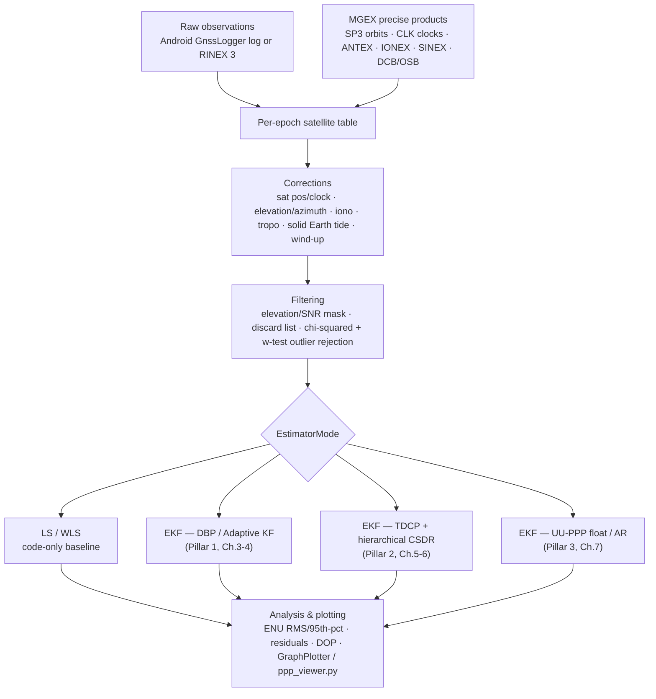

# Architecture

This document maps the thesis's three pillars ([docs/01](01-motivation-and-problem.md)) onto the actual Java packages, entry points, and classes in this repository.

## Package layout

```
com.gnssAug
├── MainApp                     Entry point — six pre-wired RUN scenarios (dataset × receiver × estimator)
├── Android/                    Consumer smartphone pipeline (raw GnssLogger logs)
│   ├── Android                 Dynamic (kinematic) sessions, Google Decimeter Challenge ground truth
│   ├── Android_Static          Static benchmark sessions at a surveyed point
│   ├── Android_Static_Rinex    Static smartphone sessions, parsed as RINEX
│   ├── constants/               EstimatorMode enum, Measurement/State/Flag enums, config
│   ├── estimation/
│   │   ├── KalmanFilter/        EKF/AKF family — Pillars 1 & 2 (see below)
│   │   └── LLS_TDCP*.java       Least-squares TDCP velocity + ambiguity-fixed variant
│   └── fileParser/              GnssLogger log, Decimeter Challenge derived.csv & ground-truth parsers
├── Rinex/                      Geodetic/RINEX pipeline shared by Android_Static_Rinex and IGS
│   ├── estimation/              RINEX EKF, dual-frequency PPP, low-cost-receiver PPP, LS — Pillar 3
│   └── fileParser/              RINEX obs/nav, SP3, CLK, ANTEX, IONEX, SINEX, DCB, OSB parsers
├── IGS/                        IGS/geodetic reference-station pipeline (RINEX + MGEX products)
├── helper/
│   ├── ComputeSatPos, ComputeEleAzm, ComputeIonoCorr,
│   │   ComputeTropoCorr, ComputeSolidEarthTide, ComputeIPP   Physical correction models (docs/08)
│   ├── lambdaNew/                LAMBDA 4.0 (TU Delft) estimators — Pillar 2 repair engine (docs/06)
│   ├── lambda/                   Legacy LAMBDA 3.0-era port (Jama-based); still used for decorrelation
│   └── INS/                      IMU alignment / attitude initialization for GNSS/INS fusion
└── utility/                     Matrix/geodesy/time helpers, weighting, JFreeChart-based plotting

tools/                           Python companions (product download, obs-file extension, diagnostics viewer)
```

## Pillars → code

| Pillar | Thesis chapter | Core algorithm | Primary class(es) |
|---|---|---|---|
| 1a — Robust Dynamics (DBP) | Ch. 3 | Doppler-driven complementary-filter state prediction, automated `Q` | `Android.estimation.KalmanFilter.EKFDoppler`, `EKF` (`Flag.POSITION`/`VELOCITY`) |
| 1b — Adaptive Stochastics (AKF/VCE) | Ch. 4 | Variance Component Estimation with elevation/C-N₀ binning, adapts `R` in real time | `Android.estimation.KalmanFilter.AKFDoppler`, `AKFDoppler_Static` |
| 2a — Cycle Slip Detection | Ch. 5 | Hierarchical hardware-flag + geometry-free + geometry-based detection | `Android.estimation.KalmanFilter.EKF_TDCP_ambFix2`, `EKF_TDCP_ambFix_allEst` |
| 2b — Stochastic Repair (LAMBDA) | Ch. 6 | ILS / IA-FFRT / BIE / PAR / PAR-FFRT integer estimators | `helper.lambdaNew.Estimators.*`, `helper.lambdaNew.LAMBDA` / `LAMBDA_all` |
| 3 — UU-PPP validation | Ch. 7 | Undifferenced-uncombined, ionosphere-constrained PPP with decoupled code/phase clocks | `Rinex.estimation.EKF_PPP`, `Android.estimation.KalmanFilter.EKF_PPP` / `EKF_PPP3` |

`EstimatorMode` (`Android.constants.EstimatorMode`) is the dispatch key tying all of this together — its own section comments literally read `// --- DBP / AKF - thesis Pillar 1 ---`, `// --- EKF TDCP - thesis Pillar 2 ---`, `// --- PPP - thesis Pillar 3 ---`.

| Mode | legacyCode | Pillar | Notes |
|---|---|---|---|
| `LLS_CODE`, `WLS_CODE`, `LLS_WLS_BOTH` | 1–3 | baseline | Single-epoch code-only least squares / weighted LS |
| `GNSS_INS` | 4 | — | Loose GNSS/INS fusion (`INSfusion`) |
| `EKF_POS_RW`, `EKF_VEL_RW`, `EKF_VEL_RW_DOPPLER`, `EKF_VEL_RW_ESTVEL`, `EKF_VEL_RW_ESTVEL_COMP`, `EKF_BASIC_MULTI` | 5–7, 12–13, 9 | baseline | The thesis's PRW / VRW / VRWD conventional filters used as comparison baselines |
| `EKF_DBP`, `AKF_DBP` | 10, 14 | **1** | Doppler-Based Prediction and the proposed Adaptive KF |
| `LLS_TDCP_VEL`, `TDCP_CSDR` | 16, 17 | **2** | TDCP velocity, cycle-slip detect & repair |
| `EKF_TDCP`, `EKF_TDCP_PHASE_RATE`, `EKF_TDCP_DOPPLER_ONLY`, `EKF_TDCP_ALL_ESTIMATORS` | 18–21 | **2** | EKF-based TDCP with LAMBDA cycle-slip repair; `ALL_ESTIMATORS` benchmarks estimators side by side |
| `PPP_FLOAT`, `RINEX_PPP_LOWCOST`, `RINEX_PPP_DF`, `IGS_PPP_FLOAT`, `IGS_PPP_AR` | 22, 105–106, 201–202 | **3** | Undifferenced-uncombined PPP, float and (architecturally) AR |
| `ALL_ANALYSIS` | 11 | — | Runs several sub-modes together for comparative plotting |

## Entry points

Four top-level `posEstimate()` pipelines cover the datasets used across the thesis's chapters:

| Pipeline | Input | Ground truth | Used for |
|---|---|---|---|
| `Android.Android` | Raw `GnssLogger` log + Google Decimeter Challenge `derived.csv` | Per-epoch GT CSV | Kinematic validation (Ch. 3–4 driving/vehicle datasets) |
| `Android.Android_Static` | Raw `GnssLogger` log | Fixed surveyed ECEF | Static smartphone benchmarks (Ch. 4, 6 stationary datasets), Pillar 1–2 dev |
| `Android.Android_Static_Rinex` | RINEX 3 obs (Android RINEX export) | Fixed surveyed ECEF | Static smartphone PPP via the RINEX/`Rinex.estimation` pipeline |
| `IGS.IGS` | RINEX 3 obs + MGEX products | SINEX-derived ARP | Geodetic validation of CSDR with artificial cycle slips (Ch. 7.4, station AJAC) |

## Processing pipeline (all four entry points)



1. **Parse** observations (Android raw log or RINEX 3) and, when enabled, MGEX precise products.
2. **Per epoch**, compute satellite position/clock, elevation/azimuth, and apply corrections (ionosphere, troposphere, solid Earth tide, phase wind-up, relativistic).
3. **Filter** satellites by elevation/SNR mask and a discard list; apply chi-squared/w-test outlier detection.
4. **Estimate** using the selected `EstimatorMode`.
5. **Analyze & plot**: ENU error statistics, residuals/innovations, DOP, ambiguity-fix counts, via `GraphPlotter` or the Python `ppp_viewer.py`.

## Further reading

- [docs/03](03-pillar1-dbp.md) — Pillar 1a: Doppler-Based Prediction
- [docs/04](04-pillar1-akf-vce.md) — Pillar 1b: Adaptive Kalman Filter / VCE
- [docs/05](05-cycle-slip-detection.md) — Pillar 2a: Hierarchical cycle-slip detection
- [docs/06](06-lambda-estimators.md) — Pillar 2b: LAMBDA 4.0 stochastic repair engine
- [docs/07](07-ppp-engine.md) — Pillar 3: UU-PPP engine
- [docs/08](08-corrections-and-models.md) — Physical correction models
- [docs/09](09-file-formats-and-parsers.md) — File formats & parsers
