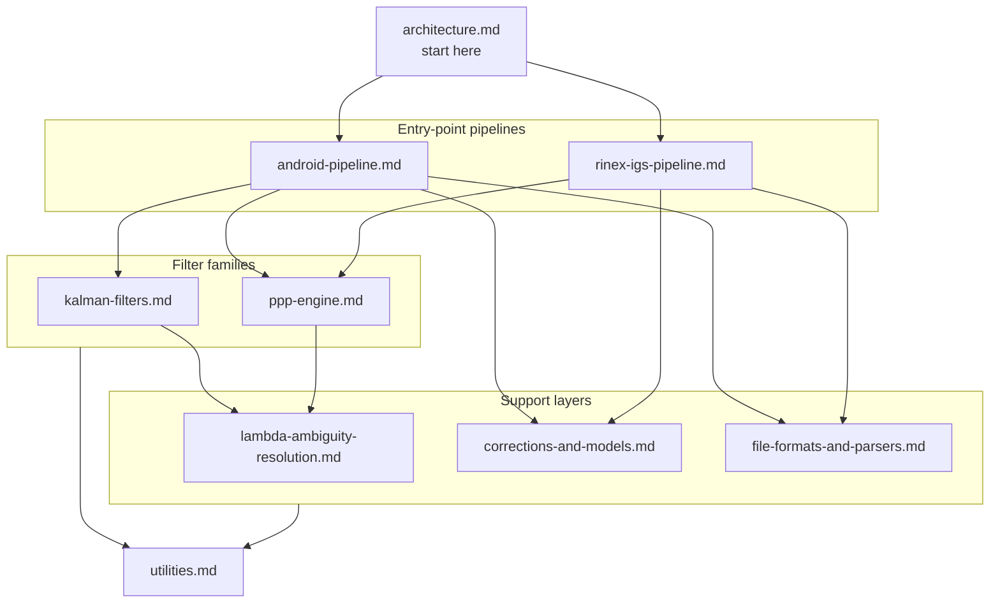

# Documentation

This folder has two tracks, deliberately kept separate so one doesn't rot while the other is maintained.

## Living reference (this folder)

Package-by-package documentation of the codebase **as it exists today**. Present tense, no historical claims, no thesis-chapter framing — this is what gets updated whenever the code changes. Method-level detail is deferred to the generated Javadoc (published at [naman4u13.github.io/gnssAug](https://naman4u13.github.io/gnssAug/)) rather than duplicated here.

| Doc | Covers |
|---|---|
| [architecture.md](architecture.md) | Package layout, the four entry-point pipelines, the `EstimatorMode` dispatch table, the processing pipeline — start here |
| [android-pipeline.md](android-pipeline.md) | `Android.*` — entry points, constants, non-KF estimation, file parsers/models, INS support |
| [kalman-filters.md](kalman-filters.md) | `Android.estimation.KalmanFilter.*` — every EKF/AKF variant except the PPP filters |
| [rinex-igs-pipeline.md](rinex-igs-pipeline.md) | `IGS.*`, non-PPP `Rinex.estimation.*`, IGS/Rinex data models |
| [ppp-engine.md](ppp-engine.md) | The PPP filter family across `Rinex.estimation.*` and `Android.estimation.KalmanFilter.*` |
| [lambda-ambiguity-resolution.md](lambda-ambiguity-resolution.md) | `helper.lambdaNew.*` (LAMBDA 4.0 port) and the legacy `helper.lambda.*` |
| [corrections-and-models.md](corrections-and-models.md) | `helper.Compute*` — satellite position/clock, ionosphere, troposphere, solid Earth tide |
| [file-formats-and-parsers.md](file-formats-and-parsers.md) | Every supported file format and its parser |
| [utilities.md](utilities.md) | `com.gnssAug.utility.*` — linear algebra, geodesy, time, weighting, plotting |

How they relate — the two entry-point pipelines sit on top of two filter families, which in turn draw on three support layers (with `utilities.md` underpinning everything):

## Thesis record ([`thesis/`](thesis/README.md))

The PhD thesis this codebase originally implemented and validated: full motivation, theoretical derivations, and experiment results tied to specific datasets and figures. Frozen as of the thesis defense — read it for the research story and the "why," not as a guide to the current code. Start at [thesis/README.md](thesis/README.md).

## Generated API docs

Method-level Javadoc is generated from source via `mvn javadoc:javadoc` and published to GitHub Pages on every push to `master`: **[naman4u13.github.io/gnssAug](https://naman4u13.github.io/gnssAug/)**. This is the authoritative source for method signatures, parameters, and return values — the living docs above intentionally don't duplicate it.
