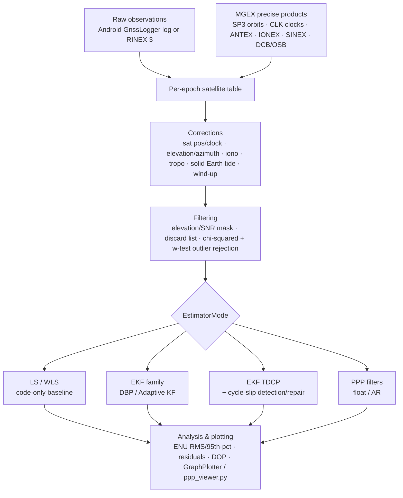

# Architecture

This is the map of the codebase: package layout, the four ways to run a positioning job, and how `EstimatorMode` routes a run to a specific estimator. For the research narrative behind why these pieces exist, see [docs/thesis/](thesis/README.md); for method-level API detail, see the generated Javadoc.

## Package layout

```
com.gnssAug
├── MainApp                     Entry point — six pre-wired RUN scenarios (dataset × receiver × estimator)
├── Android/                    Consumer smartphone pipeline (raw GnssLogger logs)
│   ├── Android                 Dynamic (kinematic) sessions, Google Decimeter Challenge ground truth
│   ├── Android_Static          Static benchmark sessions at a surveyed point
│   ├── Android_Static_Rinex    Static smartphone sessions, parsed as RINEX
│   ├── SingleFreq               Per-epoch satellite table construction shared by the three entry points above
│   ├── constants/                EstimatorMode, Measurement, State, GnssDataConfig, and other enums/config
│   ├── estimation/
│   │   ├── KalmanFilter/          EKF/AKF family — see kalman-filters.md and ppp-engine.md
│   │   └── LLS_TDCP*.java         Least-squares TDCP velocity, and its ambiguity-fixed variant
│   ├── fileParser/                GnssLogger log, Decimeter Challenge derived.csv & ground-truth parsers
│   └── models/                    Satellite, TDCP, CycleSlipDetect, IMUsensor, GNSSLog, Derived
├── Rinex/                      Geodetic/RINEX pipeline shared by Android_Static_Rinex and IGS
│   ├── estimation/                RINEX EKF, PPP filters, LS — see rinex-igs-pipeline.md and ppp-engine.md
│   ├── fileParser/                RINEX obs/nav, SP3, CLK, ANTEX, IONEX, SINEX, DCB, OSB parsers
│   └── models/                    Data records produced by the parsers above
├── IGS/                        IGS/geodetic reference-station pipeline (RINEX + MGEX products)
│   └── models/                    IGSAntenna, IGSClock, IGSOrbit — precise-product records
├── helper/
│   ├── ComputeSatPos, ComputeEleAzm, ComputeIonoCorr,
│   │   ComputeTropoCorr, ComputeSolidEarthTide, ComputeIPP   Physical correction models
│   ├── lambdaNew/                LAMBDA 4.0 (TU Delft) port — active ambiguity/cycle-slip estimators
│   ├── lambda/                   Legacy LAMBDA 3.0-era port — see lambda-ambiguity-resolution.md for current status
│   └── INS/                      IMU alignment / attitude initialization for GNSS/INS fusion
└── utility/                     Matrix/geodesy/time helpers, weighting, JFreeChart-based plotting

tools/                           Python companions (product download, obs-file extension, diagnostics viewer)
```

Living, package-by-package documentation for each of these areas:

| Doc | Covers |
|---|---|
| [android-pipeline.md](android-pipeline.md) | `Android.*` entry points, constants, non-KF estimation, file parsers/models, INS support |
| [kalman-filters.md](kalman-filters.md) | `Android.estimation.KalmanFilter.*` — every EKF/AKF variant except the PPP filters |
| [rinex-igs-pipeline.md](rinex-igs-pipeline.md) | `IGS.*`, `Rinex.estimation.EKF`/`LinearLeastSquare`, IGS/Rinex data models |
| [ppp-engine.md](ppp-engine.md) | The PPP filter family across `Rinex.estimation.*` and `Android.estimation.KalmanFilter.*` |
| [lambda-ambiguity-resolution.md](lambda-ambiguity-resolution.md) | `helper.lambdaNew.*` and the legacy `helper.lambda.*` |
| [corrections-and-models.md](corrections-and-models.md) | `helper.Compute*` physical/geophysical correction models |
| [file-formats-and-parsers.md](file-formats-and-parsers.md) | Every supported file format and its parser |
| [utilities.md](utilities.md) | `com.gnssAug.utility.*` |

## The four entry-point pipelines

| Pipeline | Input | Ground truth | Scenario |
|---|---|---|---|
| `Android.Android` | Raw `GnssLogger` log + Google Decimeter Challenge `derived.csv` | Per-epoch ground-truth CSV | Kinematic (walking/driving) |
| `Android.Android_Static` | Raw `GnssLogger` log | Fixed surveyed ECEF | Static smartphone benchmark |
| `Android.Android_Static_Rinex` | RINEX 3 obs (from an Android RINEX export) | Fixed surveyed ECEF | Static smartphone data via the RINEX/PPP pipeline *(not yet properly validated)* |
| `IGS.IGS` | RINEX 3 obs + MGEX products | SINEX-derived ARP | Geodetic IGS reference station |

`MainApp` selects one of six pre-wired `RUN` scenarios; each owns its own file paths, observable set, and estimator flags, and dispatches into one of the four pipelines above.

> [!WARNING]
> `Android.Android_Static_Rinex` has not been properly validated yet — treat its results cautiously. See [android-pipeline.md](android-pipeline.md#android_static_rinex) and [rinex-igs-pipeline.md](rinex-igs-pipeline.md).

## Processing pipeline (all four entry points)



1. **Parse** observations (Android raw log or RINEX 3) and, when enabled, MGEX precise products.
2. **Per epoch**, compute satellite position/clock, elevation/azimuth, and apply corrections (ionosphere, troposphere, solid Earth tide, phase wind-up, relativistic) — see [corrections-and-models.md](corrections-and-models.md).
3. **Filter** satellites by elevation/SNR mask and a discard list; apply chi-squared/w-test outlier detection.
4. **Estimate** using the selected `EstimatorMode` (table below).
5. **Analyze & plot**: ENU error statistics, residuals/innovations, DOP, ambiguity-fix counts, via `GraphPlotter` or the Python `ppp_viewer.py`.

## `EstimatorMode` dispatch table

`com.gnssAug.Android.constants.EstimatorMode` is the single enum every pipeline dispatches on. Each value carries a `legacyCode` int and the enum exposes predicate methods (`isLLSMode()`, `isBasicEKFMode()`, `isDBPMode()`, `isTDCPMode()`, `isPPPMode()`, `isAnalysisMode()`) used by the pipelines to group related modes.

| Mode | Code | Implementation |
|---|---|---|
| `LLS_CODE`, `WLS_CODE`, `LLS_WLS_BOTH` | 1–3 | Single-epoch (weighted) least squares, code-only |
| `GNSS_INS` | 4 | `INSfusion` — loose GNSS/INS fusion *(under development, not yet functional)* |
| `EKF_POS_RW`, `EKF_VEL_RW`, `EKF_VEL_RW_DOPPLER`, `EKF_VEL_RW_ESTVEL`, `EKF_VEL_RW_ESTVEL_COMP`, `EKF_BASIC_MULTI` | 5–7, 12–13, 9 | `EKF` — PRW / VRW / VRWD conventional filter variants |
| `EKF_DBP`, `AKF_DBP` | 10, 14 | `EKFDoppler`, `AKFDoppler`/`AKFDoppler_Static` |
| `LLS_TDCP_VEL` | 16 | `LLS_TDCP` |
| `TDCP_CSDR` | 17 | `LLS_TDCP_ambFix` *(experimental — built to test a theory, not for reliable use)* |
| `EKF_TDCP`, `EKF_TDCP_PHASE_RATE`, `EKF_TDCP_DOPPLER_ONLY`, `EKF_TDCP_ALL_ESTIMATORS` | 18–21 | `EKF_TDCP_ambFix2`, `EKF_TDCP_ambFix_allEst` *(experimental — built to test the cycle-slip detection/repair theory)* |
| `PPP_FLOAT` | 22 | `Android.estimation.KalmanFilter.EKF_PPP` / `EKF_PPP3` |
| `ALL_ANALYSIS` | 11 | Runs several sub-modes together for comparative plotting |
| `RINEX_EKF_CODE`, `RINEX_PPP_LOWCOST`, `RINEX_PPP_DF` | 104–106 | `Rinex.estimation.EKF`, `EKF_PPP_LowCostRx`, `EKF_PPP_DF` |
| `IGS_PPP_FLOAT` | 201 | `Rinex.estimation.EKF_PPP`, float solution |
| `IGS_PPP_AR` | 202 | `Rinex.estimation.EKF_PPP` with `fixAmb = true` *(not yet validated in any variant — see [ppp-engine.md](ppp-engine.md#ambiguity-resolution))* |

See [kalman-filters.md](kalman-filters.md) and [ppp-engine.md](ppp-engine.md) for what distinguishes each filter's state/measurement model.

> [!NOTE]
> A few modes above are experimental or under active development rather than finished, validated features — the table calls each one out individually, and the corresponding doc section has more detail and a matching callout.

## See also

- [docs/README.md](README.md) — index of the full documentation set, and the living-docs vs. `docs/thesis/` split.
- [docs/thesis/](thesis/README.md) — the PhD thesis this codebase originally implemented: motivation, theory, and validated experiment results.
