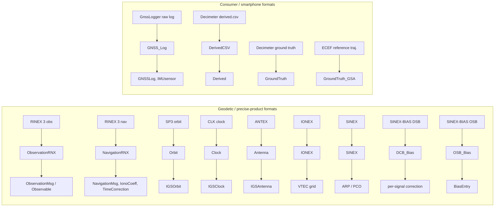

# File Formats and Parsers

Everything this codebase computes starts as a text file on disk. Two families of input are
supported: **geodetic and precise-product formats** (RINEX observation and navigation, SP3
orbits, CLK clocks, ANTEX antenna calibration, IONEX ionosphere maps, SINEX station coordinates,
and SINEX-BIAS code/phase bias files), parsed under `com.gnssAug.Rinex.fileParser` into models in
`com.gnssAug.Rinex.models` and `com.gnssAug.IGS.models`; and **consumer/smartphone formats**
(Android `GnssLogger` raw logs and Google Decimeter Challenge CSVs), parsed under
`com.gnssAug.Android.fileParser` into models in `com.gnssAug.Android.models`. All parsers are
hand-written against the fixed-column or comma-delimited layout of each format — there is no
third-party GNSS format library in the dependency set, only OpenCSV for genuine CSV and Orekit
for ephemerides and Earth models.

## Parser index

| Format | Parser | Produces |
|---|---|---|
| RINEX 3 observation | `Rinex.fileParser.ObservationRNX` | `List<Rinex.models.ObservationMsg>` of `Observable` |
| RINEX 3 navigation | `Rinex.fileParser.NavigationRNX` | `NavigationMsg`, `IonoCoeff`, `TimeCorrection` |
| SP3 (precise orbit) | `Rinex.fileParser.Orbit` | `IGS.models.IGSOrbit` time series |
| CLK (precise clock) | `Rinex.fileParser.Clock` | `IGS.models.IGSClock` time series |
| ANTEX (antenna PCO/PCV) | `Rinex.fileParser.Antenna` | `IGS.models.IGSAntenna`, via an intermediate CSV |
| IONEX (global ionosphere map) | `Rinex.fileParser.IONEX` | Internal VTEC grid + slant delay accessor |
| SINEX (station solution) | `Rinex.fileParser.SINEX` | ARP position, per-frequency PCO, antenna type |
| SINEX-BIAS DSB records | `Rinex.fileParser.DCB_Bias` | Per-PRN inter-signal correction lookup |
| SINEX-BIAS OSB records | `Rinex.fileParser.OSB_Bias` | Per-PRN/per-signal bias with validity windows |
| Android `GnssLogger` raw log | `Android.fileParser.GNSS_Log` | `Android.models.GNSSLog`, `IMUsensor` |
| Decimeter Challenge `derived.csv` | `Android.fileParser.DerivedCSV` | `Android.models.Derived` |
| Decimeter Challenge ground truth | `Android.fileParser.GroundTruth` | `[GPStime, week, lat, lon, alt, vel]` rows |
| ECEF reference trajectory | `Android.fileParser.GroundTruth_GSA` | `[GPStime, week, x, y, z]` rows |

## Data model index

| Model | Represents |
|---|---|
| `Rinex.models.ObservationMsg` | One observation epoch: timestamp, GPS time/week, and all satellites' observables |
| `Rinex.models.Observable` | One signal from one satellite: pseudorange, phase, Doppler, C/N₀, frequency, lock state |
| `Rinex.models.Satellite` | An `Observable` enriched with satellite position/velocity/clock, elevation/azimuth, and applied corrections |
| `Rinex.models.NavigationMsg` | One broadcast ephemeris record (Keplerian elements, clock polynomial, TGD, health) |
| `Rinex.models.IonoCoeff` | The eight Klobuchar alpha/beta coefficients |
| `Rinex.models.TimeCorrection` | GPS↔UTC polynomial and leap-second count |
| `Rinex.models.SatResidual` | Per-satellite post-fit residual with elevation, C/N₀, σ, and outlier flag |
| `IGS.models.IGSOrbit` | One SP3 epoch: constellation → PRN → `[x, y, z, clockOffset]` |
| `IGS.models.IGSClock` | One CLK epoch: constellation → PRN → clock bias |
| `IGS.models.IGSAntenna` | One ANTEX calibration block: offsets, PCV grids, validity window |
| `Android.models.GNSSLog` | One `Raw` line from an Android GnssLogger log, with ADR-state bit helpers |
| `Android.models.Derived` | One row of a Decimeter Challenge `derived.csv` |

## Geodetic and precise-product formats

### RINEX 3 observation — `ObservationRNX`

`rinex_obsv_process(path, useSNX, sinexPath, obsvCode, phaseReq, dopplerReq)` is a single static
call that returns a `HashMap<String, Object>` containing the epoch list, the observation interval,
the antenna reference point, and per-frequency phase center offsets. The `Object` map is the
codebase's idiom for returning heterogeneous results from a parser; callers pull known keys
(`"ObsvMsgs"`, `"interval"`, `"ARP"`, `"PCO"`).

The header pass extracts the marker name, approximate position, observation interval, and — most
importantly — the `SYS / # / OBS TYPES` block, which is flattened into a per-constellation
`observationCode → columnIndex` map. Body parsing then splits each data line into fixed 16-character
fields and, for every available `C<band><attribute>` code, pulls the matching `L`, `D`, and `S`
columns to assemble one `Observable`.

Two behaviours are worth knowing:

- **Requirements are enforced at parse time.** If `phaseReq` or `dopplerReq` is set and the
  corresponding column is missing or blank, a `null` is inserted into the observable list rather
  than a partial `Observable`. Downstream code checks for these nulls; they carry the information
  that a satellite was tracked but unusable on that signal.
- **Position source depends on `useSNX`.** With `useSNX` false, the ARP comes from the RINEX
  `APPROX POSITION XYZ` header (which is the monument marker, not the ARP, and carries zero PCO).
  With it true, `SINEX.sinex_process` supplies a properly reduced ARP and per-frequency PCO.
  For precise work you want the SINEX path.

Observables are keyed by a three-level map: constellation character → frequency band ID → code
attribute character. `ObservationMsg.getObsvSat(obsvCode)` flattens that back into a list for a
given signal string such as `"G1C"`.

### RINEX 3 navigation — `NavigationRNX`

`rinex_nav_process(path, getIonoOnly)` reads the header for `IONOSPHERIC CORR` (GPSA/GPSB
Klobuchar coefficients), `TIME SYSTEM CORR` (GPUT), and `LEAP SECONDS`, then parses eight-line
GPS ephemeris records into `NavigationMsg` objects, grouped by PRN and sorted by time of clock.

The `getIonoOnly` flag short-circuits after reading the Klobuchar coefficients. This exists
because when precise products are in use the ephemeris body is not needed at all — only the
ionosphere coefficients as a fallback — and skipping the body parse on a multi-constellation
broadcast file is a meaningful saving.

> [!WARNING]
> **Body parsing is GPS-only** — it breaks out of the loop at the first non-`G` record. Don't
> expect `NavigationRNX` to return Galileo/BeiDou ephemerides from a mixed broadcast file, only
> the header-level Klobuchar coefficients.

Numeric field splitting goes through `utility.SymbolToken.split`, which handles the RINEX quirk
of adjacent fixed-width Fortran-formatted numbers running together when a negative exponent
consumes the separating space.

### SP3 precise orbits — `Orbit`

The constructor parses the whole file into a chronological `ArrayList<IGSOrbit>`, each holding
one epoch's constellation → PRN → `[x, y, z, clockOffset]` map with positions converted from
kilometres to metres and clock offsets from microseconds to seconds. Both SP3-c and SP3-d headers
are handled (they differ in satellite-count column positions and header length; the `d` branch
scans forward to the first `*` epoch line rather than assuming a fixed header size). Records with
any zero coordinate are skipped as missing data.

Interpolation is a deliberate two-call sequence: `findPts(t, n)` selects an `n`-point window
around the requested time, then `getPV(t, PRN, n, constellation)` runs `Interpolator.lagrange`
per coordinate and returns both the interpolated position and its analytic derivative — the
satellite velocity — as a `double[2][3]`. Splitting window selection from evaluation lets a caller
locate the window once per epoch and then evaluate it for every satellite. `getPV` returns `null`
if the requested PRN is missing from any epoch in the window.

> [!WARNING]
> The window selection clamps at both ends of the file, so requesting a time past the last epoch
> **extrapolates** from the final `n` points rather than failing. Be aware of that when a session
> straddles a day boundary — load the adjacent day's product rather than relying on extrapolation.

### CLK precise clocks — `Clock`

Structurally parallel to `Orbit`, but with two differences. First, clock records are interpolated
**linearly** between the two bracketing epochs (satellite clocks are not smooth enough for
polynomial interpolation to help), with drift taken as the slope of that same segment. Second,
`Clock` owns the DCB correction: the constructor takes a `DCB_Bias`, and
`getBiasAndDrift(t, PRN, obsvCode, applyDCB)` folds the appropriate inter-signal correction into
the returned clock bias so that a pseudorange on any supported signal becomes consistent with the
precise clock's reference combination. That per-constellation logic — GPS TGD/ISC via the
L1/L2 frequency ratio, Galileo BGD, BeiDou's B1I/B3I-referenced chain — lives here rather than in
`DCB_Bias` because it is a property of how clocks are referenced, not of the bias file.

Both RINEX CLK 2.x and 3.x record layouts are supported via a record-format array chosen from the
header version. Only `AS` (satellite) records are read; `AR` (receiver) records are skipped.

### ANTEX antenna calibration — `Antenna`

`Antenna` does not parse ANTEX at runtime. `buildCSV(atxPath, csvPath)` is a one-time offline
utility that flattens an IGS ANTEX file (currently `igs20.atx`) into a row-per-(antenna,
frequency) CSV; the runtime constructor `new Antenna(csvPath)` reads that CSV. The CSV is
ordered satellite rows first (`TYPE = 'S'`), then receiver rows (`'R'`), and the loader uses
that ordering as an early-exit sentinel.

> [!NOTE]
> Re-run `buildCSV` whenever the ANTEX file is updated — the runtime path never re-reads the
> `.atx` file itself, so an ANTEX update silently has no effect until the CSV is rebuilt.

Beyond parsing, this class provides the two corrections described in
[corrections-and-models.md](corrections-and-models.md#antenna-phase-center-and-phase-wind-up):
PCO-corrected satellite phase center position, and carrier-phase wind-up. Both come back from a
single `getSatPC_windup(...)` call returning `double[4]` — three position components plus the
wind-up in metres.

> [!WARNING]
> **Eclipse exclusion is the behaviour most likely to surprise a new caller.** During Earth umbra
> passage or a noon/midnight yaw singularity, the nominal yaw-steering body frame no longer
> describes the satellite's real attitude, so both the PCO rotation and the wind-up become
> meaningless. `getSatPC_windup` returns `null` for the eclipse duration plus a 30-minute recovery
> window (Kouba 2009), tracked per satellite in `eclipseExitMap`/`prevInEclipseMap`. A `null`
> return means *drop this satellite for this epoch and delete its stored wind-up value* — carrying
> the stale value across the gap injects a phase discontinuity that cycle-slip detection will flag
> as a real slip. Umbra detection uses a cylindrical (point-source Sun) shadow model, which
> slightly over-estimates the umbra edge; that is conservative and intentional. Penumbra is not
> detected.

Receiver antennas are handled separately by `getRxPCO_ENU(antennaTypeKey, ssi, freq)`, which
returns `[E, N, U]` in metres, or `null` when the antenna model is absent from the ANTEX file —
giving callers a chance to fall back rather than silently using zero.

### IONEX global ionosphere maps — `IONEX`

The constructor reads the header for map interval, base radius, shell height, latitude/longitude
grid spacing, and the TEC exponent, then loads every TEC map into a `double[epoch][lat][lon]`
array. Only single-shell (2D) maps are supported — a non-zero `DHGT` throws, since the
interpolation and the thin-shell pierce-point geometry both assume constant height. Poles are
padded with zero-valued rows so that latitude interpolation never runs off the end of the grid.

`computeIonoCorr(elev, azm, lat, lon, gpsTime, freq, time)` is the public entry point: it computes
the pierce point via `helper.ComputeIPP`, interpolates VTEC, applies the thin-shell obliquity
factor, and converts slant TEC to metres of delay at the requested frequency. The interpolation is
bilinear in latitude/longitude and linear in time between the two bracketing maps, with each map's
longitude shifted by the Sun-fixed rotation rate — the standard treatment that avoids the
artificial "map jump" a naive time interpolation produces. `printMap()` dumps the parsed grid in
IONEX-like layout, useful for verifying a parse against the source file.

### SINEX station solutions — `SINEX`

`sinex_process(path, siteCode, obsvCode)` walks the `+SITE/ANTENNA`, `+SITE/GPS_PHASE_CENTER`,
`+SITE/ECCENTRICITY`, and `+SOLUTION/ESTIMATE` blocks for one site and returns the reduced
antenna reference point in ECEF, per-observable phase center offsets in ECEF, and the antenna type
string. The reduction chain is: estimated monument marker coordinates (`STAX`/`STAY`/`STAZ`)
→ apply the eccentricity vector to get the ARP → apply the L1/L2 phase center offsets to get the
antenna phase center, with the returned PCO expressed as the ECEF difference from the ARP. All
ENU→ECEF transforms go through `utility.LatLonUtil.enu2ecef`.

Observables with no matching phase center entry get a zero PCO rather than an error, so a request
for a frequency the SINEX file does not cover degrades to "no offset applied".

### Code and phase biases — `DCB_Bias` and `OSB_Bias`

Both read SINEX-BIAS files (`.BSX`/`.BIA`) but serve different purposes, and which one you have
determines what the PPP engine can do.

**`DCB_Bias`** reads `DSB` (differential signal bias) records for satellites, ignoring
station-specific rows. Because DCBs are inherently differential — a bias *between* two signals —
GPS entries are assembled into a per-PRN bias matrix and then resolved into a consistent set of
biases referenced to `C1W` by `computeAllGPSBias`. `getISC(obsvCode, PRN)` returns the resulting
per-signal correction. Galileo and BeiDou are handled by explicit lookup chains rather than the
matrix approach, walking from the file's reference pair to the requested signal; the BeiDou path
in particular composes several hops through B1I/B3I. Adding a signal means adding it to
`GPSindexMap` (for GPS) and extending the matrix resolution, or adding a branch to the
constellation chain.

**`OSB_Bias`** reads `OSB` (observable-specific bias) records, keeping only satellite entries
(empty station, empty second observable). Each entry is a `BiasEntry` with a validity window, a
value, a standard deviation, and a unit, and lookups are time-filtered against that window.
`getOSBMeters(ssi, signal, PRN, gpsTime, wavelength)` normalises the unit: nanosecond biases scale
by the speed of light, cycle biases by the supplied wavelength. Missing entries return `0.0`
rather than throwing.

The practical distinction: DCBs cover **code** only and make pseudoranges consistent with precise
clocks. OSBs additionally cover **phase**, which is what makes carrier-phase ambiguities
integer-valued and therefore resolvable. See [ppp-engine.md](ppp-engine.md) and
[lambda-ambiguity-resolution.md](lambda-ambiguity-resolution.md).

### Product file naming

Precise products follow the IGS long-filename MGEX convention
(`AGENCY_TYPE_YYYYDDD0000_01D_RES_TYPE.EXT`); `MainApp.pDir()` resolves the per-year/day-of-year
directory from a configured base path, and `tools/download_igs_products.py` fetches a matching set
(orbits, clocks, bias, IONEX, SINEX, broadcast navigation) for a given observation file.

## Consumer and smartphone formats

### Android raw log — `GNSS_Log`

An Android `GnssLogger` log interleaves several record types on `#`-prefixed section markers.
`GNSS_Log.process(path)` reads the final section and dispatches per line: `Raw` lines become
`GNSSLog` objects, and `UncalAccel` / `UncalGyro` / `UncalMag` lines become `IMUsensor` objects.
Results land in two static fields retrieved via `getGnssLogMaps()` (a `TreeMap` keyed by receiver
time in milliseconds, then by observation code, holding the satellite list) and `getImuList()`.

> [!WARNING]
> The parser is static and stateful — calling `process` twice replaces the previous results.
> That's fine for the single-session entry points but worth knowing before parallelising
> anything.

IMU timestamps arrive as device boot-relative nanoseconds. The parser establishes a boot-to-GPS
time origin from the first `Raw` record's `bootGPStime` and then rebases every IMU sample onto it,
warning on `stderr` if a later record implies an inconsistent origin. The IMU list is sorted by
corrected time at the end of the parse.

`GNSSLog` itself is the widest data model in the codebase, mirroring the full Android
`GnssMeasurement` field set, and it maps Android's numeric constellation and carrier-frequency
identifiers onto the codebase's `"G1C"`-style observation codes (including a QZSS PRN remap).
Its most consequential members are the **ADR (Accumulated Delta Range) state** bit constants and
their accessors — `isAdrStateValid`, `isAdrStateReset`, `isAdrStateCycleSlip`,
`isAdrStateHalfCycleResolved`, `isAdrStateHalfCycleReported`. These are the hardware's own report
of carrier-phase continuity, parsed here and consumed by the cycle-slip framework; see
[android-pipeline.md](android-pipeline.md).

### Decimeter Challenge derived CSV — `DerivedCSV`

`processCSV(path)` returns a `HashMap` keyed by receiver time (milliseconds) → observation code →
PRN → `Derived`. Each `Derived` holds the satellite position and velocity, clock bias and drift,
raw pseudorange with its uncertainty, the inter-signal range bias, and the challenge organisers'
own ionosphere and troposphere delay estimates — that is, a set of corrections computed
independently of this codebase's own models, which makes this file useful as a cross-check.

Two mapping tables live here: `codeMap` translates the challenge's signal names
(`GPS_L1`, `GAL_E5A`, `BDS_B1I`, …) into the codebase's observation codes, and `QZSSprn` remaps
QZSS PRNs into small indices. Adding a signal to a run means adding it to `codeMap`.

Receiver time is reconstructed from the satellite transmission time plus the light-time implied by
the raw pseudorange, then rounded to milliseconds so it aligns with the key used by `GNSS_Log`.

### Ground truth — `GroundTruth` and `GroundTruth_GSA`

Two small parsers for two reference-trajectory conventions. `GroundTruth.processCSV` reads the
Decimeter Challenge geodetic format and returns `[GPStime, weekNo, lat, lon, alt, velocity]` rows.
`GroundTruth_GSA.processCSV` reads a whitespace-delimited ECEF format (skipping two header lines)
and returns `[GPStime, weekNo, x, y, z]`. The entry points pick between them by configuration —
they are not interchangeable, and the column meanings differ.

## Which entry point reads what

| Entry point | Observations | Precise products | Reference |
|---|---|---|---|
| `IGS.IGS` | RINEX 3 obs + nav | SP3, CLK, ANTEX, IONEX, DCB/OSB, SINEX | SINEX ARP |
| `Android.Android` | Android raw log (+ optional `derived.csv`) | SP3, CLK, ANTEX, IONEX, DCB | `GroundTruth` or `GroundTruth_GSA` |
| `Android.Android_Static_Rinex` | RINEX 3 obs + nav (Android RINEX export) | SP3, CLK, ANTEX, IONEX, DCB/OSB | configured |

## Extending this

- **To support a new precise-product format**, add a parser class under `Rinex/fileParser/`
  following the pattern of `Orbit` and `Clock`: parse the whole file in the constructor into a
  time-ordered list of per-epoch model objects in `IGS/models/`, then expose a `findPts(t)` plus
  a `get…(t, PRN, …)` pair so callers can locate the interpolation window once per epoch and
  evaluate it per satellite. Reuse `utility.StringUtil.splitter` for fixed-column layouts and
  `utility.Interpolator` for evaluation.
- **To support a new observation format**, follow `ObservationRNX`: produce
  `Rinex.models.ObservationMsg` objects holding `Observable` instances. Everything downstream of
  the parsers — `SingleFreq`, `filterSat`, all the estimators — is written against `Observable`
  and `Satellite`, so a new format that produces those types needs no changes anywhere else.
- **To add a signal or constellation**, the touch points are
  `Android.constants.Constellation` (frequency table), `DerivedCSV.codeMap` and
  `GNSSLog`'s frequency/constellation maps (Android side), `DCB_Bias.GPSindexMap` and the
  constellation branches in `DCB_Bias.getISC` / `Clock.getBiasAndDrift` (bias side), and the
  ANTEX CSV rebuild if the signal has its own calibration.
- **To add a bias source**, model it on `OSB_Bias` rather than `DCB_Bias` — the validity-window
  plus explicit-unit design handles more cases and does not require the matrix resolution step.
- **A note on error handling**: parsers throw a wrapped `Exception` with the file type named,
  and there is no partial-parse recovery. If you add a parser, keep that convention — a
  half-parsed product file is far worse than a failed run.

## See also

- [corrections-and-models.md](corrections-and-models.md) — the physical models that consume these
  products
- [rinex-igs-pipeline.md](rinex-igs-pipeline.md) — how `IGS.IGS` wires the parsers together
- [android-pipeline.md](android-pipeline.md) — the smartphone path and ADR-state consumption
- [ppp-engine.md](ppp-engine.md) — why DCB versus OSB availability changes what the filter can do
- [utilities.md](utilities.md) — `StringUtil`, `Time`, `Interpolator`, and the other helpers every
  parser here depends on
- [architecture.md](architecture.md) — package layout and data flow overview
- [thesis/09-file-formats-and-parsers.md](thesis/09-file-formats-and-parsers.md) — the
  research-track treatment of the same formats
