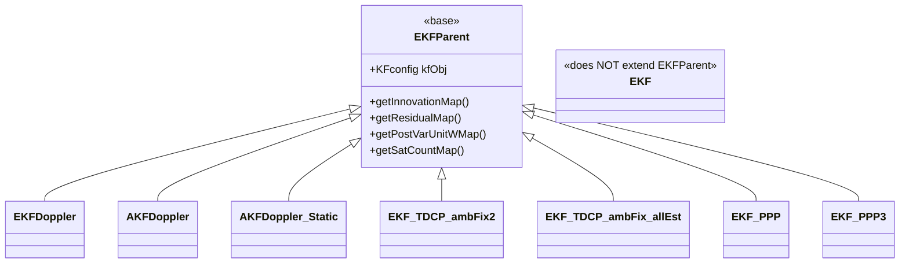
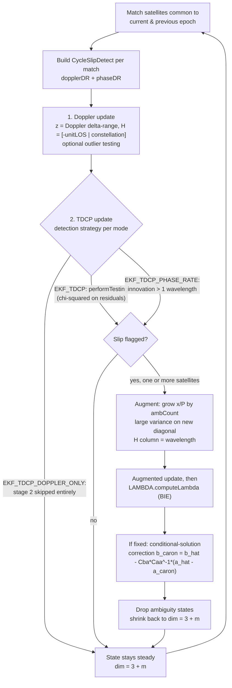

# Kalman Filters

`com.gnssAug.Android.estimation.KalmanFilter` holds the recursive estimators that turn a
time series of `Satellite` observations into a filtered position or velocity trajectory.
The package is a family rather than a hierarchy: a shared linear-algebra core
(`Models.KF`) provides predict/update, `Models.KFconfig` builds the process model for each
filter's state layout, and each concrete filter contributes its own measurement model,
initialisation, statistical testing, and analysis bookkeeping. `EKFParent` supplies the
diagnostic maps that the drivers read after a run. The PPP filters in this package
(`EKF_PPP`, `EKF_PPP3`, `PPPStateLayout`) are documented separately in
[ppp-engine.md](ppp-engine.md).

*All non-PPP filters except `EKF` extend `EKFParent` directly — it's a flat hierarchy, not a deep one. `EKF_PPP`/`EKF_PPP3` are documented in [ppp-engine.md](ppp-engine.md). `INSfusion` also sits outside this hierarchy (see below).*

## Classes

| Class | Responsibility |
| --- | --- |
| `EKFParent` | Base class holding the `KFconfig` instance and the per-epoch diagnostic maps (innovation, residual, covariance, satellite counts) exposed to callers. |
| `EKF` | Single-point-positioning filter over pseudorange (and optionally Doppler), with selectable constant-position or constant-velocity kinematics. |
| `EKFDoppler` | Doppler-based propagation (DBP) position filter: state is propagated by an independent Doppler velocity solution, pseudorange supplies the update. |
| `AKFDoppler` | `EKFDoppler` plus adaptive measurement-noise estimation from residuals binned by elevation and C/N0. |
| `AKFDoppler_Static` | Static-receiver counterpart of `AKFDoppler`: same adaptation, no velocity propagation. |
| `EKF_TDCP_ambFix2` | Velocity/delta-position filter fusing Doppler and time-differenced carrier phase, with cycle-slip detection and LAMBDA-based repair. |
| `EKF_TDCP_ambFix_allEst` | Variant of the above that resolves each slip with every LAMBDA estimator in parallel and records their comparative repair statistics. |
| `INSfusion` | 17-state GNSS/INS loosely-coupled error-state filter driven by accelerometer, gyroscope and magnetometer samples. |
| `Models.KF` | The filter mechanics: `predict`, `update` (Joseph form), and accessors for state, covariance, gain and innovation covariance. |
| `Models.KFconfig` | Builds the transition matrix and process-noise covariance for each filter's state layout; extends `KF`. |
| `Models.Flag` | Enum selecting `EKF`'s kinematic model (`POSITION`, `VELOCITY`, `ACCELERATION`). |
| `Models.State` | Total-state container for `INSfusion` (position, velocity, DCM, accelerometer/gyro bias, receiver clock). |
| `Models.Covariance` | Diagonal 15×15 covariance holder with named accessors for the INS state blocks. Currently unreferenced. |

## Shared foundations

### `Models.KF`

The numerical core, and deliberately small. It stores `phi`, `Q`, `x`, `P`, the Kalman gain
`K` and the innovation covariance `Cvv` as EJML `SimpleMatrix` objects. `predict()` applies
`x = phi·x`, `P = phi·P·phiᵀ + Q`. `update()` computes the gain, applies the state
correction, and propagates the covariance in **Joseph form**
(`P = (I−KH)·P·(I−KH)ᵀ + K·R·Kᵀ`) rather than the shorter `(I−KH)P`, to keep `P` positive
definite over long runs. Update is overloaded for `double[][]` and `SimpleMatrix` arguments,
all funnelling into the `SimpleMatrix` version.

`KF` knows nothing about GNSS. Everything domain-specific lives in `KFconfig` and the
filters.

### `Models.KFconfig`

`KFconfig extends KF`, so each filter holds exactly one object that is both its process-model
builder and its filter instance — the `configXxx(...)` call and the subsequent `predict()`
are made on the same reference. Each `configXxx` method assembles `phi` and `Q` for one
specific state layout and pushes them into the parent via `KF.configure`.

Two conventions run through all of them:

- **Process noise is built in ENU and rotated to ECEF** using
  `LatLonUtil.getEnu2EcefRotMat`, because the physically meaningful noise split is
  horizontal versus vertical, not X/Y/Z. Filters that need this pass a reference position.
- **Clock process noise comes from the two-state Allan-variance model** (`sf` for white
  frequency noise, `sg` for random-walk frequency noise), with coefficients from
  `constants.ClockAllanVar` sized for a smartphone TCXO.

The methods and their state layouts:

| Method | State layout | Used by |
| --- | --- | --- |
| `config` | `[pos(3) \| clk(m) \| clkDrift(m)]` or `[pos(3) \| clk(m) \| vel(3) \| clkDrift(m)]` | `EKF` |
| `configIGS` | `[pos(3) \| clk(m) \| clkDrift(m)]`, geodetic-oscillator noise | IGS SPP path |
| `configDoppler` | `[pos(3) \| clk(m)]`, `Q` derived from the previous epoch's velocity covariance | `EKFDoppler`, `AKFDoppler` |
| `configAKFStatic` | `[pos(3) \| clk(m)]`, near-zero position random walk | `AKFDoppler_Static` |
| `configTDCP` | `[vel(3) \| Doppler drift(m) \| TDCP drift(m)]` | `EKF_TDCP_ambFix2`, `EKF_TDCP_ambFix_allEst` |
| `configPPP_IGS`, `configPPP_Android` | see [ppp-engine.md](ppp-engine.md) | PPP filters |

`configTDCP` is worth noting for a design decision that is easy to miss: within each clock
drift group, index 0 (the base oscillator drift) carries high process noise so the filter can
track TCXO frequency jumps, while indices 1+ (inter-system bias drifts) carry low process
noise, reflecting that ISBs vary slowly with temperature rather than jumping.

### `EKFParent`

A thin base class, not an abstract algorithm. It declares the `KFconfig kfObj` field, the
speed of light, the working `innovation` arrays, and a set of `TreeMap`s keyed by epoch
time — innovation, residual, measurement noise, posterior variance of unit weight, posterior
error covariance, satellite count, satellite list — plus a redundancy list, all exposed
through getters. The drivers populate their plots and error statistics entirely from these
getters, so a new filter that extends `EKFParent` and fills the maps under `doAnalyze` gets
the whole analysis pipeline for free.

`EKFDoppler`, `AKFDoppler`, `AKFDoppler_Static`, `EKF_TDCP_ambFix2`, `EKF_TDCP_ambFix_allEst`
and the PPP filters extend it.

> [!NOTE]
> **`EKF` does not extend `EKFParent`.** It was the first Kalman filter written in this
> codebase and predates `EKFParent`, keeping its own maps keyed by `(time, Measurement)` and
> `(time, State)` because it can estimate from two measurement types simultaneously (position
> and velocity, pseudorange and Doppler), which the flat `EKFParent` maps cannot express.
> Despite predating the later blueprint, `EKF` is a solid, actively-used SPP filter, not a
> deprecated one — a future refactor is planned to bring it in line with `EKFParent`, but
> until then, don't assume every filter in this package shares the `EKFParent`
> diagnostic-map contract without checking.

### `Models.State`, `Models.Covariance`, `Models.Flag`

`State` is the total-state container for `INSfusion` only: position, velocity, a
`SimpleMatrix` DCM, accelerometer and gyroscope bias triplets, and a two-element receiver
clock (offset, drift). It exists because the INS filter separates a nonlinear *total* state
from the linear *error* state it actually filters, and the total state needs somewhere to
live between epochs.

`Covariance` is a diagonal 15×15 matrix with named getters/setters for the INS blocks
(position, velocity, attitude, accelerometer bias, gyro bias).

> [!WARNING]
> **`Models.Covariance` is dead code.** It is currently referenced nowhere — `INSfusion`
> builds its 17×17 `P` directly, having grown two clock states beyond what `Covariance`
> models. Don't assume it reflects the live INS state layout; either extend it to 17 states
> or delete it.

> [!NOTE]
> `Flag` selects `EKF`'s kinematic model. Only `POSITION` and `VELOCITY` are handled —
> `ACCELERATION` is declared but not implemented.

## The filters

### `EKF`

The general-purpose SPP filter, reached through the `isBasicEKFMode()` family
(`EKF_POS_RW`, `EKF_VEL_RW`, `EKF_VEL_RW_DOPPLER`, `EKF_VEL_RW_ESTVEL`,
`EKF_VEL_RW_ESTVEL_COMP`, `EKF_BASIC_MULTI`). State dimension depends on `Flag`: `3 + 2m`
for `POSITION`, `6 + 2m` for `VELOCITY`, where `m` is the number of observation codes (one
clock offset and one drift per code). Position is initialised from a first-epoch WLS
solution via `LinearLeastSquare`; other states get a large a-priori variance.

Its behaviour is controlled by three orthogonal booleans that the driver sets from the mode:

- `useDoppler` — appends Doppler observations to the pseudorange measurement vector,
  doubling the measurement dimension.
- `useEstVel` — instead of raw Doppler, feeds a *pre-computed* LS velocity solution and its
  covariance in as a pseudo-measurement on the velocity states.
- `complementary` — treats the incoming velocity as near-perfect and injects high process
  noise on the velocity sub-states rather than integrating kinematics; when combined with
  `useEstVel` the filter also zeroes the cross-covariance between the position and velocity
  blocks after prediction, keeping the two halves independent.

`getJacobian` builds `H` for whichever combination is active. `performTesting` implements
innovation-based outlier detection with a chi-squared threshold, and `performAnalysis`
records residuals, redundancy and covariance per `Measurement`.

### `EKFDoppler`

The Doppler-based propagation (DBP) filter. The idea that distinguishes it from `EKF` is
that velocity is *not* a filter state. Instead the state is `[pos(3) | clk(m)]`
(dimension `3 + m`), and each epoch `predictTotalState` computes an independent WLS velocity
solution from that epoch's Doppler observations, averages it with the previous epoch's, and
integrates it to move the total state forward. The velocity solution's posterior covariance
`Cxx_dot_hat` — likewise averaged across the two epochs — becomes the process noise for the
position block via `KFconfig.configDoppler`. The filter is therefore self-tuning in `Q`:
epochs with poor Doppler geometry automatically get a larger position process noise.

It is a **complementary (error-state) filter**. The total state `X` is propagated outside the
Kalman recursion; the filter estimates only the *error* in that total state, so the predicted
error state is zero, the estimated measurement `ze` is zero, and the measurement `z` is the
pseudorange minus the pseudorange predicted from the total state. This is why `runFilter`
builds `z` as a difference and leaves `ze` as zeros.

Measurement noise defaults to the elevation/C-N0 weighting from `utility.Weight` scaled by
`GnssDataConfig.pseudorange_priorVarOfUnitW`. An alternative that uses the Android-reported
`ReceivedSvTimeUncertaintyNanos` is present behind a local `useAndroidW` flag. Selected by
`EstimatorMode.EKF_DBP`; theory and validation background in
[thesis/03-pillar1-dbp.md](thesis/03-pillar1-dbp.md).

### `AKFDoppler`

`AKFDoppler` is `EKFDoppler` with one addition: adaptive estimation of the measurement noise
matrix `R`. Everything else — state layout, complementary formulation, Doppler propagation,
`configDoppler` process model — is the same, and the two classes are near-identical line for
line. They are separate classes rather than a flag on one class, so the two can be run
side by side in `ALL_ANALYSIS` mode.

The adaptation lives in `adapt()`, called after the update step when `isAdapt` is set. It
uses a variance-component-estimation style ratio: for each satellite it accumulates the
squared post-fit residual and the corresponding redundancy number (the diagonal of
`I − H·K`), and the adapted variance is the ratio of their sums. Samples are pooled into bins
indexed by observation code, elevation (5° bins, 18 of them) and C/N0 (5 dB bins, 10 of
them), on the premise that satellites in the same geometry/signal-quality cell share noise
characteristics. Each bin keeps a sliding window of the last 10 samples and needs at least 5
before it adapts; below that threshold the a-priori `R` entry is left alone. A parallel
`adaptVarMapCont` records the same samples plus the applied variance for offline inspection.

Selected by `EstimatorMode.AKF_DBP`; theory and validation background in
[thesis/04-pillar1-akf-vce.md](thesis/04-pillar1-akf-vce.md).

### `AKFDoppler_Static`

The static-receiver form of `AKFDoppler`. It keeps the identical `adapt()` binning logic and
the same `[pos(3) | clk(m)]` state, but drops `predictTotalState` entirely — there is no
`prevVel`, no Doppler velocity solution, and no integration step. Prediction instead uses
`KFconfig.configAKFStatic`, which models position as a near-static random walk with tiny ENU
process noise and applies clock noise without the position/drift cross-coupling term used in
`config`. `Android_Static` substitutes this class for `AKFDoppler` when the mode is
`AKF_DBP`.

### `EKF_TDCP_ambFix2`

> [!WARNING]
> Experimental — built to test the cycle-slip detection/repair theory, not a finished
> production filter. Reached through `EstimatorMode.EKF_TDCP` / `EKF_TDCP_PHASE_RATE` /
> `EKF_TDCP_DOPPLER_ONLY`.

The most involved of the non-PPP filters, and the one that carries the cycle-slip detection
and repair logic. Its state is `[vel(3) | Doppler drift(m) | TDCP drift(m)]` where `m` is the
number of *constellations* (derived from the first character of each observation code and
deduplicated into an ordered set), not the number of observation codes — different signals
from the same constellation share a clock drift state.

Each epoch it matches satellites common to the current and previous epoch and builds a
`CycleSlipDetect` per match, carrying two independent estimates of the same delta range: one
from averaged Doppler (`dopplerDR`, corrected for troposphere and ionosphere rate) and one
from differenced carrier phase (`phaseDR`). `runFilter` then performs **two sequential
updates** on the same state:

1. **Doppler update.** `z` is the Doppler delta range minus the satellite-motion correction,
   `H` is `[−unitLOS | constellation indicator]`. Optional innovation testing removes
   outliers. This gives a robust but noisy velocity.
2. **TDCP update.** The same geometry with the phase delta range as `z`. Because the phase
   observation is precise but ambiguous, this stage is where slips must be caught.

Cycle-slip detection has two selectable strategies, chosen by the `innPhaseRate` flag which
the driver derives from the mode:

- `EKF_TDCP_PHASE_RATE` — flag a slip when the TDCP innovation exceeds one wavelength.
- `EKF_TDCP` — run `performTesting` (statistical hypothesis testing on the TDCP residuals)
  and flag whatever it rejects.
- `EKF_TDCP_DOPPLER_ONLY` sets `onlyDoppler`, which skips stage 2 entirely and yields a
  Doppler-only baseline for comparison.

Each flagged satellite gets an ambiguity state appended to the filter: the state and
covariance are grown to `3 + m + ambCount`, the new diagonal entries are set to a very large
variance, and the corresponding `H` column is set to the carrier wavelength. After the
augmented update the float ambiguities and their covariance are extracted and handed to
`LAMBDA.computeLambda` (`helper.lambdaNew`, with `EstimatorType.BIE`). If anything is fixed,
the position/velocity block is corrected with the standard conditional-solution formulation
— `b_caron = b_hat − Cba·Caa⁻¹·(a_hat − a_caron)` with the matching covariance update — and
the ambiguity states are then **dropped again**, shrinking the state back to `3 + m` for the
next epoch. This keeps the state dimension bounded: ambiguities exist only for the epoch in
which a slip occurs.

*The ambiguity state only exists for the epoch in which a slip occurs — it's added and removed every time, never carried forward. This is what keeps the filter's steady-state dimension fixed regardless of how many slips have happened over a run.*

> [!NOTE]
> There is also a partially implemented wide-lane path (`enableWL`) that reuses the ambiguity
> mechanism for satellites whose slip was seen on a sibling signal; it is currently gated off
> because the driver only supplies single-frequency observation codes.

The filter reports `getAmbDetectedCount` / `getAmbRepairedCount` and their per-epoch maps,
and a `csdListMap` of the full `CycleSlipDetect` records for analysis. Theory background in
[thesis/05-cycle-slip-detection.md](thesis/05-cycle-slip-detection.md).

### `EKF_TDCP_ambFix_allEst`

> [!WARNING]
> Experimental — like `EKF_TDCP_ambFix2`, this exists to test a theory (here, comparing
> LAMBDA estimators against each other), not as a finished production filter.

A benchmarking variant of `EKF_TDCP_ambFix2`. The state model, two-stage update and slip
detection are the same; what changes is what happens after the float ambiguities are formed.
Instead of one call to `LAMBDA.computeLambda` with a single estimator, it calls
`LAMBDA_all.computeLambda`, which returns a `HashMap<EstimatorType, LambdaAllResult>` for
`ILS`, `PAR`, `IA_FFRT`, `BIE` and `PAR_FFRT` simultaneously. All bookkeeping becomes
per-estimator: `ambRepairedCount`, `ambRepairedCountMap` and `csdListMap` are all keyed by
`EstimatorType`, and `srfrMap` collects per-estimator success-rate / failure-rate pairs.

Because each estimator produces a different fixed solution, the filter must choose one to
propagate; the comparison output is the point of the class, not a fused solution. Reached
only through `EstimatorMode.EKF_TDCP_ALL_ESTIMATORS` in `Android_Static`. See
[lambda-ambiguity-resolution.md](lambda-ambiguity-resolution.md) for the estimators
themselves.

### `INSfusion`

> [!WARNING]
> GNSS/INS fusion is still under development and not yet functional. Treat this class and
> `EstimatorMode.GNSS_INS` as work in progress, not a validated estimator.

The loosely-coupled GNSS/INS filter, and the odd one out in the package: it is a static
utility class, does not extend `EKFParent`, and does not use `KFconfig` — it builds `phi` and
`Q` itself in `getDiscreteParams`.

Its state is 17-dimensional: position (3, in geodetic radians/metres), velocity (3, ENU),
attitude error (3), accelerometer bias (3), gyroscope bias (3), receiver clock offset and
clock drift. Like the DBP filters it is an **error-state** design: the nonlinear total state
lives in a `Models.State` object and is propagated by mechanising the IMU samples in
`predictTotalState`, while the Kalman recursion estimates the error in that total state.
Sensor biases are modelled as first-order Gauss-Markov processes with the correlation times
from `ImuDataSheets`; process-noise PSDs are derived from the datasheet random-walk and
bias-instability figures, and the clock PSDs come from `ClockAllanVar`.

It runs at IMU rate, not GNSS rate. The loop iterates over the `IMUconfigure`-produced grid
and calls `update` every step; when the current grid time coincides with a GNSS epoch the
update includes pseudorange observations, otherwise it is a magnetometer-only update
(`onlyMagneto`) that constrains heading between fixes. The initial DCM comes from
`StateInitialization` and is re-orthonormalised (`Rotation.reorthonormDcm`) and converted
from ENU to NED before use.

Reached only through `EstimatorMode.GNSS_INS` in the `Android` driver.

## Extending this

**Adding a filter variant.** Extend `EKFParent`, construct `kfObj = new KFconfig()` in the
constructor, and follow the established two-method shape: a public `process(...)` that sizes
and initialises the state (usually from `LinearLeastSquare` on the first epoch), allocates
the analysis maps when `doAnalyze` is set, and delegates to a package-private `iterate(...)`
that loops epochs and calls a private `runFilter(...)`. Populating the inherited maps is what
makes the driver's plotting and error statistics work — skip it and the run produces
numbers but no analysis.

**Adding a new state layout.** Add a `configXxx` method to `KFconfig` rather than building
`phi`/`Q` inside the filter. Build process noise in ENU and rotate it to ECEF, and document
the state layout in the method's Javadoc — the layout is not otherwise discoverable from the
matrix code. Building `Q` in the filter (as `INSfusion` does) works but puts the process
model out of reach of the other filters.

**Adding a new measurement type to an existing filter.** The pattern used by
`EKF_TDCP_ambFix2` — a second `kfObj.update(...)` on the same state with a different `z`,
`H` and `R` — is cheaper than widening the measurement vector and keeps per-type statistical
testing separable. Prefer it when the two measurement types have very different noise
characteristics.

**Adding states that come and go.** Follow the `EKF_TDCP_ambFix2` ambiguity pattern: grow
`x` and `P` with `insertIntoThis`, set a large variance on the new diagonal entries, run the
update, apply the conditional-solution correction, then extract the permanent sub-block and
call `setState_ProcessCov` to shrink back. This keeps the steady-state dimension fixed.

**Statistical testing.** Every filter has its own `performTesting`, all built around a
chi-squared threshold on innovations or residuals.

> [!TIP]
> These have drifted apart across filters — if you touch one, check whether the change
> belongs in the others too.

## See also

- [architecture.md](architecture.md) — system overview and the `EstimatorMode` dispatch table
- [android-pipeline.md](android-pipeline.md) — the drivers, constants and `LinearLeastSquare` these filters depend on
- [ppp-engine.md](ppp-engine.md) — `EKF_PPP`, `EKF_PPP3`, `PPPStateLayout` and the PPP `KFconfig` methods
- [lambda-ambiguity-resolution.md](lambda-ambiguity-resolution.md) — `LAMBDA`, `LAMBDA_all` and the estimator types
- [rinex-igs-pipeline.md](rinex-igs-pipeline.md) — the RINEX-side filters that also extend `EKFParent`
- [corrections-and-models.md](corrections-and-models.md) — the ionosphere/troposphere terms consumed by the TDCP filters
- [utilities.md](utilities.md) — `Weight`, `Matrix`, `SatUtil`, `LatLonUtil`
- [thesis/03-pillar1-dbp.md](thesis/03-pillar1-dbp.md), [thesis/04-pillar1-akf-vce.md](thesis/04-pillar1-akf-vce.md), [thesis/05-cycle-slip-detection.md](thesis/05-cycle-slip-detection.md) — theory and validation background
