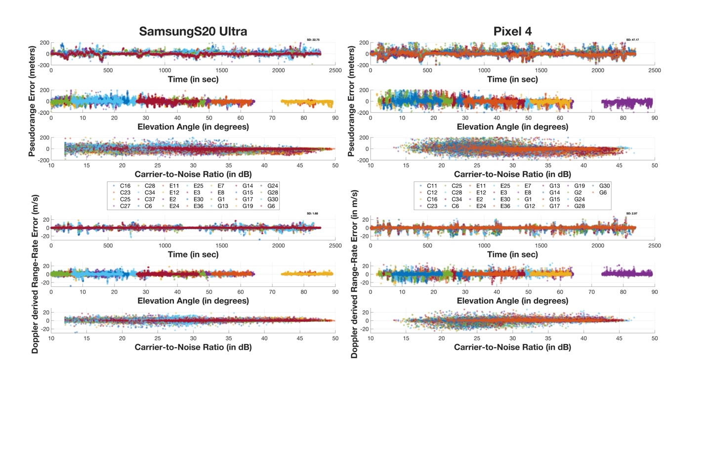
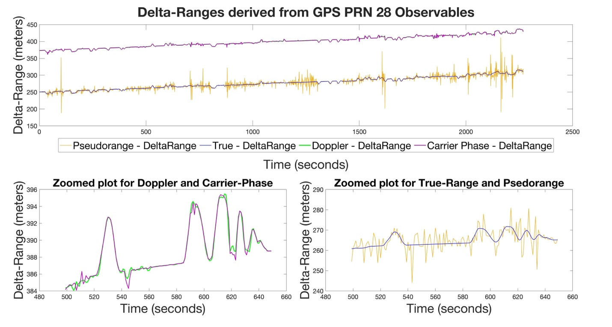
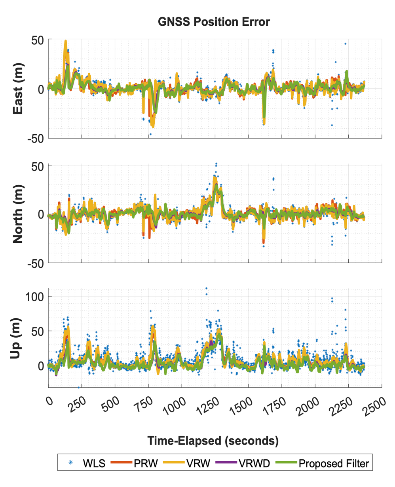
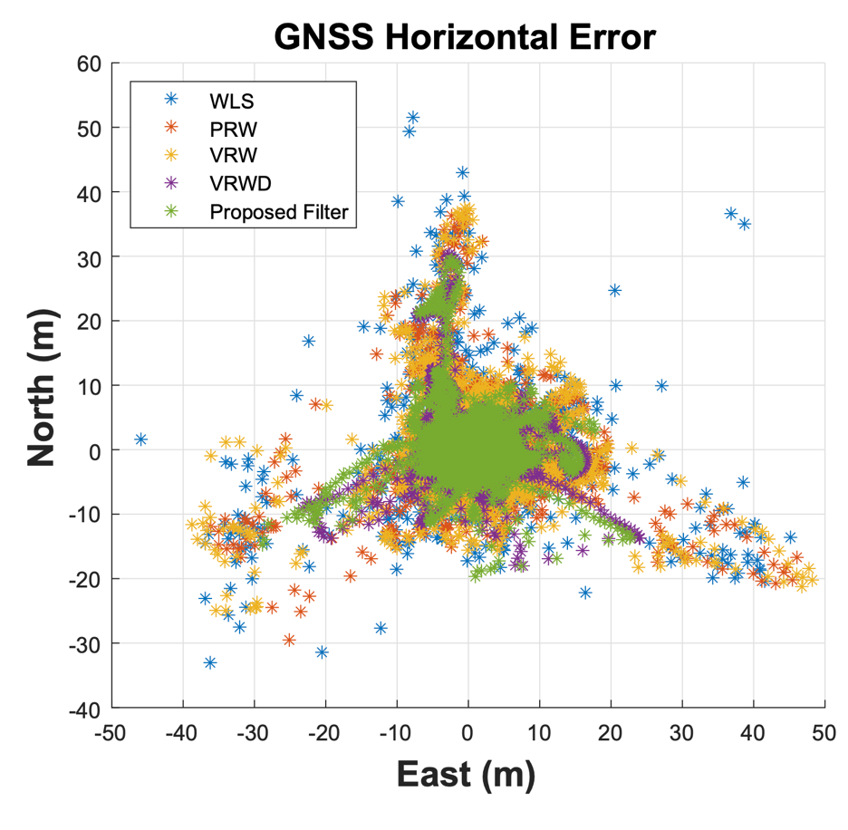
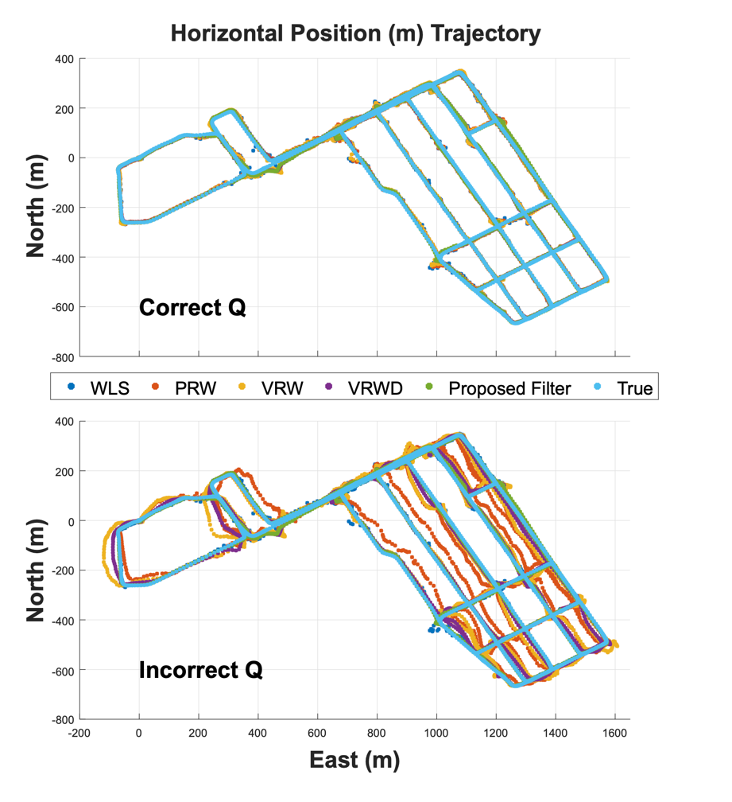
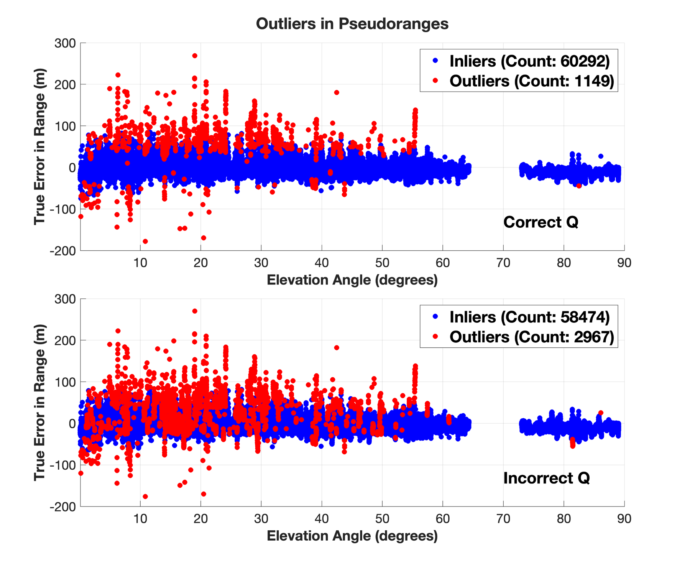
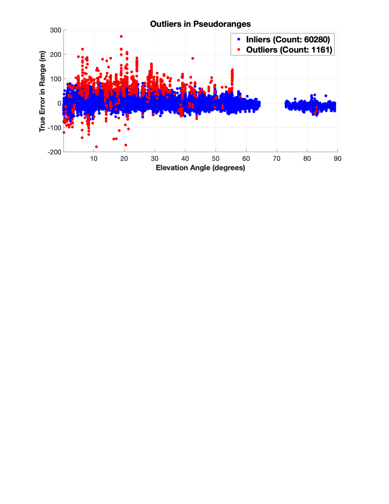
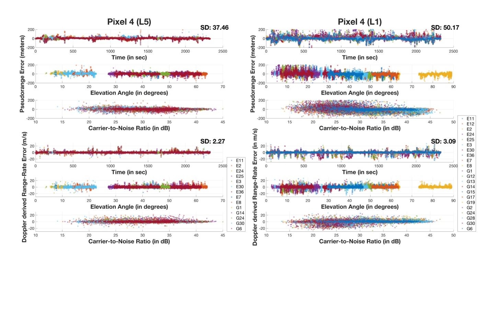
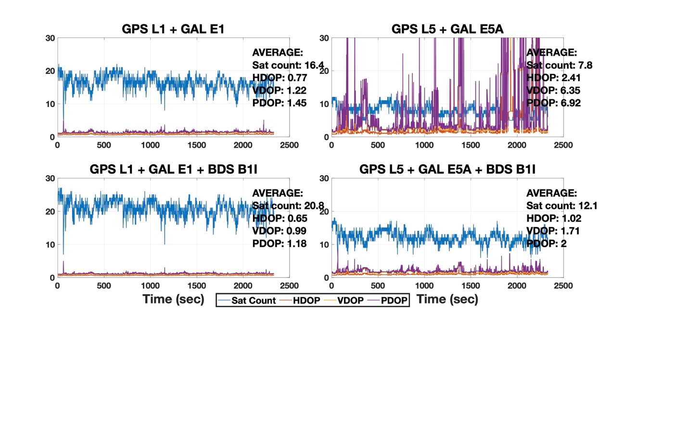

# Pillar 1a — Robust Dynamics Modelling: Doppler-Based Prediction (DBP)

> Source: thesis Chapter 3, "Robust Dynamics Modelling" — reproduced verbatim from N. Agarwal and K. O'Keefe, *IEEE JISPIN*, 2023 (doi: [10.1109/JISPIN.2023.3337188](https://doi.org/10.1109/JISPIN.2023.3337188)), plus IPIN 2023.

## The problem

A Kalman filter predicts its state forward using a transition equation `x_k = Φ_k x_{k−1} + w_k`. For that prediction to be trustworthy, the process noise covariance `Q` — the statistical description of `w_k` — has to reflect reality. Professional GNSS receivers are usually static or vehicle-mounted with predictable motion, so a heuristically-tuned `Q` (e.g. "constant velocity, moderate process noise") works fine. A smartphone doesn't cooperate: it can go from stationary, to pocketed walking, to running for a bus, to riding in a car, within seconds. A fixed `Q` is either too tight (the filter lags during maneuvers and diverges) or too loose (it fails to smooth measurement noise). Worse, because Fault Detection and Exclusion (FDE) relies on the innovation covariance — which itself depends on `Q` — a wrong `Q` also breaks outlier rejection.

## Baseline filters (used for comparison throughout Ch. 3–4)

Three conventional EKF formulations, all pseudorange-based:

| Name | State `x` | Transition `Φ` | Measurement `z` |
|---|---|---|---|
| **PRW** — Position as Random Walk | `[p]` | `[I]` | `[ρ]` |
| **VRW** — Velocity as Random Walk | `[p; v]` | `[[I, Δt],[0, I]]` | `[ρ]` |
| **VRWD** — Velocity as Random Walk with Doppler | `[p; v]` | `[[I, Δt],[0, I]]` | `[ρ; v̂_u]` |

(`p` = position, `v` = velocity, `ρ` = pseudorange, `v̂_u` = Doppler-derived velocity, `Δt` = epoch interval.) VRWD folds Doppler into the *measurement update* only — it still needs a tuned `Q` for prediction. DBP instead uses Doppler in the *prediction* step, which is the structural difference that removes the tuning requirement.

## The complementary filter background

DBP is built as an error-state complementary Kalman filter. Splitting the true state into an estimated total state plus a true error state (`x = x̂ + Δx`) and linearizing the dynamics `f(x) = f(x̂) + FΔx` separates the total-state ODE `x̂̇ = f(x̂)` from the error-state ODE `Δẋ = FΔx + Gω`. The error-state KF prediction is then

```
Δx̂̇ = FΔx̂
Δx̂⁻_{t+Δt} = e^{FΔt} Δx̂⁺_t = Φ Δx̂⁺_t
P⁻_{t+Δt} = Φ P⁺_t Φᵀ + Q,   Q = ∫ Φ G · cov(ω) · Gᵀ Φᵀ dt
```

with a feedback step `x̂⁺_{t+Δt} = x̂⁻_{t+Δt} + Δx̂⁺_{t+Δt}` that folds the corrected error state back into the total state — making it a *feedback* complementary filter. This is the same principle behind the "go-free" concept (Hwang & Brown): states whose stochastic behaviour is poorly known aren't discarded, just not modelled with speculative assumptions.

## The DBP mechanism

DBP propagates position using Doppler-derived velocity rather than an assumed dynamics model, and derives `Q` directly from that velocity estimate's own covariance — no tuning required.

### Error-state formulation

Only pseudorange is used in the measurement update; the filter carries **position states only**, and velocity is estimated epoch-wise from Doppler via least squares (not sequentially filtered):

```
ṗ = v̂_u
p̂⁻_{t+Δt} = p̂⁺_t + ∫_t^{t+Δt} v̂_u dt
Q = ∫_t^{t+Δt} Φ G C_{v̂_u v̂_u} Gᵀ Φᵀ dt
```

Since `Φ` and `G` are identity for this formulation, **`Q` reduces to the time-integral of the Doppler-velocity least-squares covariance**: `Q = ∫ C_{v̂_u v̂_u} dt`. This is the core trick — `Q` is a measured quantity (the LS covariance of the Doppler solution), not a guess.

For integrating velocity across the epoch interval, two options exist: averaging the velocity at both epochs (a better physical approximation, but it reuses each epoch's estimate twice, violating the KF independence assumption), or holding the first epoch's velocity constant for the whole interval. **The thesis recommends the latter** to respect KF principles, especially when `Δt` is small.

### Total-state formulation (equivalent)

Uses the **"boosted Q"** trick: state `x = [p; v_u]` (position + receiver clock offset; velocity + clock drift) with `Q = [[0,0],[0,∞]]` — an infinite variance on the velocity/drift block. This forces the filter to fully discard its prior velocity estimate at every update (predicted velocity is thrown away, brand-new velocity states are estimated from Doppler each epoch), which is exactly equivalent to the error-state form: **velocity and clock drift are never sequentially filtered**, only position accumulates over time.

## Fault Detection and Exclusion (FDE)

Outlier rejection uses Baarda's Iterative Data Snooping on two levels: innovation testing inside the KF (for corrupt pseudoranges — depends on both `R` and `Q`) and residual testing in the Doppler least-squares solve (for Doppler outliers). Because DBP continuously generates an accurate `Q` from real Doppler statistics, its FDE stays reliable even when the true dynamics change abruptly — unlike PRW/VRW/VRWD, whose FDE degrades whenever their fixed `Q` stops matching reality.

## Results

**Dataset:** Google Smartphone Decimeter Challenge, `2021-04-29-US-SJC-2`, Samsung Galaxy S20 Ultra + Google Pixel 4 (both Snapdragon 865), driven around the San Francisco Bay Area, ground truth from NovAtel SPAN + Waypoint Inertial Explorer. GPS + Galileo + BeiDou, single-frequency only (mass-market representative).

<p align="center"></p>

*Figure 3-1 — Pseudorange and Doppler error for GPS L1 + GAL E1 + BDS B1I. Pseudorange error is on the order of tens of metres; Doppler error is ≈1 m/s.*

<p align="center"></p>

*Figure 3-2 — Delta-range from GPS PRN 28 observables (Samsung Galaxy S20 Ultra). Doppler- and phase-derived delta-ranges show an "inter observation-type bias" against pseudorange-derived delta-range (attributed to receiver clock drift), while Doppler and carrier-phase delta-ranges track each other closely — the empirical basis for using Doppler as a carrier-phase stand-in in DBP.*

### With correctly-tuned `Q` (2D RMSE, m)

| Filter | S20 Ultra | Pixel 4 |
|---|---|---|
| WLS | 12.63 | 16.62 |
| PRW | 12.26 | 14.46 |
| VRW | 12.72 | 15.88 |
| VRWD | 9.74 | 11.09 |
| **DBP** | **9.78** | **11.57** |

With a correctly tuned `Q`, DBP and VRWD perform comparably — **VRWD can even slightly outperform DBP** when its `Q` is well tuned. DBP's advantage isn't accuracy under ideal tuning; it's that its `Q` estimation is fully automated.

<p align="center">
  
  
</p>

*Figure 3-3 / 3-4 — FDE-processed ENU and horizontal positioning results under correctly-tuned `Q`.*

### With deliberately mistuned `Q` (2D RMSE, m; PSD reduced ×30 for VRW/VRWD, ×10 for PRW)

| Filter | S20 (no FDE) | S20 (with FDE) | Pixel 4 (no FDE) | Pixel 4 (with FDE) |
|---|---|---|---|---|
| PRW | 29.55 | **296.35** | 44.09 | **278.11** |
| VRW | 28.91 | **214.36** | 35.44 | **173.31** |
| VRWD | 16.48 | 17.89 | 23.33 | 26.82 |
| **DBP** | **9.78** | **7.75** | **11.57** | **9.57** |

This is the headline robustness result: with a maladjusted `Q` and FDE enabled, PRW and VRW blow up to hundreds of metres of error (FDE actively makes it *worse*, since it starts rejecting good measurements based on the wrong `Q`), while DBP's numbers are completely unchanged from the well-tuned case — because its `Q` can't be maladjusted, it's measured every epoch. Outlier counts confirm the mechanism: with incorrect `Q`, VRWD's outlier flags jump from 1,149 to 2,967 (many good measurements wrongly rejected), while DBP stays essentially flat at 1,149→1,161.

<p align="center"></p>

*Figure 3-5 — Horizontal position trajectory. With correct `Q`, VRWD and DBP track the true path closely; with incorrect `Q`, conventional EKFs visibly deviate during vehicle turns and take time to re-converge, while DBP stays on-track.*

<p align="center">
  
  
</p>

*Figure 3-6 / 3-7 — Outlier flags in pseudorange measurements: VRWD (left, correct `Q` above / incorrect `Q` below) vs. DBP (right). VRWD's outlier count roughly doubles under incorrect `Q`; DBP's is essentially unchanged.*

### L5 vs L1 (Google Pixel 4)

L5 pseudorange is markedly cleaner than L1 (SD 37.46 m vs 50.17 m) despite far worse satellite geometry (7.8 vs 16.4 average satellites, PDOP 6.92 vs 1.45), and produces better positioning accuracy in the correctly-tuned case — but degrades faster under outlier rejection due to lower measurement redundancy. DBP's robustness advantage under incorrect dynamics holds on both bands (2D error with FDE: DBP 10.56 m / 9.57 m on L5/L1 vs. PRW's 472.95 m / 278.11 m).

<p align="center">
  
  
</p>

*Figure 3-8 / 3-9 — L5 vs L1 pseudorange/Doppler error (left) and satellite count/DOP (right), Google Pixel 4. L5 is cleaner per-measurement but has markedly worse geometry.*

## Conclusion (as stated in the thesis)

> "The DBP filter remains suboptimal compared to VRWD when the correct Q matrix tuning is available. However, correct Q matrix tuning is often not available for mobile smartphone positioning."

Chapter 8's summary states the headline figure as: DBP **reduced Horizontal RMSE by 57% compared to standard Doppler-aided filters (17.89 m → 7.75 m)** under mismatched process noise, and eliminated over 1,800 false outlier detections.

## Code

- `com.gnssAug.Android.estimation.KalmanFilter.EKF` — implements PRW/VRW/VRWD baselines (`Flag.POSITION` / `Flag.VELOCITY`, `useDoppler` flag).
- `com.gnssAug.Android.estimation.KalmanFilter.EKFDoppler` — implements DBP (`EstimatorMode.EKF_DBP`).
- FDE / outlier testing is shared with the [Adaptive Kalman Filter](04-pillar1-akf-vce.md) pillar.

## Next

[Pillar 1b — Adaptive Kalman Filter (VCE)](04-pillar1-akf-vce.md) builds directly on DBP: it reuses DBP for `Q` in kinematic scenarios so it can focus entirely on adapting `R`.
