# Pillar 1b — Adaptive Stochastic Modelling: AKF via Variance Component Estimation (VCE)

> Source: thesis Chapter 4, "Adapting Measurement Variance" — reproduced verbatim from N. Agarwal and K. O'Keefe, *ION GNSS+ 2024* (doi: [10.33012/2024.19884](https://doi.org/10.33012/2024.19884)).

## The problem

Positioning also needs the measurement noise covariance `R` to be right. The standard approach builds `R` from empirical elevation-angle and/or C/N₀ look-up tables — reasonable for a clean, open-sky, geodetic-grade antenna, but not for a phone. In an urban canyon, a high-elevation satellite can still arrive via a non-line-of-sight reflection off a glass building and get wrongly assigned a high weight, while a genuinely clean low-elevation signal down a street corridor gets wrongly de-weighted. Adaptive Kalman filtering existed for professional-grade receivers, but hadn't been applied to smartphones.

## Background: three families of adaptive KF

**Multiple Model Adaptive Estimation (MMAE)** runs a bank of KFs in parallel, each with different candidate `(Q, R)`, and blends their state estimates by the posterior probability of each model given the innovation sequence (Bayes' rule applied recursively). Expensive — you're running `k` filters at once.

**Variance Component Matrix Estimation (VCME)**, a.k.a. covariance matching / adaptive Sage windowing, due to Mehra — estimates `R` and/or `Q` from a window of pre-fit or post-fit residuals. It reframes adaptation as a maximum-likelihood problem: minimize `ln|C_v| + vᵀC_v⁻¹v`. The second term is the familiar weighted least-squares objective; the first — the log-determinant of the innovation covariance — is what makes the objective *also* solve for the weight itself, not just the state. Sub-variants estimate `R` alone (assuming `Q` known) via **innovation-based** (`R̂ = Ĉ_v − HP⁻Hᵀ`) or **residual-based** (`R̂ = Ĉ_v + HP⁺Hᵀ`) adaptive estimation, or `Q` alone via a similar residual-accumulation formula.

**Robust AKF** (Yang) adds an M-estimation-theory loss function with an adaptive factor `α_k` balancing measurement fit against the predicted state, for simultaneous outlier control and adaptation.

**Variance Component Estimation (VCE)** (Wang), built on Helmert's classical VCE, reformulates the KF update as three stacked least-squares equations (measurement, prediction, process-noise pseudo-observation) and estimates an *individual* variance component `σ̂²` for each. Because each posteriori variance-of-unit-weight has expected value 1, VCE can run tests at **global** (all epochs), **regional** (a sliding window), or **local** (single-epoch) scope — the multi-epoch version drives adaptation, the single-epoch version drives outlier detection. This is the family the thesis builds on.

## The proposed AKF

Four design decisions distinguish the proposed method from generic VCE:

1. **`Q` is not this filter's job.** For kinematic data, `Q` comes from [DBP](03-pillar1-dbp.md) (Pillar 1a). For static data, `Q` is simply set to zero (a stationary receiver has no real process noise). The thesis states plainly: *"only one noise covariance matrix, Q or R, can be accurately adapted at a time in the AKF, and the success in correctly adapting either is highly dependent on the accuracy of presumed values of the other."* Splitting the burden this way lets the AKF focus entirely on `R`.
2. **Why VCE over MMAE/IAE/RAE:** VCE estimates *individual* variance components, i.e. a separate variance per measurement, and — unlike other AKF families — doesn't require tracking which satellites entered/left the constellation to keep an innovation vector's ordering consistent epoch to epoch.
3. **Sliding window:** `R` is adapted from a multi-epoch window of past residuals, not a single epoch.
4. **Binning (the key novel assumption):** satellites of the same constellation are assumed to share the same measurement variance if their elevation angle and C/N₀ fall in the same bin. Bins are **5° elevation × 5 dB-Hz C/N₀**. Combined with the sliding window, this pools enough residuals per bin for a stable variance estimate even though any single satellite's residual history is short and noisy.

### Algorithm

**Prediction:** Doppler-derived velocity (DBP) for kinematic data; sequential LS or `Q = 0` for static data.

**Update:** measurement vector is pseudorange only. Each measurement's variance is the sum of squared *a posteriori* residuals from the last `n` epochs in the same elevation/C-N₀ bin, normalized by their summed redundancy:

```
σ̂²_{z_i(k₁,…,k_n)} = [ Σ_{k=k₁}^{k_n} v²_{z_i}(k) ] / [ Σ_{k=k₁}^{k_n} r_{z_i}(k) ]
```

`R` is then rebuilt from these per-bin `σ̂²` values — and **must stay diagonal** for individual variance components to be estimable this way.

Note a deliberate asymmetry: **FDE / outlier rejection is applied to the Doppler measurements** used for DBP velocity, but **not to the pseudoranges inside the AKF** — the AKF's whole thesis is that de-weighting a noisy pseudorange is better than excluding it (see Results below).

**Stated limitation:** if the kinematic dataset's Doppler is itself corrupted, DBP mis-estimates `Q`, and the AKF (which assumes `Q` is externally correct) can then mis-adapt `R` — potentially worse than a static weighting model. This doesn't apply to stationary data, where `Q = 0` is exact.

## Baseline weighting model used for comparison

All non-AKF filters use the Tay & Marais combined elevation/C-N₀ model:

```
σ² = 10^(−C/N₀ / 10) / sin²(θ)
```

which the thesis critiques directly: single-parameter models are insufficient in urban environments — elevation-only penalizes clean low-elevation signals, C/N₀-only ignores geometric propagation error — and the function still needs a scale factor tied to the dataset's real noise level.

<p align="center">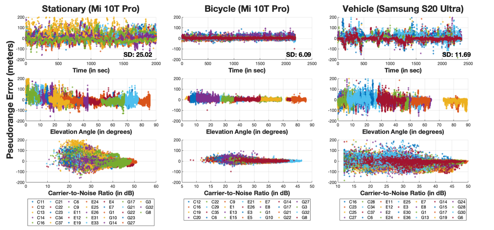</p>

*Figure 4-1 — Pseudorange error for GPS L1 + GAL E1 + BDS B1I across the three datasets used below.*

## Datasets

| Scenario | Dataset label | Device |
|---|---|---|
| Stationary | T-A-SIS-10 (GSA GNSS Raw Measurements Task Force) | Xiaomi Mi 10T Pro (Snapdragon 865 / SM8250) |
| Bicycle | T-A-SIS-09 (same source) | Xiaomi Mi 10T Pro |
| Vehicle (urban) | Google Smartphone Challenge 2021, `2021-04-29-SJC-2` | Samsung S20 Ultra (BCM47755) |

<p align="center">
  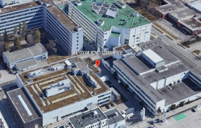
  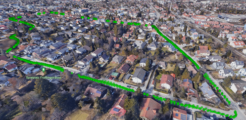
  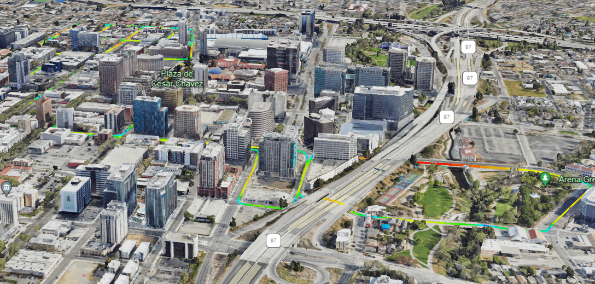
</p>

*Figure 4-2 — Stationary, bicycle, and vehicle-based smartphone GNSS datasets (left to right).*

<p align="center">
  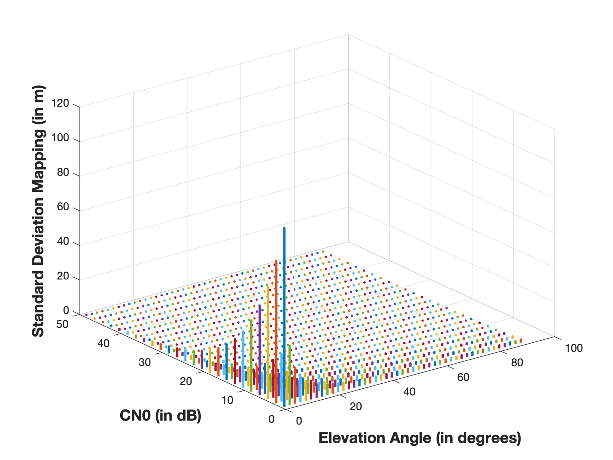
  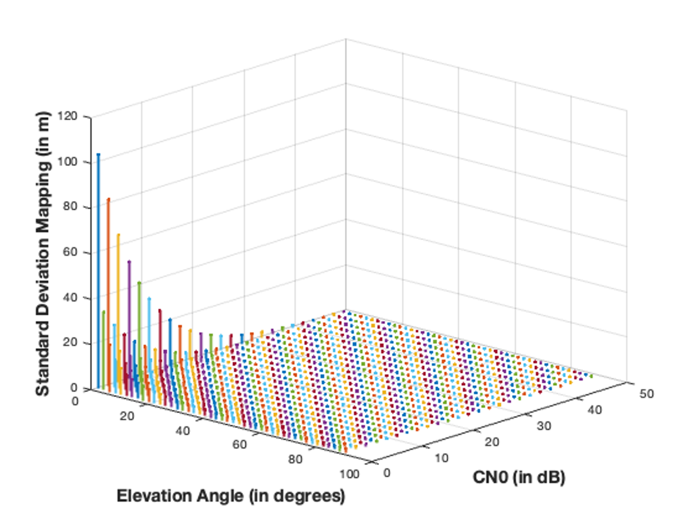
</p>

*Figure 4-3 — Standard deviation function based on elevation angle and C/N₀ ratio — the Tay & Marais baseline model being critiqued above.*

## Results (RMSE, m)

| Scenario | WLS | 2nd-best baseline | Proposed AKF | Horizontal gain | Vertical gain |
|---|---|---|---|---|---|
| **Static** | 13.10 (2D) | PRW 7.34 (2D) | **4.74 (2D) / 15.03 (3D)** | **35.4%** vs PRW | **13.2%** vs PRW |
| **Bicycle** | 4.01 (2D) | DBP 2.58 (2D) | **2.31 (2D) / 2.97 (3D)** | **10.5%** vs DBP | **50.5%** vs DBP |
| **Vehicle** | 10.66 (2D) | VRWD 7.24 (2D) | **5.26 (2D) / 6.61 (3D)** | **27.3%** vs VRWD | **59.6%** vs VRWD |

<p align="center">
  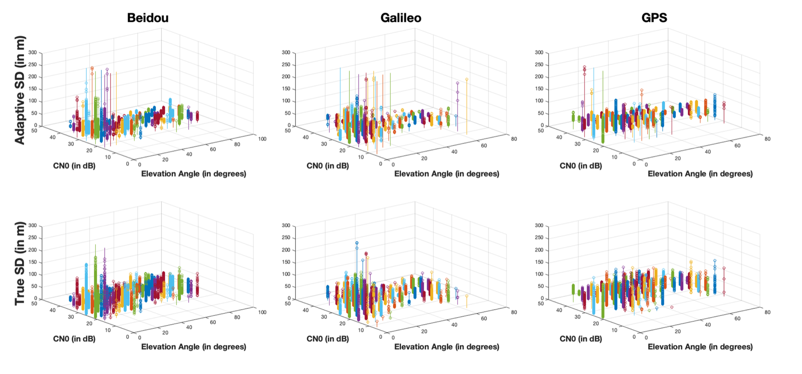
  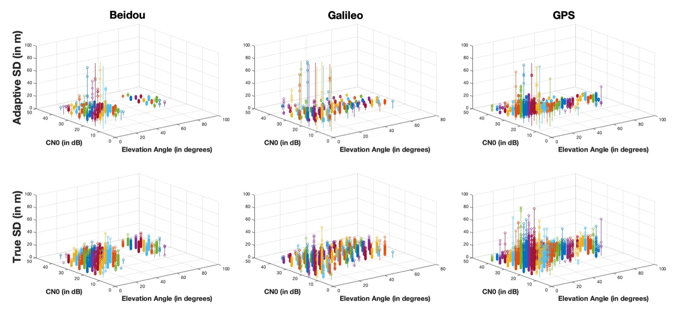
  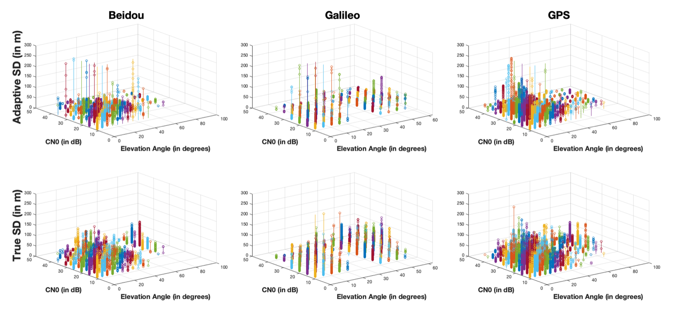
</p>

*Figure 4-4 — VCE-adapted measurement-noise SD vs. true SD (stationary / bicycle / vehicle). The adaptive SD tracks the true noise level far more closely than the fixed elevation/C-N₀ mapping in Figure 4-3, especially at high elevation and C/N₀ where the fixed model underestimates noise.*

<p align="center">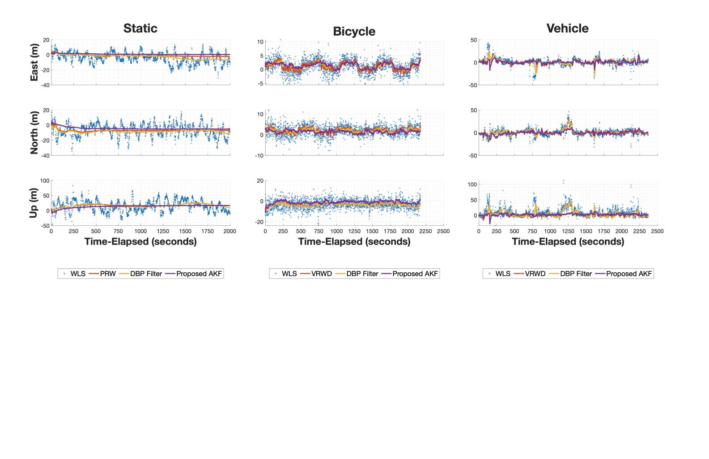</p>

*Figure 4-5 — Proposed AKF (purple) vs. conventional methods (WLS, PRW/VRW, DBP) in static and kinematic environments — notably smoother trajectories and reduced Up-component noise.*

<p align="center">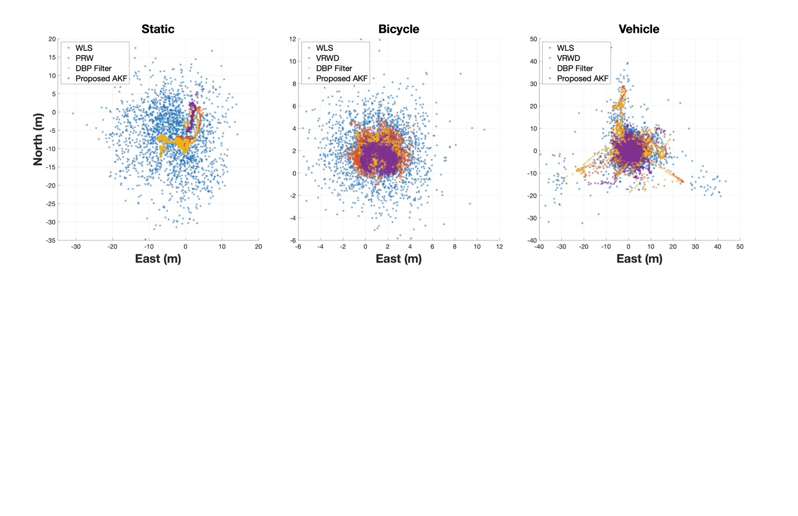</p>

*Figure 4-6 — Horizontal positioning results, all filters, all scenarios.*

### Why de-weighting beats exclusion (vehicle dataset)

Running FDE purely as a diagnostic (not to actually exclude anything) after `R` adaptation:

| Filter | Inliers | Outliers flagged |
|---|---|---|
| Proposed AKF | 66,185 | **67** |
| DBP Filter | 65,601 | 651 |
| VRWD | 65,574 | 678 |

Only 67 of the AKF's measurements would even be flagged as outliers by a fixed-`R` test, versus 650+ for the other filters — because the AKF correctly inflates the variance of multipath-affected measurements, their *normalized* innovation (innovation ÷ σ) drops below the rejection threshold, and they're retained (de-weighted) rather than excluded. This preserves satellite geometry that a fixed-variance filter loses whenever it rejects ~650 measurements. The normalized-residual histogram confirms this quantitatively: AKF SD ≈ **1.48** (close to the ideal standard-normal), vs. ≈ **2.09–2.10** for DBP/VRWD.

<p align="center">
  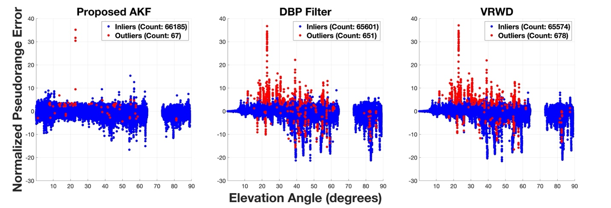
  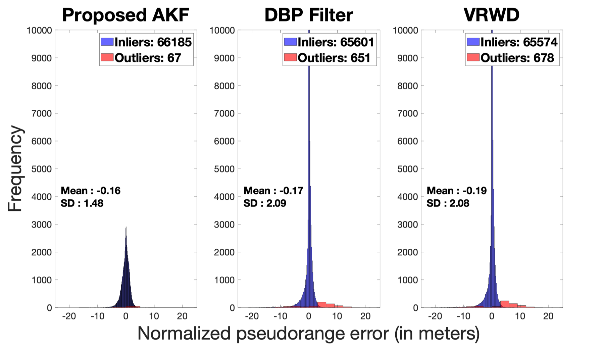
</p>

*Figure 4-7 / 4-8 — Outliers (left) and histogram (right) of normalized pseudorange errors across filters, vehicle dataset. Red bars mark FDE-flagged outliers; the AKF's histogram sits closest to a standard normal.*

## Conclusion (as stated in the thesis)

> Conventional filters perform poorly in real-time kinematic smartphone GNSS because they assign `R` from empirical error analysis or manual tuning; across three different dynamic scenarios the proposed VCE-based AKF continuously adapts `R` and consistently outperforms them, relaxing the need to heuristically tune either `Q` or `R`.

**Stated future work:** (1) investigate whether phone orientation changes the appropriate elevation/C-N₀ variance mapping; (2) integrate handset inertial-sensor dynamics to further improve `Q` modelling and `R` adaptation.

## Code

- `com.gnssAug.Android.estimation.KalmanFilter.AKFDoppler` (kinematic) / `AKFDoppler_Static` (static) — implements `EstimatorMode.AKF_DBP`.
- Weighting/variance utilities: `com.gnssAug.utility.Weight`.

## Next

[Pillar 2a — Cycle Slip Detection Framework](05-cycle-slip-detection.md), which uses the same FDE/data-snooping machinery but to catch phase discontinuities rather than pseudorange outliers.
