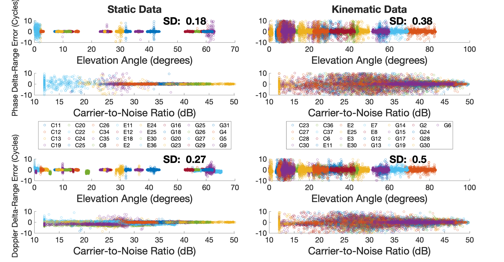
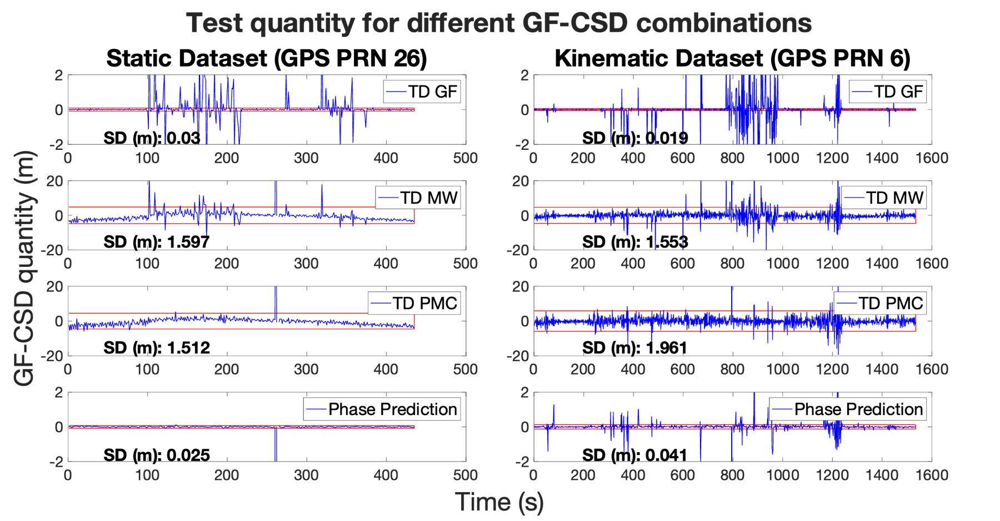
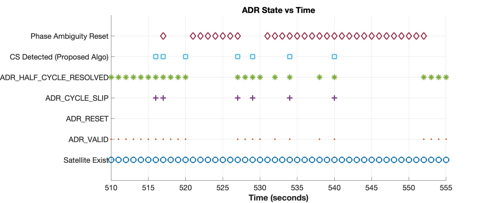

# Pillar 2a — Hierarchical Cycle Slip Detection Framework

> Source: thesis Chapter 5, "Cycle Slip Detection Framework." Related publication: N. Agarwal and K. O'Keefe, "Hybrid Cycle Slip Detection Method for Smartphone Global Navigation Satellite System," *Engineering Proceedings* (ENC 2024), doi: [10.3390/engproc2025088010](https://doi.org/10.3390/engproc2025088010).

## Why smartphones need a different approach

Cycle slips — integer discontinuities in accumulated carrier phase caused by loss of lock — are caused by signal obstruction, ionospheric activity, multipath, low-elevation satellites, and high receiver dynamics. Smartphone chipsets are poorly equipped for all of these, so slips are frequent rather than occasional. Most smartphone PPP implementations respond by resetting the ambiguity on detection, but that throws away the integer nature of the slip and can, on its own, be enough to weaken satellite geometry and lengthen convergence — even a single-satellite slip matters.

The thesis's answer is a **Hierarchical Cycle Slip Detection and Repair (CSDR) Framework** with two tiers:

1. **Hardware-Layer Screening** — a deterministic veto using Android chipset diagnostic flags.
2. **Hybrid Model-Based Detection** — a stochastic algorithm fusing a Geometry-Free (GF) coarse check with a Geometry-Based (GB) fine check.

This document covers detection; repair (turning a detected slip into a resolved integer) is [docs/06](06-lambda-estimators.md).

## Background: GF vs. GB cycle-slip detection

**Geometry-Free (GF) methods** work per-satellite, per-channel, with no reliance on other satellites or a position solution:

- **GF combination** `Φ_GF = Φ_L1 − Φ_L2` — dual-frequency, cancels geometry/troposphere, retains ionosphere + ambiguity.
- **Melbourne-Wübbena (MW) combination** `R_MW = Φ_WL − ρ_NL` — dual-frequency, cancels geometry *and* ionosphere; long wide-lane wavelength is good for detection, but inherits pseudorange noise/multipath.
- **Phase-minus-Code (PMC)** `R_PMC = Φ − ρ` — single-frequency, but ionosphere error is amplified (×2) and pseudorange noise dominates.

Classic time-series techniques for any of the above (from the literature review): **n-order time differencing** (a high-pass filter — amplifies slips but also amplifies ionospheric instability, risking false detections); **polynomial fitting over a sliding window** (Blewitt's TurboEdit — smooths ionospheric effects); **sliding-window mean/sigma testing** (Blewitt — flags a measurement exceeding a threshold multiple of the running standard deviation).

**Geometry-Based (GB) methods** use statistical testing (chi-squared, w-test) on the residuals/innovations of a position or velocity filter, benefiting from the redundancy of a multi-satellite solution — healthy satellites help detect the one that slipped.

### Why standard GF methods don't work well here

Two hard constraints rule out relying on GF alone for smartphones:

1. Despite dual-frequency chips existing since 2018, L1-only receivers still dominate the market.
2. GPS L5 isn't broadcast by the whole constellation (older Block IIR/IIR-M satellites don't transmit it) — a GF-based detector would simply have no visibility into **~40% of the GPS constellation**.

A single-frequency alternative — the **Doppler-based "Phase-Prediction" GF test** — removes geometry using Doppler instead of a second frequency:

```
test qty = (Φ_{k+Δt} − Φ_k) − ((D_{k+Δt} + D_k)/2)·Δt = λ·CS + ε
```

But it's only good for *large* slips: both Doppler and phase can have standard deviations as large as ½ an L1 cycle in kinematic data, so it can't reliably catch small slips, and systematic Doppler/TDCP biases in smartphone data can also trigger false alarms if used too aggressively.

<p align="center">
  
  
</p>

*Figure 5-1 / 5-2 — Left: carrier-phase and Doppler-derived delta-range error (cycles), GPS L1 + GAL E1 + BDS B1I. Right: test quantity for different GF-CSD combinations (GF, MW, PMC, Phase-Prediction) — GF and Phase-Prediction are cm-level, MW and PMC are metre-level because they inherit pseudorange noise.*

## Hardware-Layer Screening: Android ADR states

The Android `GnssMeasurement` API exposes an **Accumulated Delta Range (ADR) State** bitfield per measurement — a hardware-layer diagnostic straight from the chipset's phase-lock loop, not something Android computes itself (it's a mandatory pass-through field the chipset vendor's HAL driver populates).

| ADR_STATE | Meaning |
|---|---|
| `UNKNOWN` | No valid carrier phase at this epoch. |
| `VALID` | Valid carrier phase; usable as a future reference, but for delta-range computation against the *previous* epoch, other bits must also be checked (valid, no reset, no cycle slip). |
| `RESET` | Phase accumulation restarted since the previous epoch — usable going forward, but **not** comparable to the previous epoch. |
| `CYCLE_SLIP` | Chipset detected a slip since the previous epoch — usable, but comparing to the previous epoch for delta-range is "at the client's own risk." |
| `HALF_CYCLE_RESOLVED` | Half-cycle ambiguity resolved at this epoch. |
| `HALF_CYCLE_REPORTED` | Half-cycle ambiguity reported at this epoch. |

Veto logic (applied *before* any statistical estimation):

```
Reset_flag = F_hardware ∪ F_consistency
```

- **`F_hardware`** — if the chipset reports `ADR_STATE_RESET`, `ADR_STATE_CYCLE_SLIP`, or `ADR_STATE_VALID == 0`, the arc is rejected immediately (an invalid phase measurement is dropped entirely and its ambiguity reset).
- **`F_consistency`** — since repair works on TDCP (a phase *difference* across two epochs), both epochs need `ADR_STATE_HALF_CYCLE_RESOLVED`. If either epoch has an unresolved half-cycle, the TDCP difference carries a non-integer (±0.5) uncertainty and is strictly unrepairable by an integer estimator.

## Time-Differenced Functional Model

Mass-market chipsets often show real disagreement between Doppler-derived clock drift and carrier-phase-derived clock offset change ("anomalous clock variations" from crystal instability or duty cycling), so the model has to carry **two separate receiver clocks**:

```
((D(k) + D(k−1))/2)·λ = ρ̄̇ + c·dt̄^sys_Doppler + ε_D̄
Φ(k) − Φ(k−1)         = δρ + c·δdt^sys_Phase + λδN + ε_δΦ
```

`dt̄^sys_Doppler` (average clock drift from Doppler) and `δdt^sys_Phase` (phase clock offset change) are estimated as **independent, unconstrained parameters** — this "dual-drift" separation is what lets the filter absorb receiver clock anomalies without biasing the geometric velocity states. `δN` is the integer cycle-slip parameter: zero for continuous phase, a non-zero integer when a slip occurs. In linearized form, `y = Ax + Bn + ε`, where `A`/`B` are the design matrices for the geometric and cycle-slip unknowns respectively. Differencing at ≥1 Hz strongly attenuates temporally-correlated error sources (atmosphere, hardware bias, orbit error, multipath), leaving mostly the slip signal plus noise.

## The proposed detection pipeline (9 steps)

Runs inside a **Velocity-based Kalman Filter (VKF)**, strictly sequential per epoch:

1. **Hardware-Layer Screening (the veto layer).** Apply `Reset_flag` from the equation above before any estimation. Failing satellites are immediately reset, bypassing the repair engine entirely.
2. **Coarse Geometry-Free Screening.** Doppler-based Phase-Prediction as a magnitude filter — if the discrepancy exceeds **100 cycles**, the slip is too large to reliably estimate as an integer and the satellite is excluded for the epoch (this step may need to be disabled on handsets with known Doppler/TDCP biases).
3. **State Propagation.** Constant-velocity model; state = receiver velocity + receiver clock drift.
4. **Doppler Measurement Update.** A pre-emptive update using *only* Doppler (unambiguous, slip-immune) tightens the velocity/clock-drift covariance **before** phase is touched, giving a precise reference trajectory for the next step.
5. **Geometry-Based Fine Detection.** Predict the expected TDCP from the Doppler-updated state and test the innovation `v_TDCP = ΔΦ_obs − ΔΦ_obs(x̂⁺_Doppler)` against the filter's statistical threshold — this catches small slips (1–5 cycles) that step 2 misses.
6. **Signal Stability / Persistence Guard.** If a satellite is flagged for more than **N = 1** consecutive epoch, that's tracking instability, not a momentary discontinuity — abort repair, hard-reset the ambiguity, clear the counter.
7. **State Augmentation and Slip Estimation.** Temporarily augment the state with a float slip parameter `δN`; a second (TDCP) measurement update estimates `δN̂_float` and its variance `Q_δN̂_float`. This variance is the crucial link to repair: a tight variance means a confident float estimate and a reliable integer fix; a loose one means a "soft" repair.
8. **Integer Resolution.** Hand `(δN̂_float, Q_δN̂_float)` to the [Stochastic Repair Engine](06-lambda-estimators.md) — ILS, BIE, or PAR-FFRT resolves the integer, and the corrected phase is assimilated.
9. **Cleanup.** Remove `δN` from the state vector to prevent unbounded state growth, returning to the nominal velocity/clock configuration.

## Validation

Galileo E1C PRN 29, Google Pixel 7 Pro, ~510–555 s window: `ADR_STATE_CYCLE_SLIP` was raised by the chipset at 7 distinct epochs, all of which the framework correctly flagged as repair candidates. But **at epoch 520 the framework detected a slip the chipset never flagged** — caught purely by the geometry-based fine check — directly demonstrating why the hybrid (hardware + model) approach is necessary rather than trusting either source alone. Cross-checked at scale on the Pixel 4 dataset (Ch. 7): chipset-only detection found 1,108 Galileo slips, model-only found 1,243, and the **hybrid found 1,783** — each source catches slips the other misses.

<p align="center"></p>

*Figure 5-3 — Proposed cycle-slip detection on Google Pixel 7 Pro data, Galileo E1C PRN 29. Blue squares = detected by the hierarchical engine; maroon diamonds = forced ambiguity reset; the epoch-520 slip (detected without a chipset flag) is visible here.*

## Code

- `com.gnssAug.Android.estimation.KalmanFilter.EKF_TDCP_ambFix2` — the velocity-based Kalman filter implementing the detection pipeline (`getAmbDetectedCount()`, `getCsdListMap()`).
- `com.gnssAug.Android.estimation.KalmanFilter.EKF_TDCP_ambFix_allEst` — variant exposing per-`EstimatorType` repair counts, used to benchmark the estimators from [docs/06](06-lambda-estimators.md) against each other (`EstimatorMode.EKF_TDCP_ALL_ESTIMATORS`).
- `com.gnssAug.Android.models.CycleSlipDetect`, `com.gnssAug.Android.models.TDCP` — supporting data models.

## Next

[Pillar 2b — Stochastic Repair Engine & LAMBDA Estimators](06-lambda-estimators.md) covers what happens once a slip is detected: how the float estimate `δN̂_float` becomes a validated (or "soft-fixed") integer.
