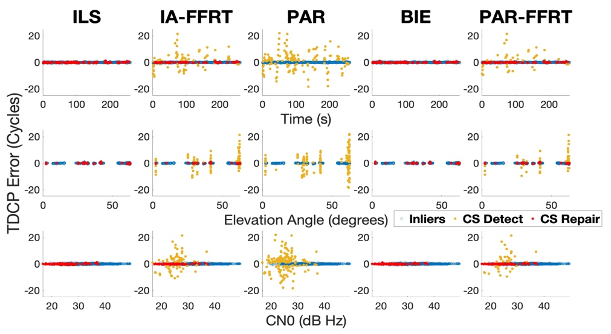
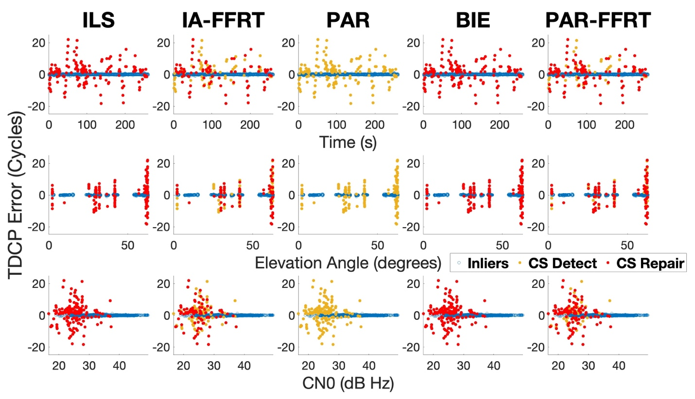
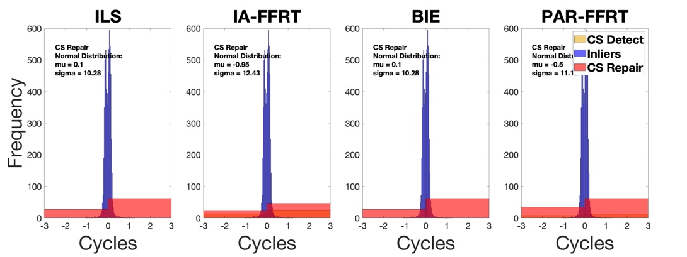
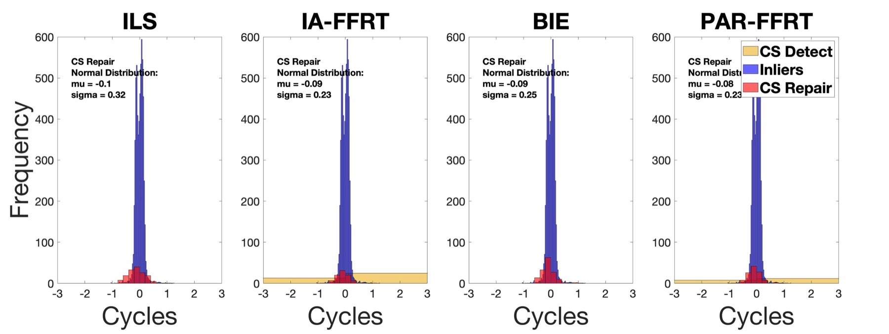
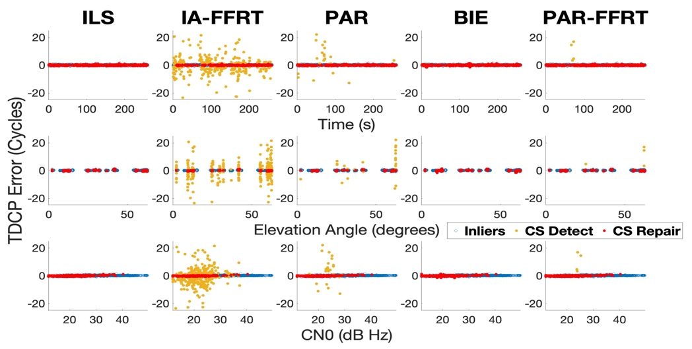
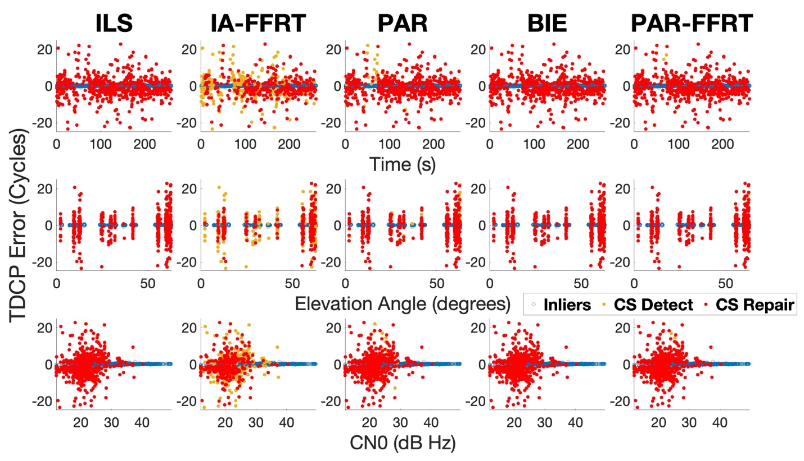
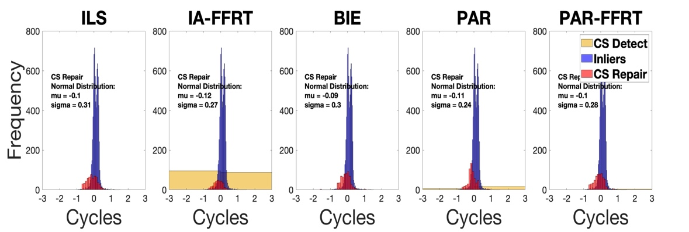
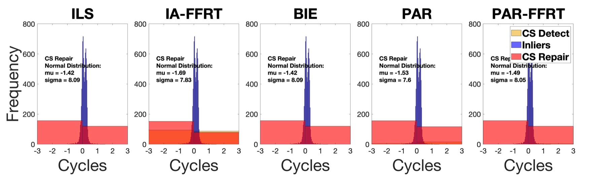

# Pillar 2b — Stochastic Cycle Slip Repair Engine (LAMBDA 4.0)

> Source: thesis Chapter 6, "Stochastic Cycle Slip Repair Engine." Related publications: N. Agarwal and K. O'Keefe, "Cycle Slip repair for single-frequency smartphone GNSS using the Best Integer Equivariant estimator," *IEEE/ION PLANS 2025* (doi: [10.1109/PLANS61210.2025.11028424](https://doi.org/10.1109/PLANS61210.2025.11028424)); "Investigating Cycle Slip Repair for Single and Multi-Frequency Smartphone GNSS," *ION GNSS+ 2025*.

## Cycle-slip repair is ambiguity resolution

Once [detection](05-cycle-slip-detection.md) produces a float slip estimate `δN̂_float` and its variance `Q_δN̂_float`, resolving it to an integer is mathematically the same problem as carrier-phase integer ambiguity resolution — so the estimators developed for AR apply directly. Three classes of estimator exist in the literature: **Integer (I)** estimators (always output an integer, e.g. ILS), **Integer Aperture (IA)** estimators (output an integer only if it passes a validation test, otherwise fall back to float), and **Integer Equivariant (IE)** estimators (output a weighted combination of integers, e.g. BIE). ILS becomes an IA estimator the moment a validation test is applied to its output.

All estimators here are implemented via the **LAMBDA 4.0 toolbox** (TU Delft; Teunissen 1993/1995; de Jonge & Tiberius 1996; Verhagen 2005), ported to Java in `com.gnssAug.helper.lambdaNew`.

### Decorrelation is different for cycle slips than for phase ambiguities

LAMBDA's Z-transformation step normally decorrelates strongly-correlated float ambiguities and constructs optimal integer combinations (effectively including wide-laning). For **cycle slips specifically**, the thesis notes float CS estimates are only *weakly* correlated to begin with — even across multiple frequencies of the same satellite at the same epoch — because each slip is unique to its epoch and must be resolved instantaneously, unlike phase ambiguities which accumulate correlation as they're estimated over many epochs. So for CS repair, the Z-transformation mostly just reorders by precision rather than performing a substantive decorrelation.

## Why a binary fix/float decision doesn't work for smartphones

The traditional playbook: compute the ILS success rate (SR); if SR ≈ 1, fix; otherwise keep float or discard the arc. Smartphone carrier-phase residuals are typically an order of magnitude noisier than geodetic-grade receivers (low/irregular C/N₀, high multipath from a compact linearly-polarized antenna), so ILS success rates routinely fall well below unity — "safe" integer fixing is rare. Discarding low-confidence repairs destroys geometric strength; forcing a hard fix (variance = 0) on an uncertain integer introduces real bias, since treating a fixed ambiguity as deterministic is only valid when the success rate is near 100%.

**The thesis's proposal:** replace "Fix or Reset" with **stochastic repair** — assign the repaired slip a variance reflecting its actual uncertainty, and feed it into the position filter as a weighted observation rather than either a hard constant or a discarded arc.

## Statistical properties of the fixed integer

Given a float solution `â ~ N(a, Q_ââ)`, ILS is the maximum-likelihood integer estimate `ǎ_ILS = argmin_{a∈Zⁿ} ‖x−a‖²_Q_ââ`. Because `ǎ_ILS` is a discrete random variable, it has its own probability mass function, mean, and variance-covariance matrix `Q_ǎ_ILS` — and that variance is exactly what's needed to weight a "soft" repair correctly.

### Monte Carlo variance estimation

A key simplifying property — **translational invariance** — makes this tractable: the error distribution of `ǎ_ILS − a` depends only on the float covariance `Q_ââ`, not on the true integer value `a`. So the variance can be estimated by simulation, arbitrarily assuming `a = 0`:

1. Draw `N` samples `â^(i) ~ N(0, Q_ââ)`.
2. Fix each sample to an integer with ILS (LAMBDA decorrelation makes the search efficient).
3. `P(ǎ_ILS = z) ≈ N_z / N`; since the mean is zero by construction, `Q_ǎ_ILS ≈ Σ_z z·zᵀ·(N_z/N)` — the empirical second moment.

Sample-size adequacy is checked via Chebyshev's inequality. **The thesis uses N = 100,000 samples.**

## The five estimators compared

| Estimator | Class | Behaviour |
|---|---|---|
| **ILS** | Integer Least-Squares, search-and-shrink | Always outputs *some* integer — the ML estimate — with no validation. |
| **IA-FFRT** | Integer Aperture with Fixed Failure-Rate Ratio Test | Only accepts the ILS result if it passes a ratio test calibrated to a target failure rate. |
| **BIE** | Best Integer Equivariant | Outputs a weighted sum of nearby integers — always minimizes MSE, needs no validation test. |
| **PAR** | Partial Ambiguity Resolution (conventional) | Fixes the largest subset whose *bootstrapped* success rate clears a minimum threshold. |
| **PAR-FFRT** | Partial Ambiguity Resolution + FFRT | Fixes the largest subset whose ILS solution clears the FFRT ratio test. |

### BIE

```
â_BIE = Σ_{z∈Ω} z · [ exp(−½‖â−z‖²_Qâ) / Σ_{u∈Ω} exp(−½‖â−u‖²_Qâ) ]
```

`Ω` is the integer search space inside a scaled confidence ellipsoid (`1 − α = 1 − 10⁻⁴` in this work) around the float solution. Weighted by proximity to `â`, so it degrades gracefully to something close to float when confidence is low, and converges to the ILS answer when confidence is high — but it's a continuous output, not a discrete integer, which is more expensive and less compatible with an "explicit integer restoration" architecture.

### Fixed Failure-Rate Ratio Test (FFRT)

Instead of an empirical fixed ratio threshold (e.g. the traditional "3.0"), FFRT derives the critical value `μ` from a *target failure probability* `P_f` (**0.1% in this thesis**) and the ambiguity count `n`, via the inverse CDF of the ratio-test statistic's distribution:

```
R₂ / R₁ > μ(P_f, n)
```

`R₁`, `R₂` are the squared residual norms of the best and second-best integer candidates.

### PAR-FFRT strategy

1. Compute `μ(P_f = 0.001, n)` for the full candidate set.
2. Test the full set with LAMBDA; if it passes FFRT, fix everything.
3. If not, drop the ambiguity with the highest uncertainty (by decorrelated variance / ADOP) and retry on the `n−1` subset.
4. Repeat until a subset passes, or the count falls below the minimum satellite requirement (**4**).
5. If nothing passes, fall back to float.

## Results — L1 vs L5 vs L1+L5 (Samsung Galaxy S20+ 5G, static)

| Freq | Estimator | CS detected | Repair rate | Success rate | Failure rate | Precision gain |
|---|---|---|---|---|---|---|
| L1 | ILS | 153 | 100% | 94.60% | **5.39%** | 15.78% |
| L1 | IA-FFRT | 153 | 56.20% | 80.59% | 0.80% | 66.26% |
| L1 | BIE | 153 | 100% | — | — | 22.32% |
| L1 | PAR | 153 | **0%** | — | — | — |
| L1 | **PAR-FFRT** | 153 | 66.01% | 81.00% | 0.81% | 65.81% |
| L5 | ILS | 810 | 100% | 94.17% | 5.82% | 45.84% |
| L5 | IA-FFRT | 810 | 43.58% | 91.46% | 0.73% | 74.01% |
| L5 | BIE | 810 | 100% | — | — | 11.23% |
| L5 | PAR | 810 | 29.25% | 99.17% | 0.82% | 52.12% |
| L5 | **PAR-FFRT** | 810 | 73.95% | 93.04% | 0.75% | 71.02% |
| L1+L5 | ILS | 589 | 100% | 96.37% | 3.62% | 46.5% |
| L1+L5 | IA-FFRT | 589 | 53.48% | 90.78% | 0.77% | 71.1% |
| L1+L5 | BIE | 589 | 100% | — | — | 11.04% |
| L1+L5 | PAR | 589 | 38.87% | 99.39% | 0.60% | 57.44% |
| L1+L5 | **PAR-FFRT** | 589 | **78.94%** | 92.73% | 0.76% | 69.44% |

(Failure-rate threshold for FFRT: 0.1%. Minimum success-rate threshold for PAR: 99%. BIE confidence: `1 − 10⁻⁴`. Adding L5 to L1 roughly **quadruples** the number of detected slips due to the added redundancy and geometry.)

<p align="center">
  
  
</p>

*Figure 6-1 — TDCP error (cycles) per estimator, L1 signals; top rows are pre-repair (Inliers / CS Detect / CS Repair), bottom rows are the same epochs after repair.*

<p align="center">
  
  
</p>

*Figure 6-2 — Corresponding histograms for Figure 6-1 (L1). Pre-repair σ ≈ 10–12 cycles collapses to post-repair σ ≈ 0.2–0.32 cycles across all four estimators shown.*

<p align="center">
  
  
</p>

*Figure 6-3 — Same layout as Figure 6-1, for L1+L5 signals.*

<p align="center">
  
  
</p>

*Figure 6-4 — Corresponding histograms for Figure 6-3 (L1+L5), all five estimators. Post-repair σ collapses to ≈0.24–0.31 cycles across the board.*

### Verdict per estimator

- **ILS — high risk.** 100% repair rate, but no validation: on L1 that means roughly **1 in 20 repairs introduces a cycle error**, which is unacceptable to feed back into a position filter.
- **IA-FFRT — conservative.** Failure rate stays under 1% everywhere, but availability is poor (56.2% on L1) and — counterintuitively — gets *worse* on L1+L5 (43.58%), because validating a larger simultaneous ambiguity vector is harder and the strict ratio test rejects the whole set more often.
- **BIE — robust but awkward.** 100% availability and optimal in the MSE sense, but its continuous, weighted-sum output doesn't fit an architecture built around restoring a discrete integer phase measurement, and it's computationally heavier with multiple simultaneous slips.
- **PAR — too conservative.** On L1 it repaired **zero** slips (effectively a full reset every time) — no better than the standard reset baseline it was meant to improve on.
- **PAR-FFRT — the chosen method.** ~81% success rate and ~0.8% failure rate on L1, ~93%/0.76% on L1+L5, with a **78.9% repair rate on L1+L5** — the best balance of safety and availability. Post-repair TDCP error distributions become zero-mean with tight standard deviation, statistically resembling the clean "inlier" distribution (σ collapses from ~8–12 cycles pre-repair to ~0.2–0.3 cycles post-repair).

**Conclusion (Ch. 6.4.4, verbatim):** *"PAR-FFRT and BIE demonstrated superior performance compared to the other three resolution techniques. BIE, though being a robust estimator with 100% availability or repair rate, has a major drawback in that it is computationally demanding, especially when there are multiple ambiguities or CS. Therefore, PAR-FFRT will be the estimator of choice for the CS repair and will be used for all the experiments performed later in the Chapter 7."*

## Code map

| Thesis concept | Class |
|---|---|
| LAMBDA 4.0 toolbox entry point / method dispatch | `helper.lambdaNew.LAMBDA`, `LAMBDA_all` |
| ILS (search-and-shrink) | `helper.lambdaNew.Estimators.EstimatorILS` |
| ILS via the GHAH search (Ghasemmehdi & Agrell, 2011 — faster sphere decoding, drop-in replacement) | `helper.lambdaNew.Estimators.EstimatorILS_GHAH` |
| Integer Rounding | `helper.lambdaNew.Estimators.EstimatorIR` |
| Integer Bootstrapping | `helper.lambdaNew.Estimators.EstimatorIB` |
| IA-FFRT | `helper.lambdaNew.Estimators.EstimatorIA_FFRT` |
| BIE | `helper.lambdaNew.Estimators.EstimatorBIE` |
| PAR (bootstrapped success rate) | `helper.lambdaNew.Estimators.EstimatorPAR` |
| PAR-FFRT | `helper.lambdaNew.Estimators.EstimatorPAR_FFRT` |
| Estimator selector enum | `helper.lambdaNew.EstimatorType` (`ILS, IA_FFRT, BIE, PAR, PAR_FFRT, ALL`) |
| Monte Carlo variance estimation (N = 100,000) | `helper.lambdaNew.ComputeVariance`, `OptimizedVarCalc` |
| Bootstrapped / exact success-rate computation (feeds PAR) | `helper.lambdaNew.ComputeSR_IBexact` |
| FFRT critical-value computation | `helper.lambdaNew.ComputeFFRTCoefficient` |
| Z-transformation / decorrelation | `helper.lambdaNew.DecorrelateVC`, `TransformZ`, `DecomposeLtDL` |
| Legacy LAMBDA 3.0 port (Jama-based; still used for decorrelation by `LAMBDA.java`, and directly by the older `LLS_TDCP_ambFix`) | `helper.lambda.*` |

`EKF_TDCP_ambFix_allEst` and `EstimatorMode.EKF_TDCP_ALL_ESTIMATORS` exist specifically to run several of these estimators side-by-side on the same data and reproduce comparisons like the table above.

## Next

[Pillar 3 — UU-PPP Engine](07-ppp-engine.md), where this repair engine is validated end-to-end: cycle slips detected and repaired inline inside a full Precise Point Positioning filter, on both IGS geodetic data (with artificial slips) and real Pixel 4 / Pixel 7 Pro smartphone data.
