# Pillar 3 — Undifferenced Uncombined (UU) PPP Engine

> Source: thesis Chapter 7, "Validation of Proposed CSDR framework via Precise Point Positioning."

## Purpose

Chapters 5–6 built the CSDR detection-and-repair machinery in isolation. Chapter 7 validates it end-to-end inside a full PPP engine, testing the central claim that **"maintaining phase continuity through repair is superior to re-initialization."** Validation deliberately isolates CSDR's contribution: Pillars 1a/1b (DBP, AKF) are switched off for these experiments — constant-position dynamics and fixed a priori variances are used instead — and only **static** datasets are used, so that gains can be attributed to CSDR alone rather than conflated with dynamic-model or weighting improvements. Kinematic PPP and the fully unified DBP+AKF+CSDR engine are future work (see [docs/10](10-results-and-recommendations.md#future-scope)).

## The observation model

Every observable is treated as an **independent entity** — if a satellite's L1 pseudorange is bad, its L1 Doppler/phase and its L5 measurements are still used. This matters because low-cost chipsets already have a scarcity of usable signals; discarding a whole satellite over one bad observable is wasteful. The model is based on **GAMP**, modified with (1) **separate receiver clock offsets for code and phase**, and (2) Doppler folded into the measurement update to estimate velocity and clock drift. The two-clock structure exists specifically because smartphone code and phase tracking loops are documented to diverge — a real effect for low-cost hardware that doesn't need modelling on geodetic receivers.

For satellite `s`, constellation `T`, frequency `j`:

```
P_j^{s,T} = ρ^{s,T} + c(dt_r^Code  − dt^{s,T}) + Tr^{s,T} + I_j^{s,T} + DSB_{r,j}^{T,Code}  + ε_ρ
Φ_j^{s,T} = ρ^{s,T} + c(dt_r^Phase − dt^{s,T}) + Tr^{s,T} − I_j^{s,T} + λ_j N̄_j^{s,T} + DSB_{r,j}^{T,Phase} + ε_Φ
D_j^{s,T} = ρ̇^{s,T} + c(dṫ_r^Doppler − dṫ^{s,T}) + DSB_r^{T,Doppler} + ε_D
```

`DSB` (Differential Signal Bias) terms are relative hardware delays between a "pivot" signal (e.g. GPS L1 C/A) and every other tracked signal — zero for the pivot itself, and for non-pivot signals lumping together what geodesists usually split into Inter-System Bias and Inter-Frequency Bias. `DSB_r^{T,Doppler}` is the corresponding inter-system *clock drift* bias — same underlying phenomenon documented in the [detection framework](05-cycle-slip-detection.md#time-differenced-functional-model)'s dual-drift model, here promoted to a full state.

**Geophysical/environmental corrections applied:** relativistic effects (clock eccentricity + Sagnac), satellite antenna PCO/PCV from IGS ANTEX, phase wind-up, solid Earth tide (IERS conventions — ocean tide loading and pole tides are treated as negligible against the smartphone noise floor), Saastamoinen tropospheric dry delay with UNB3m meteorological parameters and Niell mapping functions, and GIM-constrained ionosphere.

## State vector

```
x = [ p   dt_r^Code  DSB_{r,j}^{T,Code}   dt_r^Phase  DSB_{r,j}^{T,Phase}
      v   dṫ_r^Doppler  DSB_r^{T,Doppler}   Z_w   I_TECU^{s,T}   N̄_j^{s,T} ]ᵀ
```

`p`/`v` = position/velocity, `Z_w` = zenith wet tropospheric delay, `I_TECU` = per-satellite slant ionospheric delay (TECU).

| State | Dynamic model | Spectral density (static case) |
|---|---|---|
| Position/Velocity | Constant velocity | ≈ 0 m²/s³ |
| `dt_r^Code` | White noise (approx.) | 10² m/s |
| `dt_r^Phase` | White noise (approx.) | 10⁴ m/s — deliberately huge, to absorb code/phase tracking-loop incoherency |
| `dṫ_r^Doppler` | Random walk | 1.0 m²/s³ |
| `DSB_r^{T,Doppler}` | Random walk | 10⁻⁴ m²/s³ |
| `DSB_{r,j}^{T,Code}`, `DSB_{r,j}^{T,Phase}` | Random walk | 10⁻⁴ m²/s |
| `Z_w` | Random walk | 10⁻⁸ m²/s (~1 cm/√hour) |
| `I_TECU^{s,T}` | Random walk | `10⁻³/sin²(El)` m²/s (elevation-dependent) |
| `N̄_j^{s,T}` | Random constant | ≈ 0 — only changes when a cycle slip is detected |

Measurement noise (a priori, before adaptation): pseudorange 10.0 m², phase 10⁻⁴ m², Doppler 10⁻³ m²/s², GIM ionosphere pseudo-observation 9.0 TECU². Estimated by an Extended Kalman Filter; GIM TEC values are injected as pseudo-observations to resolve the ionosphere/ambiguity rank deficiency inherent to single-frequency-capable tracking.

## Rank deficiencies

Per Odijk et al.'s S-system theory, the UU model has more unknowns than independent observation equations, so specific parameter combinations are inseparable without fixing a datum. Three matter here:

- **Type 2a — receiver clock vs. hardware code bias.** `dt_r^Code` and the receiver's own code hardware bias are indistinguishable in the undifferenced code equation. Resolved with a **lumped-clock S-basis**: the first signal (GPS L1 C/A) is the reference, so the estimated "clock" is really `dt_true^Code + d_{r,GPS-L1}`, and every other signal's bias is estimated relative to it as `DSB_{r,j}^{T,Code}`.
- **Type 2b — ionosphere vs. receiver code bias.** Slant ionosphere and absolute receiver code bias both appear as positive pseudorange delays and can't be separated in a single-receiver model. Resolved by a **loose GIM constraint** (σ² = 9.0 TECU²) — but this means the ionosphere state ends up absorbing the receiver's code bias (`I_est = I_true + d_r`), which then propagates into the float ambiguities. A single-differencing step would be required to cancel that absorbed bias before fixing ambiguities to integers.
- **Type 4 — receiver phase bias vs. float ambiguity.** Receiver phase bias and any code bias leaked through the ionosphere are linearly dependent on the integer ambiguity `N`. The textbook fix is a between-satellite single difference, since the receiver bias is common to all satellites tracking the same signal — **but this codebase's validated experiments never perform PPP-AR, so no single-differencing is actually exercised**; it stays a Float PPP solution architecturally ready for AR.
- **A fourth, empirically-driven case — phase clock vs. phase DSB (dynamic separation).** Android data shows the code clock (which is actively steered by the OS/chipset) and the free-running phase clock diverge, which forces a decoupled clock model — but adding a separate phase DSB state alongside the ambiguity reintroduces a Type-4-style singularity, since both are constant terms. This is resolved by **exploiting different temporal dynamics** rather than a differencing scheme: the float ambiguity is modelled as a random constant (≈0) to capture its integer nature, while the phase inter-signal bias is modelled as a random walk that absorbs the time-varying thermal drift between signal paths (e.g. L1 vs L5 RF front ends).

### Standard PPP vs. PPP-AR

- **Standard PPP (DCB-corrected)** — uses classic Differential Code Bias products (e.g. CAS C1C-C5Q). These resolve satellite clock/code-bias rank deficiency but contain no satellite phase bias (Fractional Cycle Bias) correction, so that bias gets absorbed into the float ambiguity — and because it's satellite-specific, forming a single difference between two satellites does **not** cancel it. Ambiguities stay non-integer; the module produces a rigorous **Float PPP** solution. This is what's validated in this thesis.
- **PPP-AR (OSB-corrected)** — uses Observation Specific Bias products (CNES/WUM/IGS-MGEX) that remove both satellite code *and* satellite phase biases. With the satellite phase bias gone, the remaining ambiguity-absorbed term is purely receiver-specific, which *does* cancel in a single difference — recovering the integer property and enabling LAMBDA-based fixing. `EstimatorMode.IGS_PPP_AR` and the OSB parsing path (`Rinex.fileParser.OSB_Bias`) exist for this, architecturally ready, but full PPP-AR validation on smartphone data is future work.

## CSDR integration

The CSDR module is not a pre-processing pass — it's a **tightly coupled feedback loop inside the EKF cycle**: phase discontinuities are resolved (reset or repaired) before they can contaminate the position and ambiguity states, using exactly the detection pipeline from [docs/05](05-cycle-slip-detection.md) and repair engine from [docs/06](06-lambda-estimators.md).

## Validation 1 — IGS geodetic data with artificial slips

**Setup:** 15 minutes of 1 Hz RINEX from IGS station **AJAC** (Ajaccio, France), 18 July 2024, GPS L1+L5, 10 satellites throughout, WUM MGEX final products. **1,045 artificial cycle slips** were injected into 6 satellites (PRN 5, 10, 16, 18, 23, 26) at 3–8 s intervals — about 7.3% of the data.

<p align="center">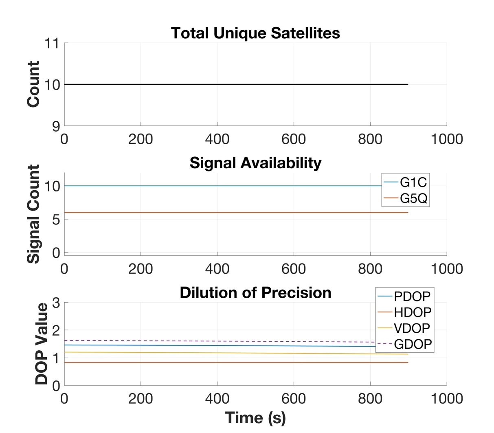</p>

*Figure 7-1 — Satellite count, signal availability, and DOP for the IGS AJAC validation dataset.*

| Case | Strategy | Up RMSE |
|---|---|---|
| 1 — Clean baseline | no slips | 16.0 cm |
| 2 — Detect & Reset | standard reset on detection | **52.9 cm** |
| 3 — Detect & Repair | proposed CSDR | **15.9 cm** |

Repair recovers accuracy statistically indistinguishable from the clean baseline; Reset triples the vertical error. Both strategies show the same "staircase" jump in the ambiguity state when a slip hits, but Reset shows a visible re-convergence wobble afterward, while Repair jumps instantaneously with **zero** convergence cost — it's just adding the (correctly estimated) slip value to the existing, still-precise ambiguity.

<p align="center">
  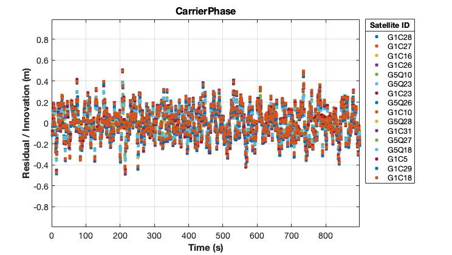
  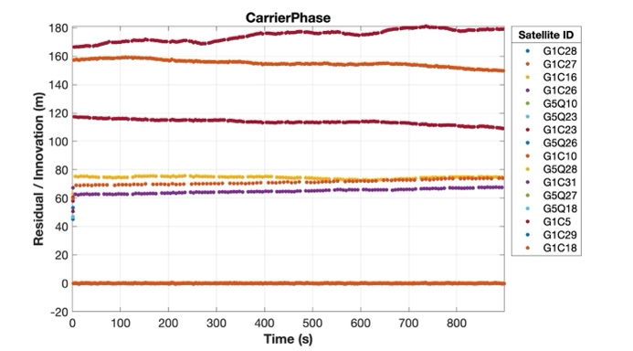
</p>

*Figure 7-2 — Carrier-phase innovation (m). Left: Case 1/3 (slips absent or repaired) stays stable; right: Case 2 (slips present, unrepaired) shows clear discontinuities.*

<p align="center">
  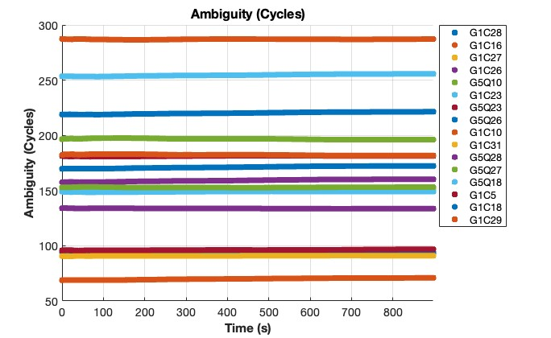
  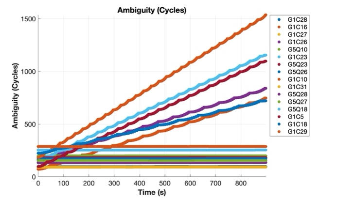
</p>

*Figure 7-3 — Phase ambiguity (cycles). Left: Case 1 (no artificial slips); right: Case 2 & 3 (slips introduced) — both show the same staircase step, but only Reset (Case 2) shows a re-convergence wobble afterward.*

<p align="center">
  
  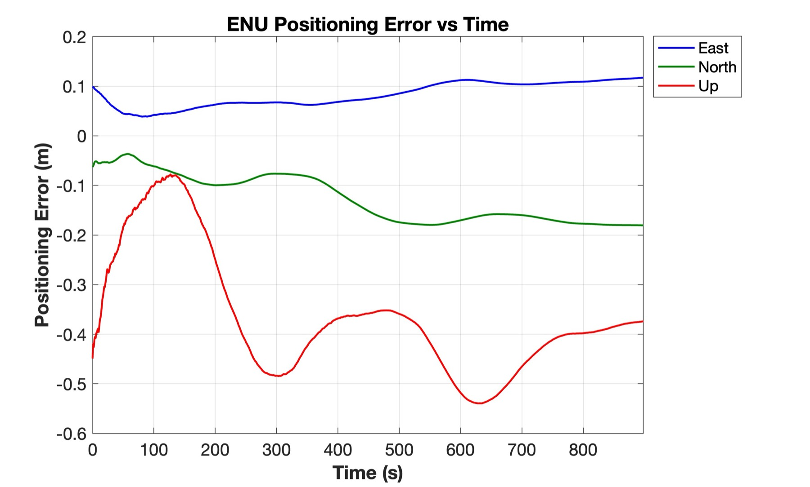
</p>

*Figure 7-4 — ENU positioning error (m). Left: Case 1 and 3 (slips absent or repaired); right: Case 2 (slips present, unrepaired) — the ambiguity resets visibly propagate into position error.*

## Validation 2 — real smartphone data (Google Pixel 4)

Of a wide device sweep (Pixel 4/5/7 Pro/8a, Samsung S22), **only the Pixel 4** had stable enough continuous raw data (clean ADR states, no aggressive clock steering) to validate CSDR properly. Location: University of Calgary, next to Alberta Survey Control Marker ASCM 419739. Three sessions: Pixel 4 Fall (21 Nov 2025), Pixel 4 Winter (28 Jan 2025), Pixel 7 Pro (21 Nov 2025).

<p align="center">
  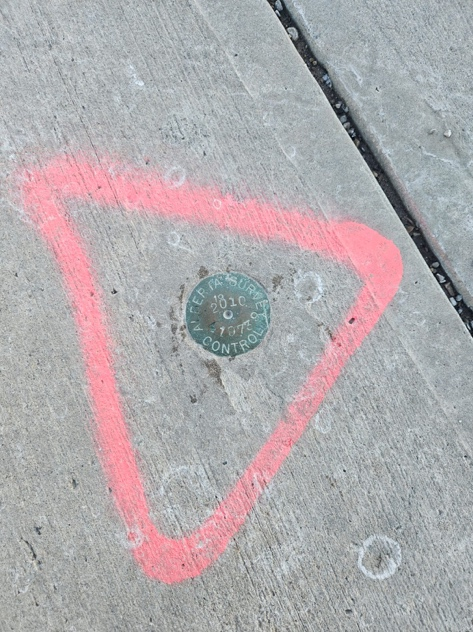
  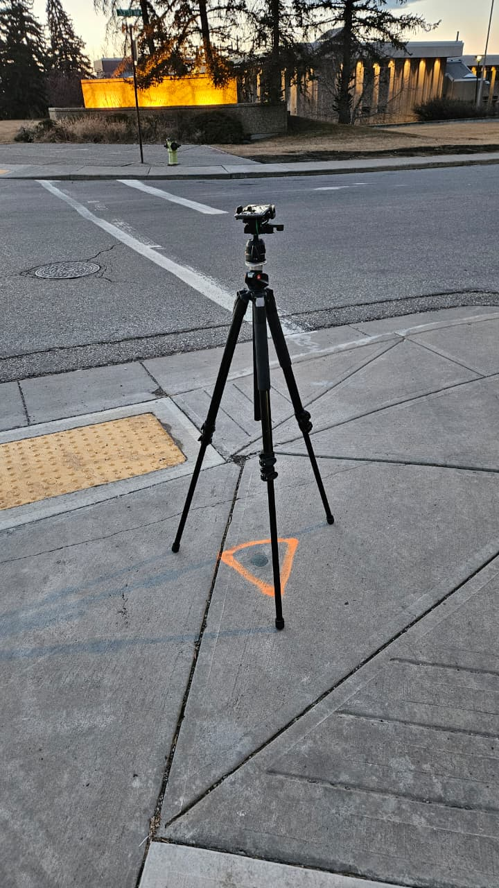
  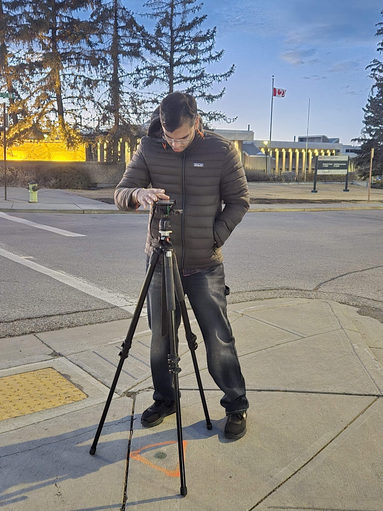
</p>

*Figure 7-5 — Dataset collection near the University of Calgary campus, at Alberta Survey Control Marker ASCM 419739.*

Two structural findings specific to smartphone hardware, both directly shaping the state vector above:

- **Phase clock drifts by over 1,500 m (Pixel 4) / 2,000,000 m (Pixel 7 Pro)** over 15 minutes, with per-signal inter-signal biases fluctuating **±10 cm** — empirical confirmation that a single shared clock state would leave these fluctuations unmodelled and contaminate residuals.
- **Code clock offset carries a ~−2,350 m bias** that itself evolves over time — confirming `DSB_r^Code`/`DSB_r^Phase` need to be *estimated states*, not constants.

<p align="center">
  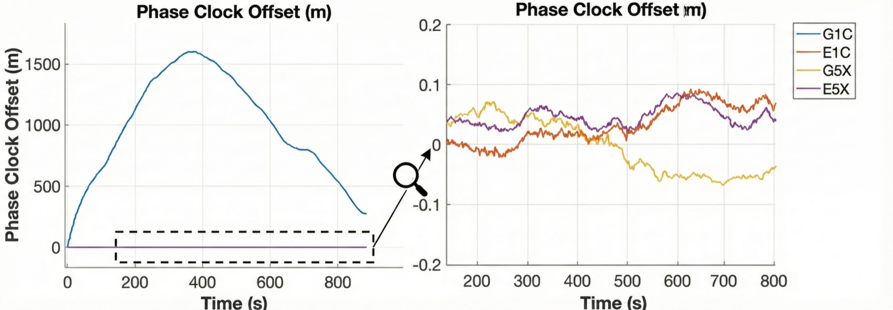
</p>
<p align="center">
  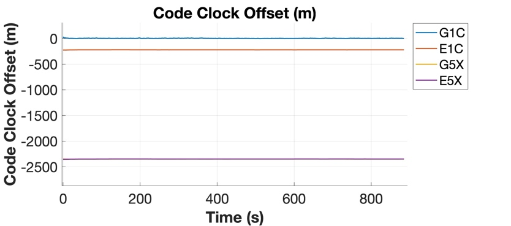
  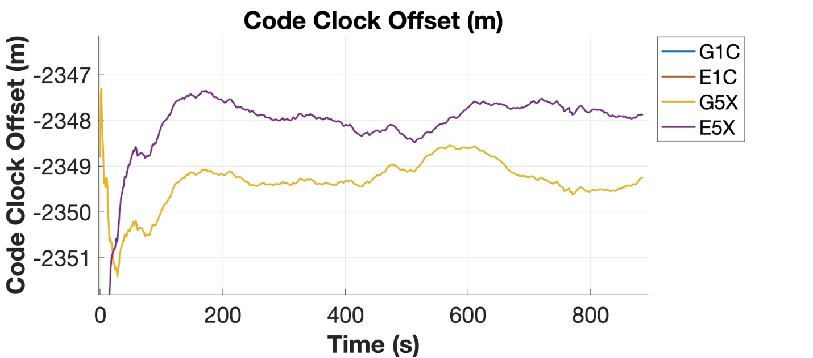
</p>

*Figure 7-6 — Pixel 4 (Fall) dataset. Top: phase clock offset (G1C) with a zoomed inset showing the other signals stay near zero by comparison. Bottom left: code clock offset detail. Bottom right: phase clock offset across all six tracked signals. Signal-specific divergences fluctuate within ±10 cm even after the common drift is removed.*

<p align="center">
  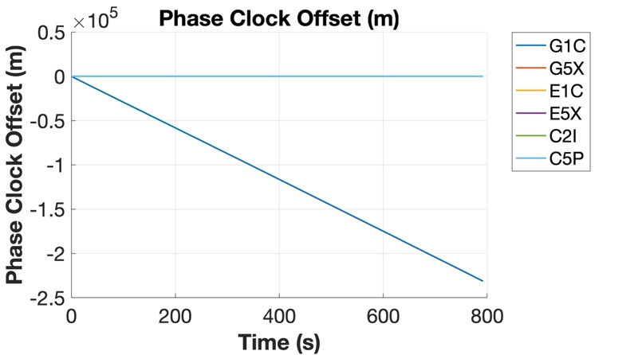
  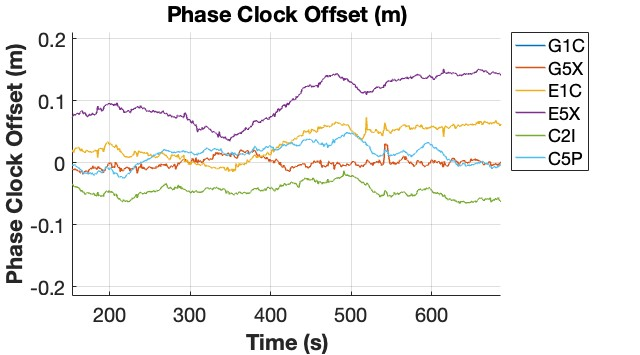
</p>
<p align="center">
  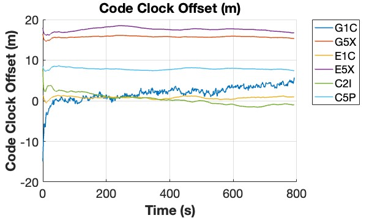
</p>

*Figure 7-7 — Pixel 7 Pro dataset: phase clock offset (full scale and zoomed detail) and code clock offset across all six tracked signals — the same divergence pattern as Figure 7-6, at a larger drift magnitude.*

<p align="center">
  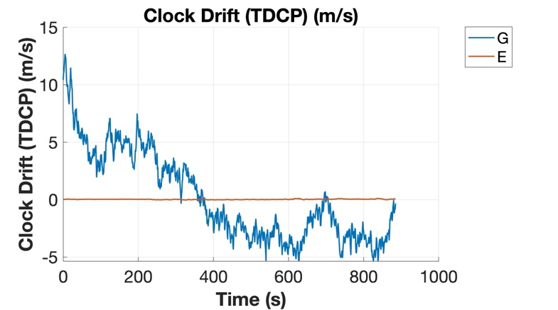
  
</p>

*Figure 7-8 — Clock drift derived from Doppler vs. TDCP measurements, Pixel 4. The two estimates behave nearly identically for this handset, justifying the Phase-Prediction coarse check (Ch. 5) for this device.*

### Dual-frequency (L1+L5) positioning accuracy — Pixel 4 (Fall)

<p align="center">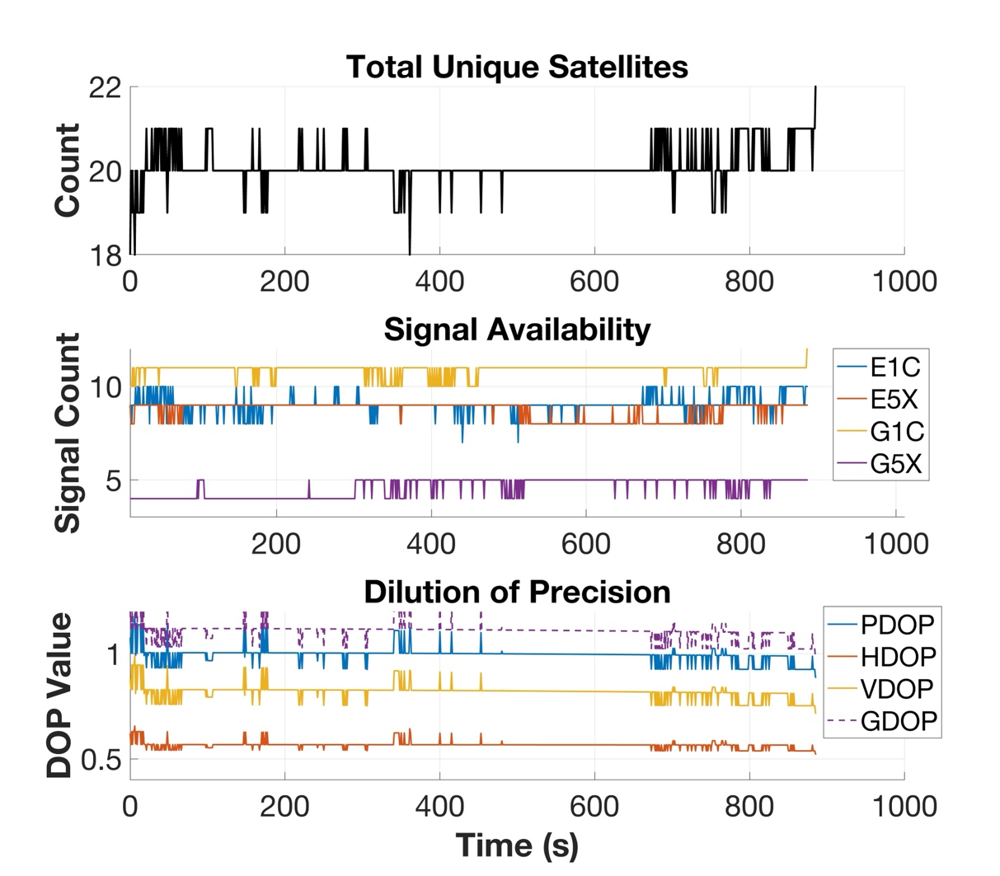</p>

*Figure 7-9 — Satellite count, signal availability, and DOP, Pixel 4 (Fall/Nov) dataset. ~18–22 satellites, PDOP ≈ 1.*

| Constellation | Vertical RMSE, Reset | Vertical RMSE, Repair | Improvement |
|---|---|---|---|
| Galileo | 150.1 cm | **82.2 cm** | **~45%**, converged error down >2 m |
| GPS | 731.3 cm | 634.4 cm | ~13%, weaker due to lower L5 availability |
| GPS+Galileo | 191.8 cm | 201.4 cm (RMSE ~flat) | converged vertical error down 3× (~100 cm → ~30 cm) |

Repair matters most exactly where geometry is weakest: with strong combined-constellation redundancy, a single reset ambiguity gets absorbed by the rest of the solution, but in single-constellation cases with weaker geometry, resetting one satellite spikes DOP and error directly — CSDR is a stabilizer specifically for users with limited satellite visibility.

<p align="center">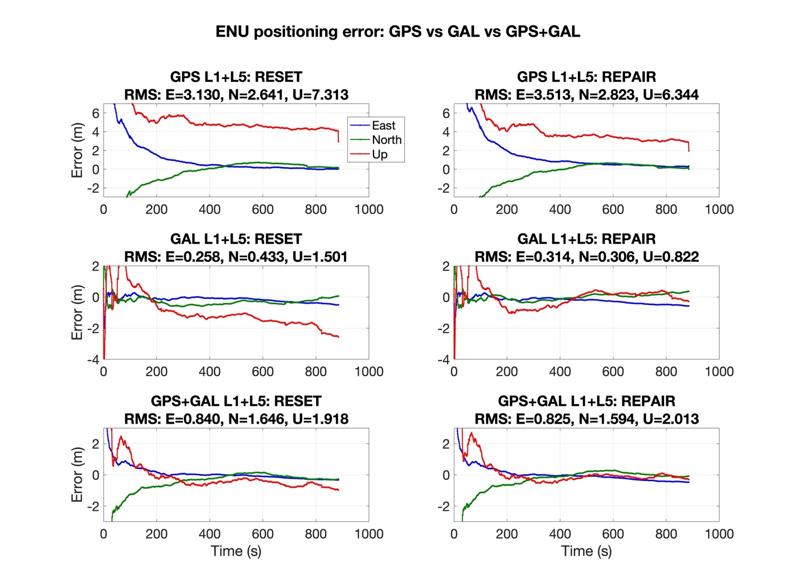</p>

*Figure 7-10 — Pixel 4 (Fall) PPP positioning error, L1+L5, Reset vs. Repair, per constellation.*

### Convergence stability (2-minute time-sliced "cold start" stress test)

The 15-minute session was chopped into independent 2-minute windows, each forcing a full filter reset and re-convergence, scoring the RMSE of the last 30 seconds of each window (a proxy for realistic short smartphone sessions — check a map, lock the screen, check again).

- Average **vertical** RMSE improvement across all slices: **Galileo 38.3%**, **GPS 17.0%**, **combined GPS+GAL 35.4%**.
- For combined GPS+Galileo, repair raised the probability of reaching sub-metre accuracy within 2 minutes **from 65% to 88%**.
- Mechanism: resetting during the fragile early-convergence window discards exactly the information needed to keep DOP low; repairing preserves continuity and keeps the filter's geometry stable through the stress test.

<p align="center">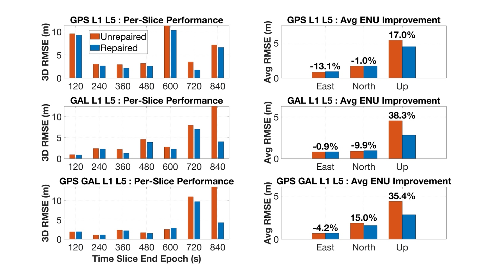</p>

*Figure 7-11 — Last-30s RMSE per 2-minute time slice (Reset vs. Repair). Top: GPS L1+L5; middle: Galileo L1+L5; bottom: GPS+GAL L1+L5.*

### Single-frequency PPP

Repair's benefit collapses without a second frequency: **L5-only** got a modest but real gain (~14 cm vertical RMSE improvement); **L1-only** got essentially nothing. Reason: in single-frequency processing, unmodelled residual ionospheric error gets absorbed into the float ambiguity itself, degrading the float estimate enough that repair has little to work with — **"Cycle slip repair is an accuracy enhancement tool, not a coarse error mitigation tool."** This is why the framework is explicitly targeted at dual-frequency-capable phones.

### Detection strategy matters as much as repair strategy

Disabling either half of the hybrid detector in isolation:

- **Chipset-only** (Android `ADR_STATE_CYCLE_SLIP` flag alone): missed most slips (241 of 811 on GPS L1+L5) — repair then operated on an incomplete, contaminated slip set and made things *worse*: Vertical RMSE blew up to **28.69 m**.
- **Model-only** (geometry checks alone): better, but still short of the hybrid — Galileo Vertical RMSE 105.2 cm vs. the hybrid's 82.2 cm.
- **Hybrid** (both): best of all — on the combined GPS+GAL L1+L5 dataset, Repair vs. Reset improved Vertical by **68.2%**.

Confirms the [detection framework](05-cycle-slip-detection.md)'s design: neither the hardware flag nor the statistical model alone is sufficient; the fusion is load-bearing, not a nice-to-have.

<p align="center">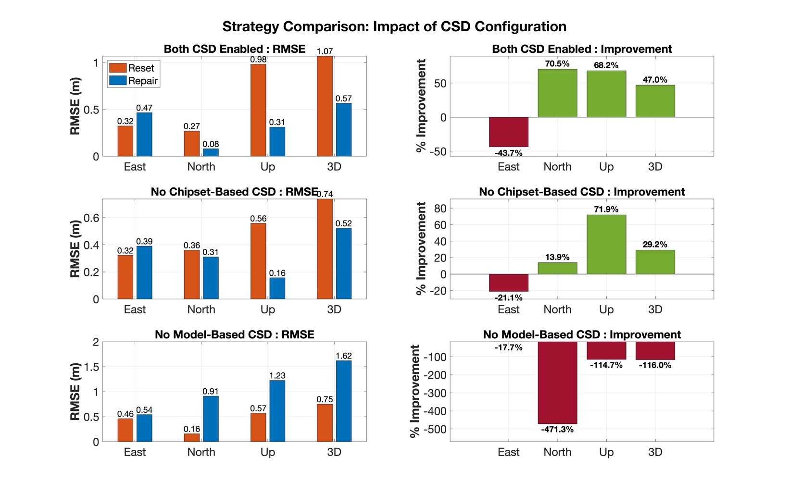</p>

*Figure 7-12 — Chipset-based vs. model-based cycle-slip detection, GPS+GAL L1+L5. Top: both enabled; middle: chipset-only; bottom: model-only disabled — the bottom row shows Repair performing *worse* than Reset when the model-based check is missing.*

### Reproducibility (Pixel 4, Winter dataset)

<p align="center">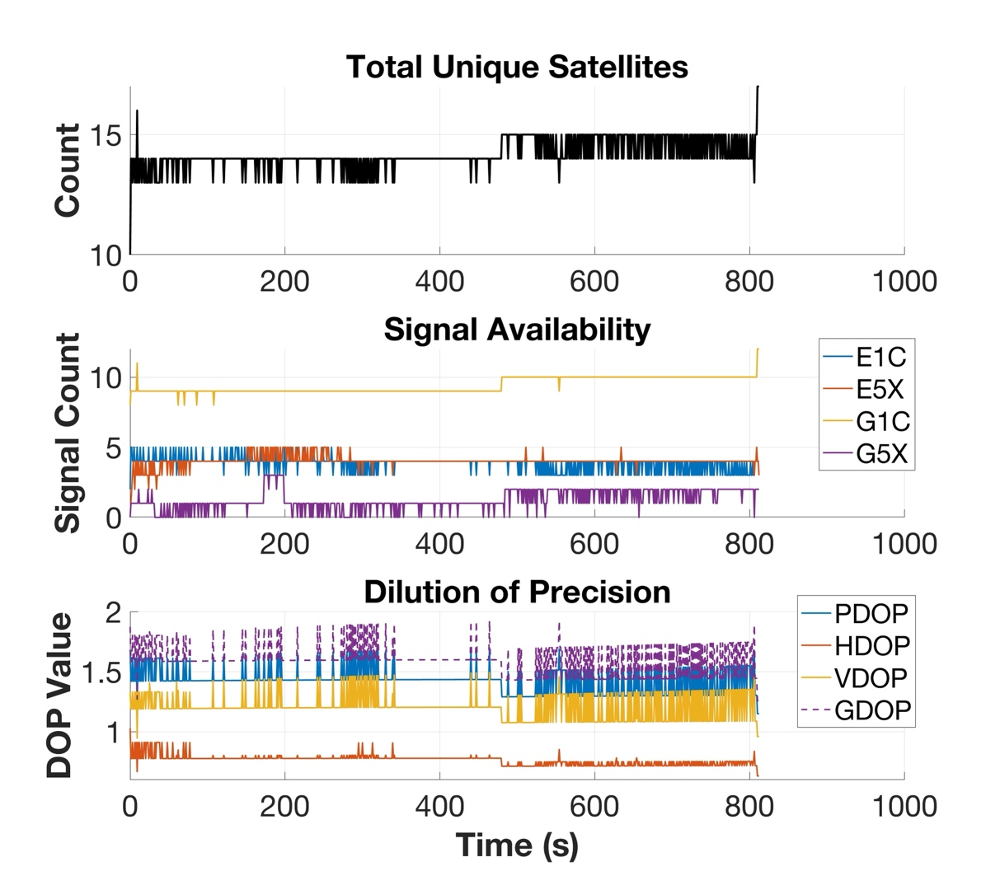</p>

*Figure 7-13 — Satellite count, signal availability, and DOP, Pixel 4 (Winter) dataset.*

Same handset, different date/geometry, to rule out the Fall results being an artifact of specific conditions. GPS had decent geometry (9.4 sats, VDOP 1.8) and improved Vertical RMSE 212.0→184.6 cm; Galileo had poor geometry (4.7 sats, VDOP 3.3) and barely moved (301.4→298.3 cm) — **if the underlying geometry can't support a reliable float ambiguity in the first place, integer repair can't rescue it.** Combined GPS+Galileo (14.2 sats, VDOP 1.2) again showed a clear ~16 cm vertical gain. Net conclusion: repair consistently matches-or-beats reset across both sessions, with the *magnitude* of the win scaling with how much redundancy the geometry provides.

<p align="center">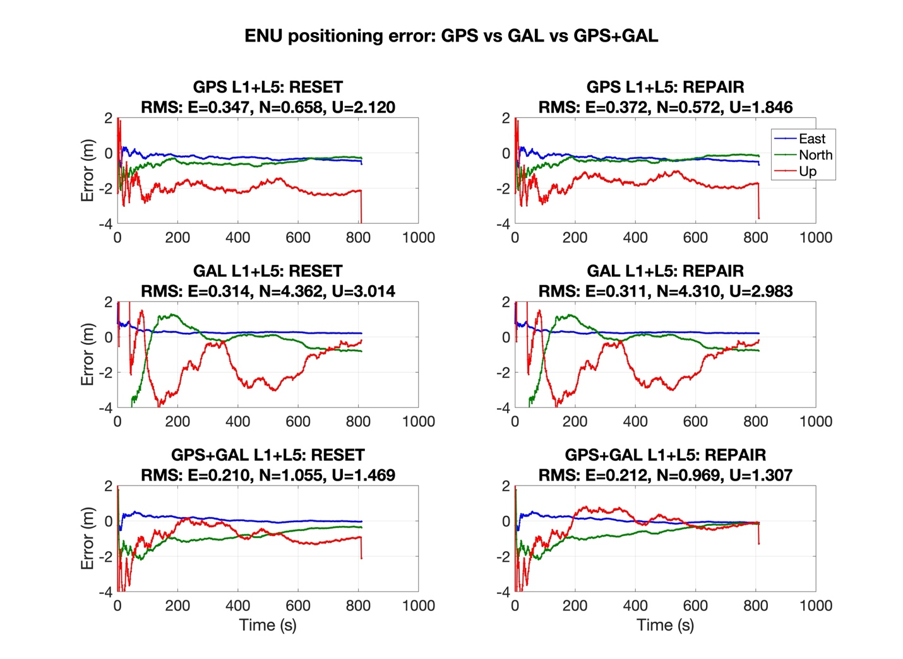</p>

*Figure 7-14 — Pixel 4 (Winter) PPP positioning error, Reset vs. Repair, per constellation.*

## Device suitability and limitations

Three specific hardware behaviours were found to defeat the framework, worth knowing before pointing this codebase at a new device:

1. **Very low cycle-slip density** (Pixel 7 Pro: 0.07% GPS, 0.49% Galileo slip density) — not a failure, just not enough slip events to statistically demonstrate a difference; repair still worked correctly on the few Galileo slips that did occur (50 cm converged-position improvement).

   <p align="center">
     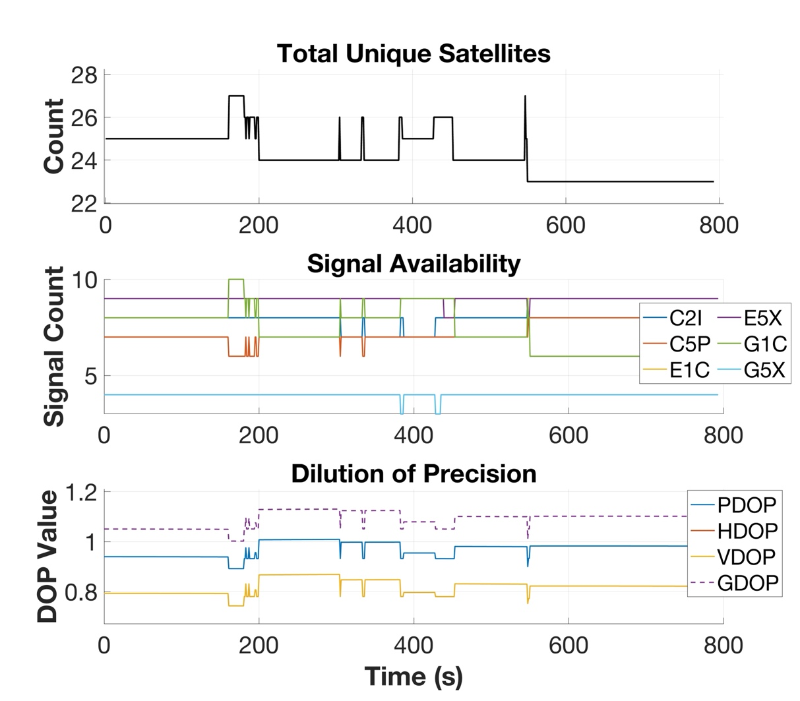
     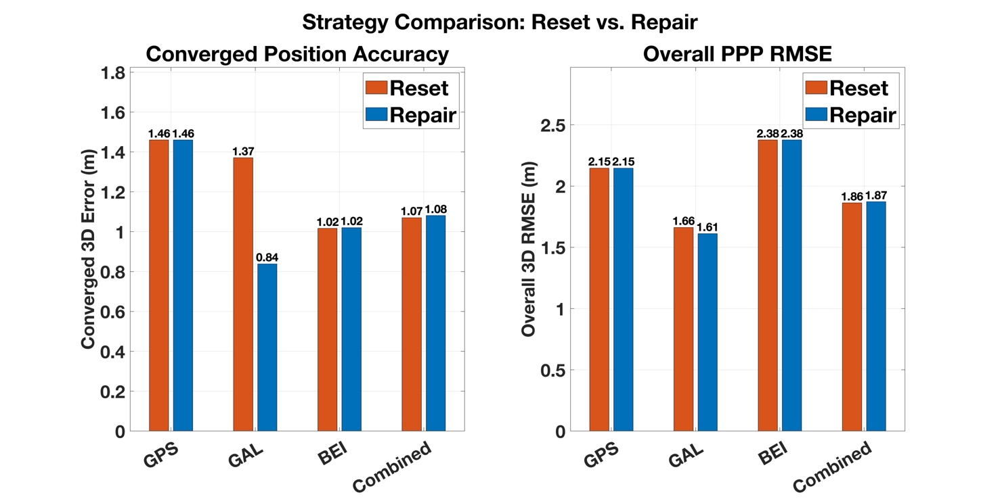
   </p>

   *Figure 7-15 / 7-16 — Pixel 7 Pro satellite geometry (left) and PPP positioning results, Reset vs. Repair (right). Strong native tracking means little room for Repair to demonstrate a difference, but the few Galileo slips present were still handled correctly.*

2. **Aggressive clock steering** (OnePlus Nord 2, Tampere University dataset) — periodic, non-physical jumps in the code clock that a Kalman filter can't distinguish from a real geometric error, making the phase data unsuitable for integer resolution altogether.

   <p align="center">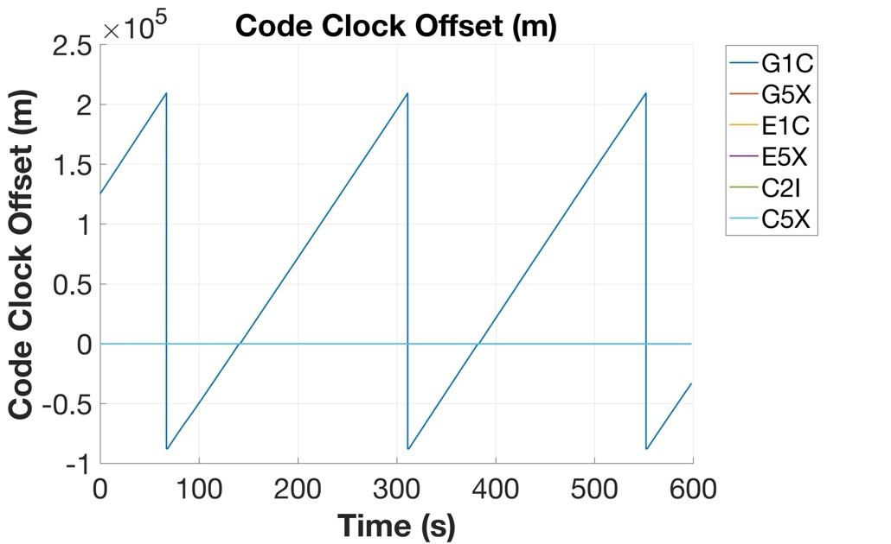</p>

   *Figure 7-17 — OnePlus Nord 2 periodic code clock steering: a sawtooth pattern in the code clock offset that defeats integer cycle-slip repair.*

3. **No dual-frequency signal** (Pixel 8a, Samsung S22) — as above, single-frequency repair is unreliable due to unmodelled ionospheric residuals masking the integer nature of the slip.

## Code

- `com.gnssAug.Rinex.estimation.EKF_PPP` — the fully-documented UU-PPP filter (used by `IGS.IGS` for `IGS_PPP_FLOAT`/`IGS_PPP_AR`); dual-filter architecture (`vel_kfObj` for TDCP/Doppler + CSDR, `pos_kfObj` for the full PPP state).
- `com.gnssAug.Rinex.estimation.EKF_PPP_DF` — dual-frequency variant (`RINEX_PPP_DF`).
- `com.gnssAug.Rinex.estimation.EKF_PPP_LowCostRx` — tuned for consumer receivers (`RINEX_PPP_LOWCOST`).
- `com.gnssAug.Rinex.estimation.RinexPPPStateLayout` — the state-vector layout described above.
- `com.gnssAug.Android.estimation.KalmanFilter.EKF_PPP` / `EKF_PPP3` — the Android raw-log equivalents (`PPP_FLOAT` mode); `EKF_PPP3` adds the static/single-clock configuration knobs (`predictPhaseClock`, `singlePhaseClock`, `singleClockDrift`) used for the Pixel 4/7 Pro experiments.
- `com.gnssAug.Rinex.fileParser.DCB_Bias` / `OSB_Bias` — the two bias-correction paths behind Standard PPP vs. PPP-AR.

## Next

[docs/08 — Physical Correction Models](08-corrections-and-models.md) documents the geophysical corrections (solid Earth tide, troposphere, ionosphere) referenced above at the code level, and [docs/10 — Results Summary](10-results-and-recommendations.md) collects every headline number from Chapters 3–7 in one place alongside the thesis's own implementation recommendations.
