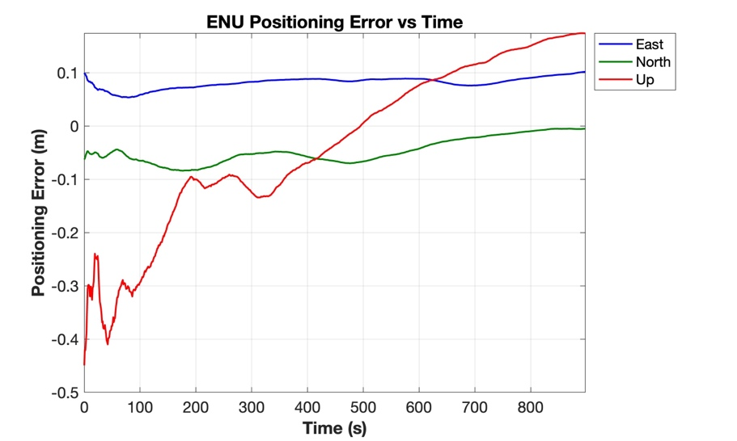

# The Thesis Behind gnssAug

This codebase began as the implementation and validation vehicle for a PhD thesis: *"Improving Precise Smartphone GNSS with Robust Dynamics, Adaptive Stochastics, and Cycle Slip Repair"* (N. Agarwal, Department of Geomatics Engineering, University of Calgary, 2026). This folder is the research record — the motivation, theory, and validated experiment results behind the code, frozen as of the thesis defense. It documents the code *as it was when the thesis was written*, not as it exists today.

**For current, living documentation of the codebase as it now stands, see [docs/](../README.md).** This folder is for provenance, citation, and understanding *why* the code is built the way it is — not for keeping up with ongoing development.

## The problem

Smartphone GNSS chipsets expose raw carrier-phase and Doppler measurements, which in principle enables decimeter-level positioning on commodity hardware. Three things stood in the way, all specific to low-cost, consumer-grade GNSS hardware:

1. **Erratic dynamics** — a phone moves unpredictably (pocketed, handheld, running, driving), so a Kalman filter's process-noise model (`Q`), normally hand-tuned, can't keep up.
2. **Volatile measurement quality** — signal quality swings from open sky to urban canyon far faster than a fixed elevation/C-N₀ weighting table can track.
3. **Chronic cycle slips** — smartphone antennas and oscillators lose carrier-phase lock constantly. The standard fix — reset the ambiguity and start over — is stable but destroys the precision that carrier phase exists to provide.

> *"For geodetic receivers, cycle slips are occasional anomalies. For smartphones, they are a chronic condition."*

The thesis's central position: **don't discard corrupted phase — repair it.** Estimate the cycle slip as a stochastic integer with an associated variance, and feed that repair back into the filter rather than resetting.

## The three pillars

| Pillar | What it does | Headline result | Docs |
|---|---|---|---|
| **1a. Robust Dynamics** — Doppler-Based Prediction (DBP) | Drives Kalman filter state prediction from Doppler-derived velocity instead of a heuristic motion model, which automates process-noise (`Q`) estimation | **57%** lower horizontal RMSE than standard Doppler-aided filters under mismatched dynamics (17.89 m → 7.75 m); eliminates 1,800+ false outlier flags | [03](03-pillar1-dbp.md) |
| **1b. Adaptive Stochastics** — AKF via Variance Component Estimation | Learns the true measurement noise (`R`) in real time from the innovation sequence, binned by elevation angle and C/N₀, instead of a static look-up table | **35.4%** (static) / **27.3%** (vehicular) horizontal accuracy gain over the best conventional filter; de-weights noisy measurements instead of discarding them, preserving geometry | [04](04-pillar1-akf-vce.md) |
| **2. Cycle Slip Detection & Repair (CSDR)** | A hierarchical framework fusing Android hardware flags with geometry-free/geometry-based statistical detection, then resolving slips as integers via LAMBDA (ILS, BIE, PAR, PAR-FFRT, IA-FFRT) with a stochastic "soft fix" | Hybrid detection found **1,783** unique slips vs. 1,108–1,243 from either source alone; PAR-FFRT repairs **~79%** of slips at **<1%** failure rate | [05](05-cycle-slip-detection.md), [06](06-lambda-estimators.md) |
| **3. Validation — UU-PPP Engine** | Integrates CSDR into a custom Undifferenced-Uncombined, ionosphere-constrained PPP filter with decoupled code/phase clocks, validated against IGS reference data and real smartphones | On IGS data with 1,045 artificial slips: repaired accuracy matches the clean baseline (15.9 cm vs 16.0 cm Up RMSE) vs. 52.9 cm for reset. On real Pixel 4 data: **45%** vertical RMSE improvement, 2-min convergence success up from 65%→88% | [07](07-ppp-engine.md) |

## Results at a glance

  
  
  

*Left: horizontal trajectory under correct vs. mismatched process noise — DBP (green) stays locked to ground truth (light blue) either way, conventional filters visibly diverge when `Q` is wrong ([03](03-pillar1-dbp.md)). Middle: the proposed AKF (purple) vs. WLS/PRW-VRW/DBP across static and kinematic environments ([04](04-pillar1-akf-vce.md)). Right: PPP-engine ENU error with cycle slips present — repaired vs. clean ([07](07-ppp-engine.md)). Every figure from the thesis is reproduced across the chapters below.*

## Reading order

| # | Document | Covers |
|---|---|---|
| 1 | [Motivation & Problem Statement](01-motivation-and-problem.md) | Why this exists, the three failure points in smartphone GNSS, the three-pillar solution, performance metric definitions, publications |
| 2 | [Architecture (as of the thesis)](02-architecture.md) | Package layout, `EstimatorMode` dispatch table, entry points, processing pipeline — see [../architecture.md](../architecture.md) for the current version |
| 3 | [Pillar 1a — Doppler-Based Prediction](03-pillar1-dbp.md) | Complementary-filter theory, automated process-noise (`Q`) estimation, FDE, results |
| 4 | [Pillar 1b — Adaptive Kalman Filter (VCE)](04-pillar1-akf-vce.md) | Variance Component Estimation, elevation/C-N₀ binning, real-time `R` adaptation, results |
| 5 | [Pillar 2a — Cycle Slip Detection](05-cycle-slip-detection.md) | Android ADR hardware states, geometry-free/geometry-based detection, the 9-step hierarchical pipeline |
| 6 | [Pillar 2b — LAMBDA Estimators & Stochastic Repair](06-lambda-estimators.md) | ILS, IA-FFRT, BIE, PAR, PAR-FFRT — Monte Carlo variance estimation, comparative results, code map |
| 7 | [Pillar 3 — UU-PPP Engine](07-ppp-engine.md) | Observation model, state vector, rank deficiencies, CSDR integration, IGS + smartphone validation results |
| 8 | [Physical Correction Models](08-corrections-and-models.md) | Satellite position/clock, ionosphere, troposphere, solid Earth tide, phase wind-up, antenna PCO/PCV |
| 9 | [File Formats & Parsers](09-file-formats-and-parsers.md) | RINEX, SP3, CLK, ANTEX, IONEX, SINEX, DCB/OSB, Android raw logs, Decimeter Challenge CSVs |
| 10 | [Results Summary & Recommendations](10-results-and-recommendations.md) | Every headline number in one place, implementation recommendations, device suitability checklist, future work |

## Quick map: thesis chapter → doc → code (as of the thesis)

| Thesis chapter | Doc | Primary package (at the time) |
|---|---|---|
| Ch. 1–2 (Intro, literature) | [01](01-motivation-and-problem.md) | — |
| Ch. 3 (Robust Dynamics / DBP) | [03](03-pillar1-dbp.md) | `Android.estimation.KalmanFilter.EKFDoppler` |
| Ch. 4 (Adaptive Variance / AKF) | [04](04-pillar1-akf-vce.md) | `Android.estimation.KalmanFilter.AKFDoppler` |
| Ch. 5 (Cycle Slip Detection) | [05](05-cycle-slip-detection.md) | `Android.estimation.KalmanFilter.EKF_TDCP_ambFix2` |
| Ch. 6 (Stochastic Repair Engine) | [06](06-lambda-estimators.md) | `helper.lambdaNew.*` |
| Ch. 7 (PPP Validation) | [07](07-ppp-engine.md) | `Rinex.estimation.EKF_PPP` |
| Ch. 8 (Conclusion) | [10](10-results-and-recommendations.md) | — |

For where these packages stand *today* (which may have moved on since the thesis), see the living docs linked from each table row above, or start from [docs/architecture.md](../architecture.md).

## License & citation

Licensed under the [PolyForm Noncommercial License 1.0.0](../../LICENSE) — free for research, academic, and personal use; commercial use requires a separate agreement with the author. If you use this code or its methods in academic work, please cite the thesis (DOI: [10.11575/PRISM/51108](https://doi.org/10.11575/PRISM/51108)) — see [CITATION.md](../../CITATION.md) for the full reference, BibTeX entry, and the list of peer-reviewed papers each module is drawn from.

## Author

Naman Agarwal — PhD, Department of Geomatics Engineering, University of Calgary.
[Thesis](https://ucalgary.scholaris.ca/items/e9b24a29-0d68-4f5d-ab0f-6a401eef1c9d) · [DOI](https://doi.org/10.11575/PRISM/51108) · naman4u13@gmail.com
